# GFIP 基因家族鉴定管线 — 完整技术路线文档

> **Gene Family Identification Pipeline (GFIP) — Comprehensive Technical Documentation**
> 本文档整合了 GFIP 管线全部 17 个模块的技术报告，按执行顺序排列。

---

## 📑 目录（点击跳转）

| # | 模块 | 文件 | 定位 |
|---|---|---|---|
| 0 | **主控制器** | [run_pipeline_v3.py](#mod-run-pipeline-v3) | 14 步 Pipeline 编排 |
| 1 | **格式检测** | [format_detector.py](#mod-format-detector) | GFF/PEP/CDS ID 映射 |
| 2 | **GFF 标准化** | [gff_normalizer.py](#mod-gff-normalizer) | AGAT 标准化 |
| 3 | **种子检索** | [retrieve_seeds.py](#mod-retrieve-seeds) | NCBI/UniProt/InterPro |
| 4 | **HMM 构建** | [build_hmm.py](#mod-build-hmm) | MAFFT + hmmbuild |
| 5 | **HMM 搜索** | [search_extract.py](#mod-search-extract) | hmmsearch + 提取 |
| 6 | **BLAST 验证** | [blast_verify.py](#mod-blast-verify) | blastp 交叉验证 |
| 7 | **InterProScan** | [interproscan_runner.py](#mod-interproscan-runner) | Domain 验证 |
| 8 | **CDD 搜索** | [scan_cdd_ncbi.py](#mod-scan-cdd-ncbi) | NCBI CDD API |
| 9 | **基因提取** | [universal_family_extractor.py](#mod-universal-family-extractor) | Domain 过滤 + 数据集提取 |
| 10 | **核心工具** | [pipeline_utils.py](#mod-pipeline-utils) | 61 函数工具库 |
| 11 | **启动子分析** | [run_promoter_analysis.py](#mod-run-promoter-analysis) | Golden List + MEME |
| 12 | **R 可视化** | [visualize_cis_elements.R](#mod-visualize-cis-elements) | ggtree + 热图 |
| 13 | **Ka/Ks 分析** | [run_kaks_analysis.py](#mod-run-kaks-analysis) | 选择压力 |
| 14 | **共线性分析** | [run_synteny_analysis.py](#mod-run-synteny-analysis) | JCVI + Circos |
| 15 | **批量运行** | [run_batch_pipeline.py](#mod-run-batch-pipeline) | 多物种并行 |
| 16 | **多物种汇总** | [render_multi_species_summary_v2.py](#mod-render-multi-species-summary) | 汇总报告 |

> 💡 **提示**：点击文件名可直接跳转到对应模块的详细报告。每个模块末尾可 [⬆ 返回目录](#-目录点击跳转) 。

---

## 总体架构

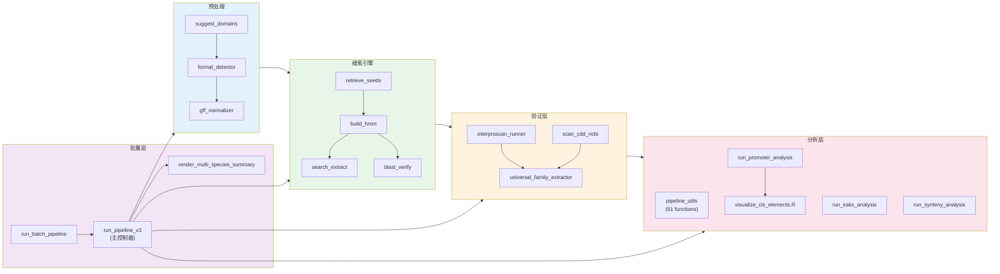

---

<div style="page-break-after: always;"></div>

<a id="mod-run-pipeline-v3"></a>

# run_pipeline_v3.py 技术报告

[⬆ 返回目录](#-目录点击跳转)

**文件**：[run_pipeline_v3.py](file:///Users/baijiuzhuo/Downloads/pipeline/run_pipeline_v3.py)
**行数**：1419 行 | **大小**：~65 KB
**定位**：**GFIP 主控制器**——负责加载配置、调度所有子模块、跟踪执行状态、汇总结果并生成最终报告。

---

## 0. Pipeline 总体流程图

```mermaid
flowchart TD
    START(["🚀 Pipeline Start"]) --> CONFIG["Load config.yaml<br/>CLI > YAML > Defaults"]
    CONFIG --> DEP_CHECK{"check_dependencies()<br/>mafft / hmmbuild / hmmsearch<br/>makeblastdb / blastp"}
    DEP_CHECK -->|All Found| STEP0
    DEP_CHECK -->|Missing| ABORT_DEP["❌ Exit"]

    subgraph STEP0 ["Step 0: Auto Format Detection"]
        FMT["format_detector.detect_formats()<br/>Learn GFF↔PEP↔CDS ID mapping"]
        FMT --> FMT_OUT["format_profile.json"]
    end

    STEP0 --> GFF_NORM{"normalize_gff?"}
    GFF_NORM -->|Yes| AGAT["AGAT normalize_gff()"]
    GFF_NORM -->|No| PRE_CHECK

    AGAT --> PRE_CHECK{"pretrained_hmm<br/>provided?"}
    PRE_CHECK -->|Yes| SKIP_12["⏭️ Skip Step 1-2<br/>Copy HMM to tmp_dir"]
    PRE_CHECK -->|No| STEP1

    subgraph STEP1 ["Step 1: Seed Retrieval"]
        direction LR
        NCBI["🔍 NCBI RefSeq<br/>get_ncbi_many()"]
        UNIPROT["🔍 UniProt<br/>Swiss-Prot / TrEMBL"]
        INTERPRO["🔍 InterPro<br/>Pfam / CDD"]
        NCBI --> MERGE_SEEDS
        UNIPROT --> MERGE_SEEDS
        INTERPRO --> MERGE_SEEDS
        MERGE_SEEDS["Deduplicate & Stratify"] --> GOLD_SEEDS["seeds_gold.fasta<br/>(NP/YP/Reviewed)"]
        MERGE_SEEDS --> BROAD_SEEDS["seeds_broad.fasta<br/>(Gold + Silver)"]
    end

    STEP1 --> STEP2

    subgraph STEP2 ["Step 2: HMM Construction"]
        direction LR
        BUILD_GOLD["build_hmm.py<br/>Gold Seeds → MAFFT → hmmbuild"]
        BUILD_BROAD["build_hmm.py<br/>Broad Seeds → MAFFT → hmmbuild"]
        BUILD_GOLD --> HMM_GOLD["gold.hmm"]
        BUILD_BROAD --> HMM_BROAD["broad.hmm"]
    end

    SKIP_12 --> STEP3
    STEP2 --> STEP3

    subgraph STEP3 ["Step 3: Quad-Core Search"]
        direction TB
        S1["Stream 1: HMM-Gold<br/>hmmsearch"]
        S2["Stream 2: HMM-Broad<br/>hmmsearch"]
        S3["Stream 3: BLAST-Gold<br/>blastp"]
        S4["Stream 4: BLAST-Broad<br/>blastp"]
        MKDB["makeblastdb<br/>(proteome)"] --> S3
        MKDB --> S4
    end

    STEP3 --> STEP4["Step 4: Candidate Merge<br/>Union of 4 streams → Deduplicate<br/>→ candidates_merged.fasta"]

    STEP4 --> STEP5

    subgraph STEP5 ["Step 5: Domain Verification (Parallel)"]
        direction LR
        IPR["InterProScan<br/>(EBI API / Local)"]
        CDD["NCBI CD-Search<br/>(REST API)"]
    end

    STEP5 --> STEP6["Step 6: Final Extraction<br/>universal_family_extractor.py<br/>Domain Filter → Extract PEP/CDS/GFF/Promoter"]

    STEP6 --> STEP7

    subgraph STEP7 ["Step 7: MSA + Motif Analysis"]
        MSA["MAFFT Alignment"] --> MOTIF_CHECK{"MEME available?"}
        MOTIF_CHECK -->|"Local"| MEME_L["MEME (Native)"]
        MOTIF_CHECK -->|"Docker"| MEME_D["MEME (Docker)"]
        MOTIF_CHECK -->|"None"| MEME_F["Fallback: MSA Conservation"]
    end

    STEP7 --> STEP8

    subgraph STEP8 ["Step 8: Phylogenetic Tree"]
        TRIM["trim_msa_by_gap()<br/>Remove >50% gap columns"] --> TREE_CHECK{"Tool available?"}
        TREE_CHECK -->|"iqtree2"| IQTREE["IQ-TREE<br/>ModelFinder + Bootstrap"]
        TREE_CHECK -->|"fasttree"| FAST["FastTree"]
        TREE_CHECK -->|"None"| SKIP_TREE["⏭️ Skip"]
    end

    STEP8 --> STEP9["Step 9: Integrated Visualization<br/>Tree + Gene Structure + Motif → SVG<br/>+ Quality Metrics"]

    STEP9 --> CSV_EXPORT["Data Export<br/>protein_properties.csv<br/>domain_annotations.csv<br/>gene_family_summary.csv"]

    CSV_EXPORT --> STEP10["Step 10: Promoter Analysis<br/>run_promoter_analysis.py<br/>Golden List + MEME Hybrid"]

    STEP10 --> STEP11["Step 11: Ka/Ks Analysis<br/>run_kaks_analysis.py<br/>Selection Pressure"]

    STEP11 --> STEP12["Step 12: Chromosomal Map<br/>Genome FASTA → Chr Lengths<br/>→ Distribution PNG"]

    STEP12 --> SYN_CHECK{"run_synteny?"}
    SYN_CHECK -->|Yes| STEP13["Step 13: Synteny Analysis<br/>Diamond + MCScanX + Circos<br/>+ Duplication Classification"]
    SYN_CHECK -->|No| REPORT

    STEP13 --> REPORT["📊 Generate report.html<br/>+ pipeline_summary.md<br/>+ Execution Summary"]
    REPORT --> FINISH(["✅ Pipeline Complete"])

    style START fill:#2d6a4f,color:#fff
    style FINISH fill:#2d6a4f,color:#fff
    style ABORT_DEP fill:#d32f2f,color:#fff
    style STEP3 fill:#e8f5e9
    style STEP5 fill:#e3f2fd
    style STEP7 fill:#fff3e0
```

---

## 1. 依赖总览

### Python 标准库
`argparse` `os` `sys` `csv` `shutil` `concurrent.futures`（线程池并行）

### 第三方库
| 库 | 用途 |
|---|---|
| [yaml](file:///Users/baijiuzhuo/Downloads/pipeline/config.yaml)（PyYAML） | 解析 [config.yaml](file:///Users/baijiuzhuo/Downloads/pipeline/config.yaml) 配置文件 |
| `Bio.SeqIO`（Biopython） | FASTA 文件读写、序列计数 |
| `dataclasses.asdict` | 将 `FormatProfile` 数据类序列化为 dict |

### 内部模块依赖
| 模块 | 导入位置 | 提供的功能 |
|---|---|---|
| `pipeline_utils` | L12, L611, L697, L794, L846, L1030 | `setup_logger` `check_dependencies` `run_cmd` `validate_fasta` `run_mafft_alignment` `extract_motifs_from_msa` `check_docker` `run_meme_docker` `run_meme_local` `parse_meme_xml` `run_iqtree` `run_fasttree` `parse_gff_structure` `render_combined_chart` `trim_msa_by_gap` `analyze_protein_properties` `compute_structure_redundancy` `compute_sequence_similarity` `generate_html_report` `parse_domain_info` `calc_chromosome_lengths` `render_chromosomal_map` `calculate_gene_density` |
| `format_detector` | L203（延迟导入） | `detect_formats` — 自动检测 GFF/PEP/CDS 的 ID 格式与映射规则 |
| `gff_normalizer` | L232（延迟导入） | `normalize_gff` `check_agat_installation` — 使用 AGAT 工具标准化 GFF3 |

### 调度的子脚本（通过 `subprocess` 执行）
| 脚本 | 调用步骤 | 功能 |
|---|---|---|
| [retrieve_seeds.py](file:///Users/baijiuzhuo/Downloads/pipeline/retrieve_seeds.py) | Step 1 | 种子序列检索（NCBI + UniProt + InterPro） |
| [build_hmm.py](file:///Users/baijiuzhuo/Downloads/pipeline/build_hmm.py) | Step 2 | HMM Profile 构建（合并→比对→hmmbuild） |
| `search_extract.py` | Step 3 | HMM 搜索（hmmsearch → 提取命中序列） |
| `blast_verify.py` | Step 3 | BLAST 搜索（blastp → 提取命中序列） |
| `interproscan_runner.py` | Step 5 | InterProScan Domain 验证（EBI API / 本地） |
| `scan_cdd_ncbi.py` | Step 5 | NCBI CDD Domain 搜索 |
| `universal_family_extractor.py` | Step 6 | 最终候选基因提取（Domain 过滤 + 序列/GFF 输出） |
| `run_promoter_analysis.py` | Step 10 | 启动子顺式元件分析（Golden List + MEME 混合策略） |
| `run_kaks_analysis.py` | Step 11 | Ka/Ks 选择压力分析 |
| `run_synteny_analysis.py` | Step 13 | 共线性分析（Diamond + MCScanX + Circos 可视化） |

### 外部二进制工具（通过 `check_dependencies` 检查）
[mafft](file:///Users/baijiuzhuo/Downloads/pipeline/build_hmm.py#77-104) [hmmbuild](file:///Users/baijiuzhuo/Downloads/pipeline/build_hmm.py#141-166) `hmmsearch` `makeblastdb` `blastp`
可选：`iqtree2`/`iqtree` `fasttree` `meme` `docker` `agat`

---

## 2. 配置系统

### 加载优先级（高→低）
```
CLI 参数  >  config.yaml  >  内置默认值
```

### 关键配置参数

| 参数 | 默认值 | 说明 |
|---|---|---|
| `family` | 必填 | 基因家族名称/前缀 |
| `query` | 必填 | NCBI 文本检索词 |
| `query_abbr` | 可选 | 检索缩写（多查询用逗号分隔） |
| `email` | 必填 | API 邮箱 |
| `genome` / `proteome` / `cds` / `gff` | 必填 | 四个输入文件路径 |
| `interpro_id` | 可选 | InterPro/Pfam/CDD ID |
| `domains` | 条件必填 | Domain 过滤 ID 列表 |
| `domain_filter` | 可选 | 高级过滤（mode/groups/expression） |
| `reviewed_only` | `false` | 仅使用 Gold (Swiss-Prot/NP/YP) 数据 |
| `cpu` | `4` | 并行线程数 |
| `evalue` | `1e-5` | HMM/BLAST E-value 阈值 |
| `max_seeds` | `10000` | 最大种子下载数 |
| `tmp_dir` / `out_dir` | 自动生成 | 临时/输出目录 |
| `pretrained_hmm` | 可选 | 预训练 HMM（跳过 Step 1-2） |
| `pretrained_blast_seeds` | 可选 | 预训练 BLAST 种子 |
| `interpro_mode` | `local` | InterProScan 运行模式 |
| `skip_interpro` | `false` | 跳过 InterProScan |
| `run_synteny` | `false` | 运行共线性分析 |
| `normalize_gff` | `false` | 用 AGAT 标准化 GFF |
| `hmm_build` | 子配置 | 长度过滤参数 |
| `seed_sources` | 子配置 | 数据源开关 (ncbi/uniprot/interpro) |
| `motif` | 子配置 | MEME 参数 (n_motifs/min_width/max_width/mode) |
| `phylogeny` | 子配置 | IQ-TREE 参数 (bootstrap/model/alrt/extra_args) |

---

## 3. 执行状态跟踪系统

### [PipelineStatus](file:///Users/baijiuzhuo/Downloads/pipeline/ncbi/run_pipeline_v3.py#20-79) 类（L22-80）

内置状态追踪器，有 5 种状态：
- `⏳` START — 已注册未开始
- `✅ SUCCESS` — 成功
- `⏭️ SKIPPED` — 跳过
- `⚠️ PARTIAL` — 部分成功
- `❌ FAILED` — 失败

预注册 **13 个步骤**（L177-189），保证输出顺序固定。最终通过 [print_summary()](file:///Users/baijiuzhuo/Downloads/pipeline/run_pipeline_v3.py#49-81) 输出执行摘要表格。

---

## 4. Pipeline 执行流程（逐步详解）

### Step 0：自动格式检测（L200-226）
- 调用 `format_detector.detect_formats()` 分析 GFF/PEP/CDS 文件
- 自动学习 ID 映射规则（GFF→PEP, GFF→CDS, PEP→CDS）
- 输出 `format_profile.json` 供下游模块使用
- **延迟导入**（`from format_detector import ...`），模块不存在时优雅降级

### GFF 标准化（L228-266）— 可选
- 条件：`normalize_gff: true` 且 GFF 文件存在
- 用 AGAT 工具标准化 GFF3（修复格式问题）
- 检查是否已标准化（文件首行含 `AGAT`）避免重复处理
- 可配置：`gff_preserve_ids`（保留原始 ID），`gff_fix_overlaps`（修复重叠）

### Step 1：种子检索（L296-338）
- 调用 [retrieve_seeds.py](file:///Users/baijiuzhuo/Downloads/pipeline/retrieve_seeds.py)，传递所有相关参数
- 支持 `--skip_ncbi` / `--skip_uniprot` / `--skip_interpro` 数据源选择
- 输出两个文件：`{family}_seeds_gold.fasta`（Gold 层）和 `{family}_seeds_broad.fasta`（Broad 层）
- **失败处理**：无 seed → `sys.exit(1)` 终止 Pipeline

#### 预训练模式（L273-291）
- 提供 `pretrained_hmm` 时直接跳过 Step 1-2
- 复制预训练 HMM 到标准路径
- 可选 `pretrained_blast_seeds` 用于 BLAST 搜索

### Step 2：HMM 构建（L340-385）
- 读取 `hmm_build` 配置（len_filter / min_len_ratio / max_len_ratio）
- 内部辅助函数 [_build_hmm_cmd()](file:///Users/baijiuzhuo/Downloads/pipeline/run_pipeline_v3.py#350-364) 统一构建命令
- **Gold HMM**：始终构建（如果有 gold seed）
- **Broad HMM**：仅在 `reviewed_only: false` 时构建
- 调用 [build_hmm.py](file:///Users/baijiuzhuo/Downloads/pipeline/build_hmm.py) 执行：合并去重 → MAFFT 对齐 → MSA 修剪 → hmmbuild

### Step 3：四核搜索（L387-457）— 核心创新
四个独立搜索流并行：

| 流 | 方法 | 输入 | 条件 |
|---|---|---|---|
| Stream 1: HMM-Gold | hmmsearch | `{family}_gold.hmm` → proteome | 始终运行 |
| Stream 2: HMM-Broad | hmmsearch | `{family}_broad.hmm` → proteome | `reviewed_only: false` |
| Stream 3: BLAST-Gold | blastp | `seeds_gold.fasta` → proteome | 始终运行 |
| Stream 4: BLAST-Broad | blastp | `seeds_broad.fasta` → proteome | `reviewed_only: false` |

- BLAST 前先 `makeblastdb` 建库（L421-424）
- 每个流独立容错（`ignore_error=True`），单流失败不影响整体
- 各流输出：`hits_hmm_gold.fasta` / `hits_hmm_broad.fasta` / `hits_blast_gold.fasta` / `hits_blast_broad.fasta`

### Step 4：候选合并（L459-499）
- 对四个流的结果取**并集**（Union），按序列 ID 去重
- 输出 `candidates_merged.fasta`
- 支持**断点续跑**：如果合并文件已存在，直接跳过

### Step 5：Domain 验证（L501-554）— **并行执行**
- 使用 `ThreadPoolExecutor(max_workers=2)` **同时**运行两个验证：
  - **InterProScan**：调用 `interproscan_runner.py`（EBI API 或本地安装）
  - **NCBI CD-Search**：调用 `scan_cdd_ncbi.py`
- 两者独立运行，互不阻塞
- 支持 `skip_interpro` 跳过 InterPro
- 各自支持 3 次重试

### Step 6：最终提取（L556-604）
- 调用 `universal_family_extractor.py`
- 传递 Domain 过滤配置（simple / groups / expression 三种模式）
- 通过 `--profile` 传入格式检测结果
- 输出到 `{out_dir}/Final_Integrated/` 目录：
  - `family_members.pep.fasta`（蛋白序列）
  - `family_members.cds.fasta`（CDS 序列）
  - `family_members.gff3`（GFF 注释）
  - `family_members.promoter.fasta`（启动子序列）

### Step 7：多序列比对（L606-693）
- 使用 `pipeline_utils.run_mafft_alignment()` 调用 MAFFT
- 前置条件：≥ 2 条序列

#### 混合 Motif 分析（嵌入在 Step 7 中）
三层降级策略：
1. **MEME 本地**（`shutil.which("meme")`）→ Gold Standard
2. **MEME Docker**（`check_docker()`）→ Gold Standard
3. **MSA Fallback**（`extract_motifs_from_msa()`）→ Lightweight

MEME 参数可通过 `motif` 配置节调整：`n_motifs`(15) / `min_width`(6) / `max_width`(50) / `mode`(zoops)

### Step 8：系统发育树（L695-748）
1. **MSA 修剪**：`trim_msa_by_gap()` 去除 gap > 50% 的列
2. 工具优先级：**IQ-TREE** > **FastTree**
3. IQ-TREE 参数可通过 `phylogeny` 配置节调整：`bootstrap`(1000) / `model`(TEST) / `alrt`(0) / `extra_args`
4. 中间文件放在 `tmp_dir`，最终 `.nwk` 放在 `out_dir`

### Step 9：整合可视化（L750-791）
- 解析 GFF 基因结构（`parse_gff_structure()`）
- 计算**结构冗余度**（`compute_structure_redundancy()`）— 检测注释质量
- 计算**跨scaffold序列相似性**（`compute_sequence_similarity()`）— 检测基因组组装质量
- 渲染 Tree + Structure + Motif 组合 SVG 图（`render_combined_chart()`）

### 数据导出（L864-962）
生成 3 个 CSV 文件：

| CSV 文件 | 内容 |
|---|---|
| `protein_properties.csv` | 蛋白理化性质（长度、MW、pI、GRAVY、不稳定指数） |
| `domain_annotations.csv` | Domain 注释 + TMHMM + SignalP |
| `gene_family_summary.csv` | **主表**：基因坐标 + 理化性质 + Domain + 跨膜区 + 信号肽 |

### HTML 报告（L964-976, L1315-1355）
- 调用 `generate_html_report()` 生成交互式报告
- 包含：搜索漏斗、候选基因表、Domain 统计、Motif 图、进化树、染色体图、共线性图、Ka/Ks 数据
- 报告生成**两次**：Step 9 后初步版 + 全部完成后最终版

### Step 10：启动子分析（L978-1019）
- 条件：`family_members.promoter.fasta` 存在
- 调用 `run_promoter_analysis.py`
- 先将当前 config dump 为临时 YAML 传入

### Step 11：Ka/Ks 选择压力分析（L1101-1149）
- 条件：MSA 和 CDS 文件均存在
- 调用 `run_kaks_analysis.py`
- 支持 `kaks_remove_gaps` 选项
- 传递 format_profile 用于 ID 匹配

### Step 12：染色体分布图（L1023-1099）
- 从基因组 FASTA 计算各染色体/scaffold 长度
- 可选计算全基因组基因密度（`calculate_gene_density()`）
- 渲染染色体分布图 PNG
- 同时保存 `final_candidates_ids.txt` 供下游使用

### Step 13：共线性分析（L1151-1288）— 可选
- 条件：`run_synteny: true`
- 调用 `run_synteny_analysis.py`（Diamond + MCScanX + Circos）
- 事后**富化**共线性表格：
  - 合并 Ka/Ks 数据
  - 合并基因重复类型数据（来自 MCScanX `duplicate_gene_classifier`）
  - 类型分类：Singleton / Dispersed / Proximal / Tandem / WGD-Segmental
  - 无 classifier 时使用距离启发式：< 200kb → Tandem；< 1Mb → Proximal

### 执行摘要（L1365-1414）
- 输出到终端的 emoji 状态表
- 写入 `pipeline_summary.md`（Markdown 格式）
  - 配置参数表
  - 各步骤状态表
  - Key Results
  - 质量指标（结构冗余度 + 跨scaffold相似性）

---

## 5. 核心设计模式

### 5.1 断点续跑
多个步骤检查输出文件是否已存在，存在则跳过（`[SKIP]`）。关键检查点：
- Seeds 文件、HMM 文件、`candidates_merged.fasta`

### 5.2 优雅降级
- 格式检测失败 → `format_profile = None`，下游自行处理
- GFF 标准化模块不存在 → 跳过
- MEME 不可用 → Docker MEME → MSA Fallback
- IQ-TREE 不可用 → FastTree → 跳过
- InterPro 跳过 → CDD 仍运行

### 5.3 并行策略
- Step 5：InterPro + CDD 使用 `ThreadPoolExecutor` 并行
- 搜索阶段（Step 3）：4 个流串行执行（各自内部可能有多线程）

### 5.4 配置合并
CLI → Config File → Default，通过 `None` 判断是否显式设置

---

## 6. 输出文件清单

### 临时目录 (`tmp_dir`)
| 文件 | 来源 |
|---|---|
| `format_profile.json` | Step 0 格式检测 |
| `{family}_seeds_gold.fasta` | Step 1 种子检索 |
| `{family}_seeds_broad.fasta` | Step 1 种子检索 |
| `{family}_gold.hmm` | Step 2 HMM 构建 |
| `{family}_broad.hmm` | Step 2 HMM 构建 |
| `hits_hmm_gold.fasta` | Step 3 HMM-Gold 搜索 |
| `hits_hmm_broad.fasta` | Step 3 HMM-Broad 搜索 |
| `hits_blast_gold.fasta` | Step 3 BLAST-Gold 搜索 |
| `hits_blast_broad.fasta` | Step 3 BLAST-Broad 搜索 |
| `proteome_db.*` | Step 3 BLAST 数据库 |
| `candidates_merged.fasta` | Step 4 候选合并 |
| `interproscan_results.tsv` | Step 5 InterProScan |
| `cdd_hits.txt` | Step 5 CDD |
| `meme_out/` | Step 7 MEME Motif |
| `family_members.trimmed.aln` | Step 8 修剪后 MSA |
| `iqtree_run.*` | Step 8 IQ-TREE 中间文件 |

### 输出目录 (`out_dir`)
| 文件/目录 | 来源 |
|---|---|
| `Final_Integrated/family_members.pep.fasta` | 最终蛋白序列 |
| `Final_Integrated/family_members.cds.fasta` | 最终 CDS 序列 |
| `Final_Integrated/family_members.gff3` | 最终 GFF 注释 |
| `Final_Integrated/family_members.promoter.fasta` | 启动子序列 |
| `Final_Integrated/family_members.aln.fasta` | MSA |
| `Final_Integrated/protein_properties.csv` | 蛋白理化性质 |
| `Final_Integrated/domain_annotations.csv` | Domain 注释 |
| `Final_Integrated/gene_family_summary.csv` | 综合表 |
| `combined_analysis.svg` | Tree+Structure+Motif 图 |
| `family_tree.nwk` | Newick 格式进化树 |
| `report.html` | 交互式 HTML 报告 |
| `pipeline_summary.md` | 管线执行摘要 |
| `final_candidates_ids.txt` | 候选基因 ID 列表 |
| `Chromosomal_Map/chromosomal_distribution.png` | 染色体分布图 |
| `Selection_Pressure/family.kaks` | Ka/Ks 结果 |
| `Synteny_Analysis/` | 共线性分析结果 |

---

<div style="page-break-after: always;"></div>


---

<div style="page-break-after: always;"></div>

<a id="mod-format-detector"></a>

# format_detector.py 技术报告

[⬆ 返回目录](#-目录点击跳转)

**文件**：[format_detector.py](file:///Users/baijiuzhuo/Downloads/pipeline/format_detector.py)
**行数**：553 行 | **大小**：~20 KB
**定位**：**"Rosetta Stone" 格式检测模块**——自动检测 GFF/PEP/CDS 文件的 ID 格式差异，通过动态三角定位学习最优 ID 映射规则，解决不同来源文件间的 ID 不匹配问题。

---

## 0. 流程图

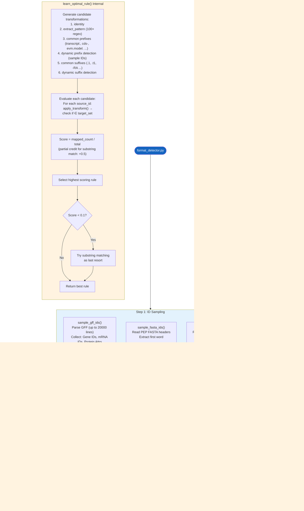

---

## 1. 依赖总览

### Python 标准库
`os` `sys` [re](file:///Users/baijiuzhuo/Downloads/pipeline/run_pipeline_v3.py#34-38) [json](file:///Users/baijiuzhuo/Downloads/pipeline/format_detector.py#45-48) `gzip` `logging`
`collections.Counter` `dataclasses` `typing`

### 第三方库
无（纯标准库实现）

---

## 2. 核心数据结构

### [FormatProfile](file:///Users/baijiuzhuo/Downloads/pipeline/format_detector.py#25-55) dataclass（L25-54）

| 字段 | 类型 | 默认值 | 说明 |
|---|---|---|---|
| `gff_feature_types` | List[str] | `[]` | GFF 中的 feature 类型 |
| `gff_id_attr` | str | `"ID"` | GFF ID 属性名 |
| `gff_parent_attr` | str | `"Parent"` | GFF Parent 属性名 |
| `gff_protein_attr` | str | `"ID"` | 蛋白 ID 来源属性 |
| `gff_has_hierarchy` | bool | `False` | 是否有 gene→mRNA→CDS 层级 |
| `gff_id_prefixes` | List[str] | `[]` | 检测到的 ID 前缀 |
| **`rule_gff_to_pep`** | Dict | `{type: "identity"}` | GFF → PEP ID 映射规则 |
| **`rule_gff_to_cds`** | Dict | `{type: "identity"}` | GFF → CDS ID 映射规则 |
| **`rule_pep_to_cds`** | Dict | `{type: "identity"}` | PEP → CDS ID 映射规则 |
| `source_type` | str | `"unknown"` | 来源类型推测（ncbi/ensembl/custom） |

支持 JSON 序列化/反序列化：[to_json()](file:///Users/baijiuzhuo/Downloads/pipeline/format_detector.py#45-48) / [from_json()](file:///Users/baijiuzhuo/Downloads/pipeline/format_detector.py#49-55)

### [TransformType](file:///Users/baijiuzhuo/Downloads/pipeline/format_detector.py#60-68) 类（L60-67）

| 类型 | 操作 | 示例 |
|---|---|---|
| `identity` | 原样返回 | `AT1G01010` → `AT1G01010` |
| `strip_prefix` | 去除前缀 | `cds-XP_123` → `XP_123` |
| `strip_suffix` | 去除后缀 | `AT1G01010.1` → `AT1G01010` |
| `regex` | 正则提取 group(1) | `gene:AT1G01010` → `AT1G01010` |
| `extract_pattern` | 用 100+ 模式提取基因ID | `lcl\|NC_001.1_cds_XP_123.1_456` → `XP_123.1` |
| `substring` | 子串匹配模式 | 特殊模式，匹配逻辑处理 |
| `lower` | 转小写 | `AT1G01010` → `at1g01010` |

---

## 3. GENE_ID_PATTERNS 模式库（L70-170）

预编译的 **100+ 正则表达式**，覆盖主流物种的 ID 格式：

| 物种/来源 | 模式示例 | ID 示例 |
|---|---|---|
| 棉花 (Gossypium) | `Gh_[AD]\d{2}G\d+` | `Gh_A01G0001` |
| 拟南芥 (Arabidopsis) | `AT[1-5MC]G\d{5}` | `AT1G01010` |
| 水稻 (Oryza) | `Os\d{2}g\d{7}` `LOC_Os\d{2}g\d+` | `Os01g0100100` |
| 玉米 (Zea mays) | `Zm\d+d\d+` | `Zm00001d000001` |
| 大豆 (Glycine) | `Glyma\.\d+G\d+` | `Glyma.01G000100` |
| 小麦 (Triticum) | `Traes[A-Z0-9]+` | `TraesCS1A01G000100` |
| 番茄 (Solanum) | `Solyc\d{2}g\d+` | `Solyc01g005000` |
| 葡萄 (Vitis) | `VIT_\d+s\d+g\d+` | `VIT_01s0011g00100` |
| NCBI RefSeq | `XP_\d+\.\d+` `NP_\d+\.\d+` 等 | `XP_012345678.1` |
| NCBI Gene | `LOC\d+` `gene-(LOC\d+)` `cds-(XP_\d+)` | `LOC12345678` |
| Ensembl | `ENS[A-Z]*[GTP]\d{11}` | `ENSG00000000001` |
| UniProt | `[OPQ][0-9][A-Z0-9]{3}[0-9]` | `P12345` |
| 通用模式 | `[A-Za-z]+\d+[Gg]\d+` | 兜底通配 |

> 模式按**优先级排序**：物种特异性高的在前，通用模式在后，避免错误匹配。

---

## 4. 核心函数详解

### 4.1 [apply_transform()](file:///Users/baijiuzhuo/Downloads/pipeline/format_detector.py#172-225)（L172-224）

输入一个字符串 + 一个规则字典，返回转换后的字符串。

支持的规则类型：
- `identity`：直接返回
- `strip_prefix`：去除 `val` 前缀（如 `cds-`、`evm.model.`）
- `strip_suffix`：去除 `val` 后缀（如 `.1`、`.t1`）
- `regex`：用 `val` 作为正则提取 `group(1)`
- `extract_pattern`：遍历 100+ `GENE_ID_PATTERNS`，提取首个匹配的 gene ID
- `substring`：特殊标记，实际匹配逻辑在外部处理
- `lower`：转小写

### 4.2 [learn_optimal_rule()](file:///Users/baijiuzhuo/Downloads/pipeline/format_detector.py#226-341)（L226-340）— 核心算法

**输入**：一组 source IDs + 一组 target IDs
**输出**：最优映射规则（Dict）

**算法流程**：

1. **生成候选转换规则**（L241-288）：
   - `identity`（原样匹配）
   - `extract_pattern`（100+ 正则模式提取）
   - **常见前缀**：`transcript:` `gene:` `cds:` `evm.model.` `rna-` `cds-` `ref|` 等 13 种
   - **动态前缀检测**：从 sample IDs 中按分隔符（`: . - _ |`）拆分，自动发现 1-2 级前缀
   - **常见后缀**：`.1` `.2` `.t1` `_P1` `-RA` `.p1` `-T1` 等 13 种
   - **动态后缀检测**：从 sample IDs 反向拆分发现后缀

2. **去重**（L291-297）：按 `type:val` 签名去重

3. **评估每个候选规则**（L305-324）：
   - 对 source_ids（最多抽样 2000 个）逐个 [apply_transform()](file:///Users/baijiuzhuo/Downloads/pipeline/format_detector.py#172-225)
   - 检查转换后是否 ∈ target_set
   - 精确匹配得 **1 分**，子串匹配得 **0.5 分**
   - Score = 总得分 / 测试样本数

4. **降级策略**（L327-338）：
   - 如果最佳得分 < 0.1（几乎匹配不上），尝试纯**子串匹配**模式
   - 如果子串匹配得分更高，返回 `{type: "substring"}`

### 4.3 [sample_gff_ids()](file:///Users/baijiuzhuo/Downloads/pipeline/format_detector.py#346-406)（L346-405）

从 GFF 文件中采样 ID，返回三个集合：

| 集合 | 来源 | 说明 |
|---|---|---|
| `g_ids` | `type=gene` 行的 `ID=` 属性 | 基因级 ID |
| `m_ids` | `type=mRNA/transcript` 行的 `ID=` 属性 | 转录本级 ID |
| `p_ids` | 所有行的 `protein_id`、`product`、`Name`、`Alias` 属性 + CDS 的 `ID` | 蛋白相关 ID |

- 支持 gzip 压缩文件
- 最多扫描 20000 非注释行
- 手写属性解析器（按 `;` 分割，按 `=` 拆键值对）

### 4.4 [sample_fasta_ids()](file:///Users/baijiuzhuo/Downloads/pipeline/format_detector.py#407-428)（L407-427）

从 FASTA 文件头行提取第一个 word 作为 ID：
- 读取 `>` 开头的行
- `header.split()[0]` 取第一个字段
- 支持 gzip
- 最多读 5000 条

### 4.5 [detect_formats()](file:///Users/baijiuzhuo/Downloads/pipeline/format_detector.py#433-529)（L433-528）— 入口函数

**三步流程**：

**Step 1**：采样三个文件的 ID
```
GFF → (gene_ids, mrna_ids, protein_attrs)
PEP → pep_ids
CDS → cds_ids
```

**Step 2**：学习三条映射规则

| 规则 | Source | Target | 用途 |
|---|---|---|---|
| `rule_gff_to_pep` | GFF protein_attrs 或 mRNA_IDs | PEP IDs | 序列提取 |
| `rule_gff_to_cds` | GFF mRNA_IDs | CDS IDs | Ka/Ks 分析 |
| `rule_pep_to_cds` | PEP IDs | CDS IDs | 密码子比对 |

对 `rule_gff_to_pep` 特殊处理：
- 同时尝试 protein_attrs→PEP 和 mRNA_IDs→PEP
- 对前 200 个样本快速打分
- 选得分更高的那条规则

**Step 3**：构建 [FormatProfile](file:///Users/baijiuzhuo/Downloads/pipeline/format_detector.py#25-55) 并返回

### 4.6 [normalize_id()](file:///Users/baijiuzhuo/Downloads/pipeline/format_detector.py#530-534)（L530-533）

公共 API，下游模块调用此函数转换 ID：
```python
pep_id = normalize_id(gff_mrna_id, profile.rule_gff_to_pep)
```

---

## 5. 输入/输出

### 输入
| 文件 | 必须 | 说明 |
|---|---|---|
| GFF3 文件 | **是** | 基因注释文件 |
| PEP FASTA | 否 | 蛋白质组序列 |
| CDS FASTA | 否 | CDS 核酸序列 |

### 输出
| 输出 | 说明 |
|---|---|
| [FormatProfile](file:///Users/baijiuzhuo/Downloads/pipeline/format_detector.py#25-55) 对象 | 内存中的格式描述 |
| `format_profile.json` | 序列化到磁盘的 JSON 文件 |

---

## 6. 关键设计决策

### 6.1 "Rosetta Stone" 设计理念
不同来源（NCBI、Ensembl、Phytozome、自定义注释）的 GFF/FASTA 文件使用不同的 ID 规范，没有统一标准。此模块通过**数据驱动学习**自动发现 ID 映射关系，而非硬编码规则。

### 6.2 机器学习式的规则评估
- 列举所有可能的转换候选
- 用"accuracy"指标评估每个候选
- 选择最优候选
- 等价于一个**离散搜索空间上的暴力最优解**

### 6.3 多层降级
`identity` → `strip_prefix/suffix` → `regex` → `extract_pattern` → `substring`
从最简单到最复杂，确保总能找到某种程度的匹配。

### 6.4 性能控制
- GFF 采样上限 20000 行（避免读取超大文件）
- FASTA 采样上限 5000 条
- 规则评估时 source_ids 抽样 2000 个
- 打分时快速抽样 200 个

---

## 7. 被调用方式

由 [run_pipeline_v3.py](file:///Users/baijiuzhuo/Downloads/pipeline/run_pipeline_v3.py) Step 0 延迟导入调用：
```python
from format_detector import detect_formats

profile = detect_formats(
    gff_path=config.get("gff"),
    pep_path=config.get("proteome"),
    cds_path=config.get("cds"),
    sample_lines=30,
    logger=logger
)
config['format_profile'] = asdict(profile)
profile.to_json(os.path.join(tmp_dir, "format_profile.json"))
```

下游模块（`universal_family_extractor.py`、`run_kaks_analysis.py` 等）通过 `FormatProfile.from_json()` 加载，使用 [normalize_id()](file:///Users/baijiuzhuo/Downloads/pipeline/format_detector.py#530-534) 转换 ID。

---

<div style="page-break-after: always;"></div>

<a id="mod-gff-normalizer"></a>

# gff_normalizer.py 技术报告

[⬆ 返回目录](#-目录点击跳转)

**文件**：[gff_normalizer.py](file:///Users/baijiuzhuo/Downloads/pipeline/gff_normalizer.py)
**行数**：614 行 | **大小**：~21 KB
**定位**：**GFF 预处理模块**——使用 AGAT 工具套件将各来源（NCBI/Ensembl/Phytozome/JGI/自定义）的 GFF 文件标准化为统一格式，包含重叠基因修复、原始 ID 恢复、统计报告、BED 转换等功能。

---

## 0. 流程图

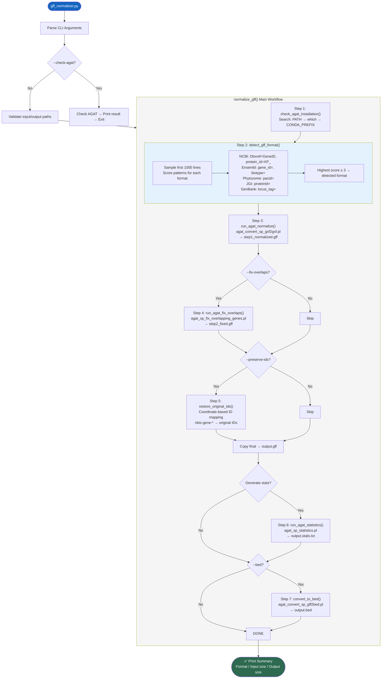

---

## 1. 依赖总览

### Python 标准库
[os](file:///Users/baijiuzhuo/Downloads/pipeline/interproscan_runner.py#189-244) `sys` `argparse` `subprocess` `shutil` `tempfile` `logging` `datetime` `gzip` [re](file:///Users/baijiuzhuo/Downloads/pipeline/run_pipeline_v3.py#34-38)

### 外部工具
| 工具 | 所属套件 | 用途 |
|---|---|---|
| `agat_convert_sp_gxf2gxf.pl` | AGAT | GFF 格式标准化 |
| `agat_sp_fix_overlapping_genes.pl` | AGAT | 修复重叠基因注释 |
| `agat_sp_statistics.pl` | AGAT | 生成 GFF 统计报告 |
| `agat_convert_sp_gff2bed.pl` | AGAT | GFF→BED 格式转换 |

> AGAT (Another Gff Analysis Toolkit) 依赖 Perl，通常通过 `conda install -c bioconda agat` 安装。

---

## 2. CLI 参数

| 参数 | 类型 | 说明 |
|---|---|---|
| `-i` / `--input` | str | 输入 GFF/GFF3 文件 |
| `-o` / `--output` | str | 输出标准化 GFF 文件 |
| `--fix-overlaps` | flag | 修复重叠基因（推荐用于低质量组装） |
| `--stats` | flag | 生成统计报告（默认 True） |
| `--no-stats` | flag | 跳过统计生成 |
| `--bed` | flag | 同时生成 BED 文件 |
| `--preserve-ids` | flag | 恢复 AGAT 重命名的原始 Gene ID |
| `-v` / `--verbose` | flag | 详细输出 |
| `--check-agat` | flag | 仅检查 AGAT 安装状态 |

---

## 3. 核心函数详解

### 3.1 [check_agat_installation()](file:///Users/baijiuzhuo/Downloads/pipeline/gff_normalizer.py#44-78)（L44-77）

三级 AGAT 安装检测：
1. 直接执行 `agat_convert_sp_gxf2gxf.pl --version`
2. `which` 命令查找
3. 检查 `CONDA_PREFIX/bin/` 目录

### 3.2 [detect_gff_format()](file:///Users/baijiuzhuo/Downloads/pipeline/gff_normalizer.py#80-155)（L80-154）

**加权评分系统**检测 GFF 来源：

| 来源 | 检测特征 | 权重 |
|---|---|---|
| NCBI | Header含"NCBI/RefSeq" | +10 |
| NCBI | `Dbxref=GeneID:` | +2 |
| NCBI | `protein_id=XP_/NP_` | +3 |
| Ensembl | Header含"Ensembl" | +10 |
| Ensembl | `gene_id=` + `transcript_id=` | +2 |
| Ensembl | `biotype=` | +1 |
| Phytozome | Header含"phytozome" | +10 |
| Phytozome | `pacid=` | +3 |
| JGI | `proteinId=` / `transcriptId=` | +3 |
| GenBank | `locus_tag=` / `product=` | +1 |

采样前 1000 行，最高分 ≥ 3 → 输出对应格式。支持 gzip 压缩文件。

### 3.3 [run_agat_normalize()](file:///Users/baijiuzhuo/Downloads/pipeline/gff_normalizer.py#157-199)（L157-198）

AGAT 核心标准化：
```bash
agat_convert_sp_gxf2gxf.pl -g input.gff -o output.gff
```

- **超时**：1 小时（大型 GFF 可能数十 GB）
- 标准化内容：
  - 修复 GFF3 格式错误
  - 补充缺失的 parent-child 关系
  - 统一 feature type 命名
  - 添加缺失的 gene feature

### 3.4 [run_agat_fix_overlaps()](file:///Users/baijiuzhuo/Downloads/pipeline/gff_normalizer.py#201-264)（L201-263）

修复重叠基因注释（低质量组装常见问题）：
```bash
agat_sp_fix_overlapping_genes.pl -gff input.gff -o output.gff
```

**兼容性处理**：
- AGAT 某些版本拼写为 `overlaping`（单 p），脚本同时尝试两种拼写
- 执行失败时降级为直接复制输入文件

### 3.5 [restore_original_ids()](file:///Users/baijiuzhuo/Downloads/pipeline/gff_normalizer.py#347-445)（L347-444）

**问题**：AGAT 标准化时会将原始 Gene ID 重命名为 `nbis-gene-*` 格式。
**解决方案**：基于坐标的 ID 恢复映射。

**算法**：
1. 从原始 GFF 建立 [(chr, start, end) → original_id](file:///Users/baijiuzhuo/Downloads/pipeline/run_pipeline_v3.py#39-48) 映射
2. 扫描 AGAT 输出，将 `nbis-gene-*` ID 通过坐标匹配替换回原始 ID
3. 同步更新所有 `Parent=nbis-gene-*` 引用
4. 使用 `dict` 直接查找（O(1)），避免逐行正则替换循环（O(n)）

### 3.6 [run_agat_statistics()](file:///Users/baijiuzhuo/Downloads/pipeline/gff_normalizer.py#266-309)（L266-308）

生成 GFF 统计报告：
```bash
agat_sp_statistics.pl -gff input.gff -o output.stats.txt
```

从结果中提取并打印 Gene 和 mRNA 数量。

### 3.7 [convert_to_bed()](file:///Users/baijiuzhuo/Downloads/pipeline/gff_normalizer.py#311-345)（L311-344）

GFF→BED 格式转换（用于共线性分析）：
```bash
agat_convert_sp_gff2bed.pl -gff input.gff -o output.bed
```

### 3.8 [normalize_gff()](file:///Users/baijiuzhuo/Downloads/pipeline/gff_normalizer.py#447-538)（L447-537）— 主编排函数

在 `tempfile.TemporaryDirectory()` 中串行执行所有步骤，最终复制结果到目标路径。中间文件自动清理。

---

## 4. 输入/输出

### 输入
| 文件 | 说明 |
|---|---|
| GFF/GFF3 文件 | 原始基因注释文件（支持 gzip） |

### 输出
| 文件 | 条件 | 说明 |
|---|---|---|
| `{output}.gff` | 始终 | 标准化后的 GFF3 |
| `{output}.stats.txt` | `--stats` | AGAT 统计报告 |
| `{output}.bed` | `--bed` | BED 格式转换 |

---

## 5. 关键设计决策

### 5.1 AGAT 选择
AGAT 是目前最全面的 GFF 操作工具，比 BEDtools/GenomeTools 更完善地处理 GFF3 层级结构错误。

### 5.2 坐标恢复策略
AGAT 重命名 ID 是其设计行为（保证唯一性）。坐标恢复利用 [(chr, start, end)](file:///Users/baijiuzhuo/Downloads/pipeline/run_pipeline_v3.py#39-48) 元组的唯一性，比复杂的名称映射更鲁棒。

### 5.3 临时目录
使用 `tempfile.TemporaryDirectory()` 确保中间文件自动清理，避免磁盘残留。

---

## 6. 错误处理

| 场景 | 处理 |
|---|---|
| AGAT 未安装 | 打印安装指南 → 返回 False |
| 输入文件不存在 | 错误日志 → 返回 False |
| 标准化超时（>1h） | 错误日志 → 返回 False |
| 重叠修复失败 | Warning → 使用标准化输出继续 |
| ID 恢复时无法读原始 GFF | Warning → 直接复制 AGAT 输出 |
| 统计生成失败 | Warning → 继续（不阻断） |
| BED 转换失败 | Warning → 继续 |

---

## 7. 被调用方式

由 [run_pipeline_v3.py](file:///Users/baijiuzhuo/Downloads/pipeline/run_pipeline_v3.py) 在 Step 0 后可选调用：

```python
from gff_normalizer import normalize_gff, check_agat_installation

if config.get("normalize_gff"):
    if check_agat_installation():
        normalize_gff(
            input_gff=config["gff"],
            output_gff=normalized_path,
            fix_overlaps=config.get("gff_fix_overlaps", False),
            preserve_ids=config.get("gff_preserve_ids", True)
        )
```

---

<div style="page-break-after: always;"></div>

<a id="mod-retrieve-seeds"></a>

# retrieve_seeds.py 技术报告

[⬆ 返回目录](#-目录点击跳转)

**文件**：[retrieve_seeds.py](file:///Users/baijiuzhuo/Downloads/pipeline/retrieve_seeds.py)
**行数**：476 行 | **大小**：~19 KB
**定位**：**种子序列检索模块**——从三个公共蛋白数据库并行检索种子序列，按质量分层（Gold/Silver），去重后输出两个 FASTA 文件。

---

## 0. 流程图

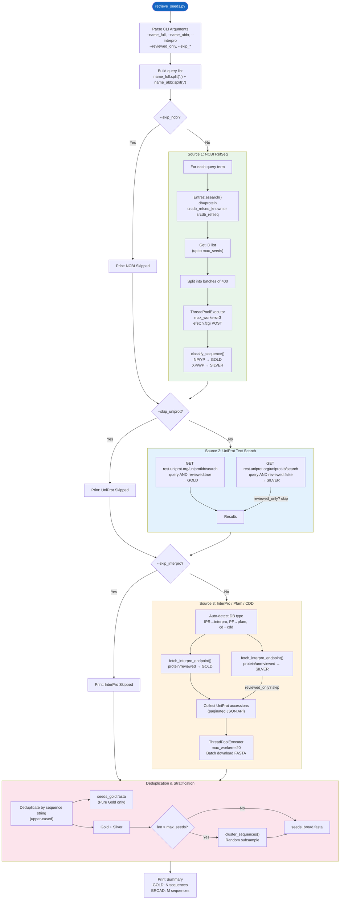

---

## 1. 依赖总览

### Python 标准库
`argparse` `sys` [io](file:///Users/baijiuzhuo/Downloads/pipeline/ncbi/retrieve_seeds.py#20-33) `time` `os` `random`

### 第三方库
| 库 | 用途 |
|---|---|
| `requests` | HTTP 请求（UniProt REST API、NCBI efetch） |
| `requests.adapters.HTTPAdapter` | 挂载自定义重试策略 |
| `urllib3.util.retry.Retry` | 定义重试规则（5次、指数退避） |
| `concurrent.futures.ThreadPoolExecutor` | 并行批量下载 |
| `Bio.Entrez`（Biopython） | NCBI E-utilities（esearch 检索） |
| `Bio.SeqIO`（Biopython） | FASTA 解析与写入 |

### 内部依赖
| 模块 | 功能 |
|---|---|
| `pipeline_utils.cluster_sequences` | 序列聚类/子采样（可选，ImportError 时降级为随机采样） |

### 外部 API
| API | 端点 | 用途 |
|---|---|---|
| NCBI E-utilities | `eutils.ncbi.nlm.nih.gov/entrez/eutils/esearch.fcgi` | 蛋白序列 ID 检索 |
| NCBI E-utilities | `eutils.ncbi.nlm.nih.gov/entrez/eutils/efetch.fcgi` | 批量 FASTA 下载 |
| UniProt REST | `rest.uniprot.org/uniprotkb/search` | 文本检索（Swiss-Prot/TrEMBL） |
| UniProt REST | `rest.uniprot.org/uniprotkb/accessions` | 按 accession 批量下载 FASTA |
| InterPro REST | `www.ebi.ac.uk/interpro/api/protein/{reviewed,unreviewed}/entry/{db}/{acc}/` | Domain 关联蛋白 accession 检索 |

---

## 2. CLI 参数

| 参数 | 类型 | 必填 | 说明 |
|---|---|---|---|
| `--name_full` | str | 否 | 完整查询名（逗号分隔支持多查询） |
| `--name_abbr` | str | 否 | 缩写查询名（逗号分隔） |
| `--interpro` | str | 否 | InterPro/Pfam/CDD ID（逗号分隔） |
| `--email` | str | **是** | API 使用邮箱 |
| `--out_prefix` | str | **是** | 输出文件前缀 |
| `--max_seeds` | int | 否 | 最大种子数（默认 10000） |
| `--taxid` | str | 否 | NCBI 分类 ID（物种过滤） |
| `--reviewed_only` | flag | 否 | 仅下载 Gold（Reviewed）序列 |
| `--api_key` | str | 否 | NCBI API Key（提升速率至 10/s） |
| `--skip_ncbi` | flag | 否 | 跳过 NCBI 数据源 |
| `--skip_uniprot` | flag | 否 | 跳过 UniProt 数据源 |
| `--skip_interpro` | flag | 否 | 跳过 InterPro 数据源 |

---

## 3. 核心函数详解

### 3.1 [get_session()](file:///Users/baijiuzhuo/Downloads/pipeline/ncbi/retrieve_seeds.py#20-33)（L20-32）
创建带重试策略的 `requests.Session`：
- **重试次数**：5
- **退避因子**：1（1s, 2s, 4s, 8s, 16s 指数退避）
- **重试状态码**：429, 500, 502, 503, 504
- **允许方法**：HEAD, GET, POST

### 3.2 [classify_sequence(rec, source)](file:///Users/baijiuzhuo/Downloads/pipeline/ncbi/retrieve_seeds.py#43-66)（L43-65）

Gold/Silver 二级质量分层系统：

| 来源 | GOLD 条件 | SILVER 条件 |
|---|---|---|
| NCBI | `NP_` 或 `YP_` 前缀 | `XP_`、`WP_` 或其他 |
| InterPro | 由检索端点决定（`/protein/reviewed`） | 由检索端点决定（`/protein/unreviewed`） |
| UniProt | `reviewed:true`（Swiss-Prot） | `reviewed:false`（TrEMBL） |

分类结果存储在 `rec._classification` 属性中。

### 3.3 [get_ncbi_many()](file:///Users/baijiuzhuo/Downloads/pipeline/retrieve_seeds.py#67-193)（L67-192）
NCBI RefSeq 多查询批量检索：

**阶段 1：检索 ID**
- 使用 `Entrez.esearch()` 在 `protein` 库中检索
- `reviewed_only=True` 时使用 `srcdb_refseq_known[PROP]`（排除 XP 预测蛋白）
- `reviewed_only=False` 时使用 `srcdb_refseq[PROP]`（包含全部 RefSeq）
- 多查询间有 2-3s 随机延迟避免限速
- 检索失败重试 5 次，429 限速时递增等待时间

**阶段 2：批量下载 FASTA**
- 将 ID 列表切分为每批 **400 个**
- 使用 `ThreadPoolExecutor(max_workers=3)` 并行下载（控制并发避免限速）
- 通过 `efetch.fcgi` POST 请求下载 FASTA
- 每批自带 0.5-1s 随机延迟（"礼貌模式"）
- 单批失败重试 5 次，429 时递增等待
- 下载后立即解析并执行 [classify_sequence()](file:///Users/baijiuzhuo/Downloads/pipeline/ncbi/retrieve_seeds.py#43-66) 分类
- `reviewed_only=True` 时**双重过滤**：下载后再次验证 classification tag

### 3.4 [get_uniprot_seeds_by_name()](file:///Users/baijiuzhuo/Downloads/pipeline/retrieve_seeds.py#240-308)（L240-307）
UniProt REST API 文本检索：

**Gold 检索**
- URL：`rest.uniprot.org/uniprotkb/search`
- Query：`{query} AND (reviewed:true)`
- Format：`fasta`
- 单页最多 2000 条（对 Swiss-Prot Gold 通常足够）

**Silver 检索**（`reviewed_only=False` 时）
- Query：`{query} AND (reviewed:false)`
- 限制 500 条（TrEMBL 数据量极大，仅取顶部样本）
- 剩余配额 = `max_records - len(gold_results)`

每条记录通过 `rec._classification` 标记为 `GOLD` 或 `SILVER`。

### 3.5 [get_interpro_seeds()](file:///Users/baijiuzhuo/Downloads/pipeline/retrieve_seeds.py#194-239)（L194-238）
InterPro Domain 关联序列检索：

**步骤 1：自动识别数据库类型**（L202-207）

| ID 前缀 | 数据库 |
|---|---|
| `IPR` | InterPro |
| `PF` / `pfam` | Pfam |
| [cd](file:///Users/baijiuzhuo/Downloads/pipeline/ncbi/run_pipeline_v3.py#453-460) / `sd` | CDD |

**步骤 2：分层检索**
- Gold：调用 [fetch_interpro_endpoint()](file:///Users/baijiuzhuo/Downloads/pipeline/ncbi/retrieve_seeds.py#309-381) 的 `protein/reviewed` 端点
- Silver：调用 `protein/unreviewed` 端点（`reviewed_only` 时跳过）
- Silver 配额 = `max_records - len(gold)`

### 3.6 [fetch_interpro_endpoint()](file:///Users/baijiuzhuo/Downloads/pipeline/ncbi/retrieve_seeds.py#309-381)（L309-380）
InterPro API 底层检索 + UniProt 批量下载：

**阶段 1：收集 UniProt Accession**（L318-329）
- 分页请求 InterPro JSON API
- URL 格式：`/api/{endpoint_type}/entry/{db}/{acc}/`
- 支持 taxonomy 过滤：追加 `taxonomy/uniprot/{taxid}/`
- 跟随 `next` 字段自动翻页直到达到 `limit`

**阶段 2：批量下载 FASTA**（L337-380）
- 将 accessions 切分为每批 **100 个**
- 使用 `ThreadPoolExecutor(max_workers=20)` **高并发**下载（UniProt 对批量 accession 查询限制宽松）
- 通过 `rest.uniprot.org/uniprotkb/accessions` 端点批量获取 FASTA
- 返回值为 FASTA 字符串列表（每条记录一个字符串），由调用者解析为 SeqRecord

### 3.7 [main()](file:///Users/baijiuzhuo/Downloads/pipeline/retrieve_seeds.py#382-464)（L382-475）
主流程编排：

1. 解析 CLI 参数
2. 构建查询列表（`name_full` + `name_abbr` 合并，逗号拆分）
3. 按顺序调用三个数据源（可通过 `--skip_*` 跳过）
4. 全局去重（按**序列字符串**去重，不是按 ID）
5. 按 `_classification` 标签分层为 `gold_recs` 和 `silver_recs`
6. 写出两个文件：
   - `{prefix}_seeds_gold.fasta`：仅 Gold
   - `{prefix}_seeds_broad.fasta`：Gold + Silver（超过 `max_seeds` 时子采样）

---

## 4. 关键设计决策

### 4.1 Gold/Silver 双层质量体系
- **Gold**：经过实验验证的蛋白（NP_/YP_/Swiss-Prot/Reviewed）→ 用于构建高质量 HMM
- **Silver**：计算预测序列（XP_/TrEMBL/Unreviewed）→ 扩展搜索范围
- 两层分别输出，下游 [build_hmm.py](file:///Users/baijiuzhuo/Downloads/pipeline/build_hmm.py) 分别构建 Gold HMM 和 Broad HMM

### 4.2 去重策略
- 按**序列字符串**（`str(rec.seq).upper()`）去重，而非按 ID
- 同一蛋白在 NCBI、UniProt、InterPro 中可能有不同 ID 但序列相同
- 序列级去重确保最大限度移除冗余

### 4.3 并行下载策略
| 数据源 | 并发数 | 原因 |
|---|---|---|
| NCBI efetch | `max_workers=3` | NCBI 严格限速（3-10 req/s），高并发会触发 429 |
| UniProt accessions | `max_workers=20` | UniProt 批量端点限制宽松，可高并发 |

### 4.4 速率限制处理
- NCBI：查询间 2-3s 延迟 + 批次间 0.5-1s 延迟 + 429 指数退避
- InterPro/UniProt：依赖 `Retry` 策略自动处理
- 所有延迟带**随机抖动**（jitter）避免多实例同步碰撞

### 4.5 Broad 集子采样
- 当 `broad_recs > max_seeds` 时，调用 [cluster_sequences()](file:///Users/baijiuzhuo/Downloads/pipeline/retrieve_seeds.py#38-41) 降采样
- 优先使用 `pipeline_utils` 中基于代表性的聚类
- 模块不可用时降级为 `random.sample()`

---

## 5. 输入/输出

### 输入
- 无文件输入，全部从网络 API 检索

### 输出
| 文件 | 内容 | 说明 |
|---|---|---|
| `{prefix}_seeds_gold.fasta` | 仅 Gold 序列 | NP/YP/Swiss-Prot/Reviewed |
| `{prefix}_seeds_broad.fasta` | Gold + Silver | 全部去重后序列（可能子采样） |

---

## 6. 错误处理

| 场景 | 处理 |
|---|---|
| NCBI esearch 失败 | 重试 5 次，429 时指数退避 |
| NCBI efetch 批次失败 | 重试 5 次，返回空列表（不中断整体） |
| UniProt 请求失败 | 捕获 Exception，打印错误，继续 |
| InterPro 翻页失败 | `break` 跳出分页循环，使用已收集的 accessions |
| `pipeline_utils` 导入失败 | 降级为 `random.sample()` 子采样 |
| 全部数据源返回 0 序列 | 写出空 FASTA（由上层 [run_pipeline_v3.py](file:///Users/baijiuzhuo/Downloads/pipeline/run_pipeline_v3.py) 检查并报错） |

---

<div style="page-break-after: always;"></div>

<a id="mod-build-hmm"></a>

# build_hmm.py 技术报告

[⬆ 返回目录](#-目录点击跳转)

**文件**：[build_hmm.py](file:///Users/baijiuzhuo/Downloads/pipeline/build_hmm.py)
**行数**：223 行 | **大小**：~9 KB
**定位**：**HMM Profile 构建模块**——将种子序列合并去重、长度过滤、MAFFT 多序列比对、MSA 修剪后，使用 HMMER [hmmbuild](file:///Users/baijiuzhuo/Downloads/pipeline/ncbi/build_hmm.py#141-166) 构建 Hidden Markov Model。

---

## 0. 流程图

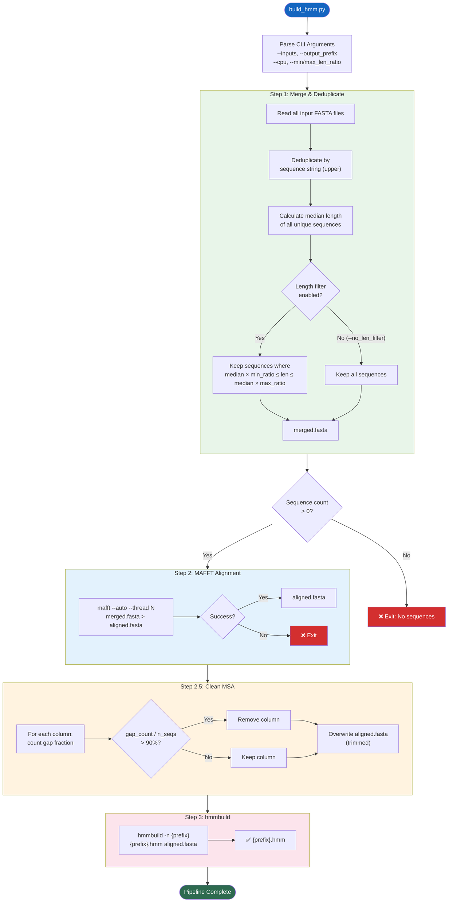

---

## 1. 依赖总览

### Python 标准库
`argparse` `subprocess` `os` `sys` `shutil`

### 第三方库
| 库 | 用途 |
|---|---|
| `Bio.SeqIO`（Biopython） | FASTA 文件读取、写入、序列操作 |

### 外部二进制工具
| 工具 | 版本要求 | 用途 |
|---|---|---|
| [mafft](file:///Users/baijiuzhuo/Downloads/pipeline/ncbi/build_hmm.py#77-104) | ≥ 7.0 | 多序列比对（自动选择最优算法） |
| [hmmbuild](file:///Users/baijiuzhuo/Downloads/pipeline/ncbi/build_hmm.py#141-166) | HMMER ≥ 3.0 | 从 MSA 构建 HMM Profile |

---

## 2. CLI 参数

| 参数 | 类型 | 默认值 | 说明 |
|---|---|---|---|
| `--inputs` | str[] | **必填** | 输入 FASTA 文件列表（支持多文件） |
| `--output_prefix` | str | `gene_family` | 输出文件前缀 |
| `--threads` | int | `4` | MAFFT 线程数 |
| `--cpu` | int | — | `--threads` 的别名（优先级更高） |
| `--min_len_ratio` | float | `0.75` | 最小长度比（相对中位数），设 0 禁用 |
| `--max_len_ratio` | float | `1.25` | 最大长度比（相对中位数），设 0 禁用 |
| `--no_len_filter` | flag | — | 完全禁用长度过滤 |

---

## 3. 核心函数详解

### 3.1 [merge_and_deduplicate()](file:///Users/baijiuzhuo/Downloads/pipeline/build_hmm.py#20-76)（L20-75）

**输入**：多个 FASTA 文件路径列表
**输出**：单个合并去重后的 FASTA 文件

**逻辑流程**：

1. **遍历所有输入文件**，逐条读取 SeqRecord
2. **序列级去重**：以 `str(seq).upper()` 为唯一键，放入 [set](file:///Users/baijiuzhuo/Downloads/pipeline/ncbi/run_pipeline_v3.py#37-46) 判重
   - 跳过空序列
   - 保留原始 ID（不修改 header）
3. **长度过滤**（可配置）：
   - 计算所有序列长度的**中位数**（`lengths[len//2]`）
   - 定义合法范围：`[median × min_ratio, median × max_ratio]`
   - 默认：`[median × 0.75, median × 1.25]`
   - 过滤掉过短/过长的异常序列
   - 打印丢弃统计
4. 写出过滤后的序列到 `{prefix}_merged.fasta`

**设计意图**：
- 长度过滤去除片段序列和多域融合蛋白，提高 HMM 建模质量
- 使用中位数（而非均值）对异常值更鲁棒

### 3.2 [run_mafft()](file:///Users/baijiuzhuo/Downloads/pipeline/ncbi/build_hmm.py#77-104)（L77-103）

**输入**：合并后的 FASTA 文件
**输出**：对齐后的 MSA FASTA 文件

**MAFFT 调用细节**：
```
mafft --auto --thread {N} {input} > {output}
```

- `--auto`：MAFFT 根据序列数和长度**自动选择最优算法**：
  - ≤ 200 序列：L-INS-i（高精度迭代比对）
  - 200-2000 序列：FFT-NS-i（中等精度）
  - \> 2000 序列：FFT-NS-2（快速模式）
- `--thread`：指定 CPU 线程数
- 二进制查找：优先 `shutil.which("mafft")`，回退 [/usr/local/bin/mafft](file:///usr/local/bin/mafft)
- stdout 重定向到输出文件，stderr 用于错误信息

### 3.3 [clean_msa()](file:///Users/baijiuzhuo/Downloads/pipeline/ncbi/build_hmm.py#105-140)（L105-139）

**输入**：原始 MSA 文件
**输出**：修剪后的 MSA 文件（原地覆盖）

**修剪逻辑**：
1. 逐列扫描 MSA 矩阵
2. 对每一列统计 gap（`-`）占比
3. **保留**：gap 占比 ≤ 90% 的列
4. **删除**：gap 占比 > 90% 的列（几乎全是 gap 的插入位置）
5. 重建序列并覆盖原文件

**参数**：`max_gap_fraction=0.9`（硬编码，不可通过 CLI 调整）

**设计意图**：
- 去除低信息量的 gap-heavy 列
- 减少 HMM 模型中的噪声插入状态
- 产生更紧凑更准确的 Profile

### 3.4 [run_hmmbuild()](file:///Users/baijiuzhuo/Downloads/pipeline/ncbi/build_hmm.py#141-166)（L141-165）

**输入**：修剪后的 MSA 文件
**输出**：HMM Profile 文件（`.hmm`）

**hmmbuild 调用**：
```
hmmbuild [-n {name}] {output.hmm} {input.msa}
```

- `-n`：为 HMM 设置内部名称（使用 `output_prefix`）
- 直接调用 `subprocess.run()`，不重定向 stdout（hmmbuild 输出到终端供用户查看统计信息）

---

## 4. [main()](file:///Users/baijiuzhuo/Downloads/pipeline/ncbi/retrieve_seeds.py#382-469) 编排流程（L167-222）

```
Step 1: merge_and_deduplicate()  →  {prefix}_merged.fasta
    ↓  count == 0 → exit(1)
Step 2: run_mafft()              →  {prefix}_aligned.fasta
    ↓  failed → exit(1)
Step 2.5: clean_msa()            →  {prefix}_aligned.fasta (overwritten)
    ↓  failed → warning, use original
Step 3: run_hmmbuild()           →  {prefix}.hmm
    ↓  failed → exit(1)
Done ✅
```

**线程处理**：`args.cpu` 优先于 `args.threads`（L183），确保上层传递的 `--cpu` 参数被正确使用。

---

## 5. 输入/输出

### 输入
| 文件 | 来源 | 说明 |
|---|---|---|
| 多个 FASTA 文件 | [retrieve_seeds.py](file:///Users/baijiuzhuo/Downloads/pipeline/retrieve_seeds.py) | `seeds_gold.fasta` 或 `seeds_broad.fasta` |

### 输出
| 文件 | 说明 |
|---|---|
| `{prefix}_merged.fasta` | 合并去重 + 长度过滤后的种子序列 |
| `{prefix}_aligned.fasta` | MAFFT 对齐 + gap 修剪后的 MSA |
| `{prefix}.hmm` | 最终 HMM Profile（hmmsearch 使用） |

---

## 6. 关键设计决策

### 6.1 长度过滤的必要性
种子序列来自 3 个数据库，难免混入：
- **片段蛋白**（部分测序 / UniProt fragment）→ 拉低 HMM 质量
- **多域融合蛋白**（目标域 + 其他域连成一条链）→ 引入噪声匹配

基于中位数的范围过滤（默认 ±25%）在保留主体的同时移除两端异常值。

### 6.2 两阶段 MSA 修剪
1. **MAFFT `--auto`** 自动选择算法（粗对齐）
2. **[clean_msa()](file:///Users/baijiuzhuo/Downloads/pipeline/ncbi/build_hmm.py#105-140) 去除 90%+ gap 列**（精修剪）

两步结合在精度和性能之间取得平衡。

### 6.3 原地覆盖 MSA
[clean_msa()](file:///Users/baijiuzhuo/Downloads/pipeline/ncbi/build_hmm.py#105-140) 输入和输出为**同一文件**（L208），减少中间文件数量，简化下游路径管理。

---

## 7. 错误处理

| 场景 | 处理 |
|---|---|
| 输入文件不存在 | Warning 跳过该文件，继续处理其他文件 |
| FASTA 解析错误 | 捕获 Exception，跳过该文件 |
| 合并后 0 条序列 | `sys.exit(1)` 终止 |
| MAFFT 未安装 | `FileNotFoundError` → 终止 |
| MAFFT 对齐失败 | `CalledProcessError` → 终止 |
| MSA 修剪失败 | Warning，使用原始未修剪的 MSA 继续 |
| hmmbuild 未安装 | `FileNotFoundError` → 终止 |
| hmmbuild 失败 | `CalledProcessError` → 终止 |

---

## 8. 被调用方式

由 [run_pipeline_v3.py](file:///Users/baijiuzhuo/Downloads/pipeline/run_pipeline_v3.py) 的 [_build_hmm_cmd()](file:///Users/baijiuzhuo/Downloads/pipeline/ncbi/run_pipeline_v3.py#267-281) 辅助函数构建命令并调用：

```python
# Gold HMM
python build_hmm.py \
    --inputs seeds_gold.fasta \
    --output_prefix {family}_gold \
    --cpu {cpu} \
    [--min_len_ratio 0.75 --max_len_ratio 1.25 | --no_len_filter]

# Broad HMM (reviewed_only=false 时)
python build_hmm.py \
    --inputs seeds_broad.fasta \
    --output_prefix {family}_broad \
    --cpu {cpu} \
    [--min_len_ratio 0.75 --max_len_ratio 1.25 | --no_len_filter]
```

---

<div style="page-break-after: always;"></div>

<a id="mod-search-extract"></a>

# search_extract.py 技术报告

[⬆ 返回目录](#-目录点击跳转)

**文件**：[search_extract.py](file:///Users/baijiuzhuo/Downloads/pipeline/search_extract.py)
**行数**：140 行 | **大小**：~5 KB
**定位**：**HMM 搜索与序列提取模块**——使用 HMMER [hmmsearch](file:///Users/baijiuzhuo/Downloads/pipeline/search_extract.py#19-48) 将 HMM Profile 搜索目标蛋白质组，解析表格结果，按 E-value 过滤，并从原始 FASTA 中提取命中序列。

---

## 0. 流程图

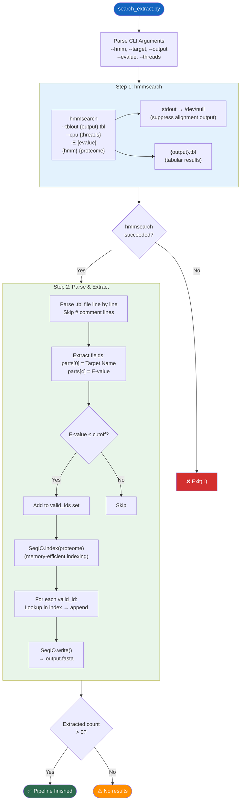

---

## 1. 依赖总览

### Python 标准库
`argparse` `subprocess` `os` `sys`

### 第三方库
| 库 | 用途 |
|---|---|
| `Bio.SeqIO`（Biopython） | FASTA 索引读取与序列写出 |

### 外部二进制工具
| 工具 | 版本要求 | 用途 |
|---|---|---|
| [hmmsearch](file:///Users/baijiuzhuo/Downloads/pipeline/search_extract.py#19-48) | HMMER ≥ 3.0 | 使用 HMM Profile 搜索蛋白序列库 |

---

## 2. CLI 参数

| 参数 | 类型 | 默认值 | 说明 |
|---|---|---|---|
| `--hmm` | str | **必填** | HMM Profile 文件路径（`.hmm`） |
| `--target` | str | **必填** | 目标蛋白质组 FASTA 文件 |
| `--output` | str | **必填** | 输出候选序列 FASTA 文件名 |
| `--evalue` | float | `1e-10` | E-value 过滤阈值 |
| `--threads` | int | `4` | hmmsearch CPU 线程数 |

---

## 3. 核心函数详解

### 3.1 [run_hmmsearch()](file:///Users/baijiuzhuo/Downloads/pipeline/search_extract.py#19-48)（L19-47）

**hmmsearch 命令构建**：
```bash
hmmsearch --tblout {output}.tbl --cpu {threads} -E {evalue} {hmm} {proteome}
```

**参数解析**：
| 参数 | 含义 |
|---|---|
| `--tblout` | 输出**每个目标序列一行**的表格格式（per-target summary） |
| `--cpu` | 搜索线程数 |
| `-E` | 全序列 E-value **报告**阈值（减小输出文件体积） |

**关键细节**：
- `stdout=subprocess.DEVNULL`：hmmsearch 默认将完整比对结果输出到 stdout（可能上百 MB），此处丢弃，仅保留 `--tblout` 表格
- E-value 在此处作为**报告阈值**（`-E`），后续 [parse_and_extract()](file:///Users/baijiuzhuo/Downloads/pipeline/search_extract.py#49-112) 中再做精确过滤

### 3.2 [parse_and_extract()](file:///Users/baijiuzhuo/Downloads/pipeline/search_extract.py#49-112)（L49-111）

**阶段 1：解析 tblout 表格**（L57-80）

tblout 格式说明（HMMER 标准）：
```
# target name   accession  query name  accession  E-value  score  bias ...
protein_id_001  -          family_hmm  -          1.2e-45  152.3  0.1  ...
```

解析逻辑：
1. 跳过 `#` 开头的注释行
2. 按空格 split（注意：tblout 是**空格分隔**而非 Tab）
3. 校验至少 19 列（tblout 标准列数）
4. 提取 `parts[0]`（Target Name）和 `parts[4]`（Full sequence E-value）
5. E-value ≤ cutoff → 加入 `valid_ids` 集合

**阶段 2：提取序列**（L88-111）

使用 `SeqIO.index()` 而非 `SeqIO.to_dict()`：
- `SeqIO.index()` 创建**磁盘索引**，不将全部序列加载到内存
- 适合大型蛋白质组文件（几十 MB 到几百 MB）
- 按 ID 随机访问：`proteome_dict[pid]`
- 找不到的 ID 打印 Warning（不中断流程）
- 最后用 `SeqIO.write()` 输出所有提取的序列

---

## 4. [main()](file:///Users/baijiuzhuo/Downloads/pipeline/retrieve_seeds.py#382-473) 编排（L113-139）

```
Step 1: run_hmmsearch(hmm, proteome) → {output}.tbl
    ↓  failed → exit(1)
Step 2: parse_and_extract(tbl, proteome) → {output}.fasta
    ↓  count == 0 → "No results" (不退出)
    ↓  count > 0 → "Success"
```

中间表格文件命名规则：`{output}.tbl`（即 `hits_hmm_gold.fasta.tbl`）

---

## 5. 输入/输出

### 输入
| 文件 | 来源 | 说明 |
|---|---|---|
| `{family}_{tier}.hmm` | [build_hmm.py](file:///Users/baijiuzhuo/Downloads/pipeline/build_hmm.py) | HMM Profile（Gold 或 Broad） |
| proteome FASTA | 用户提供 | 目标物种蛋白质组 |

### 输出
| 文件 | 说明 |
|---|---|
| `{output}.tbl` | hmmsearch 表格结果（中间文件） |
| `{output}` | 提取出的候选蛋白序列 FASTA |

---

## 6. 关键设计决策

### 6.1 双重 E-value 过滤
- **第一层**：hmmsearch `-E` 参数（报告级，减少表格大小）
- **第二层**：[parse_and_extract()](file:///Users/baijiuzhuo/Downloads/pipeline/search_extract.py#49-112) 中的精确过滤（`parts[4] ≤ evalue_cutoff`）
- 两层使用**相同阈值**，但第一层是 hmmsearch 内部过滤（可能有细微精度差异），第二层是精确控制

### 6.2 SeqIO.index vs SeqIO.to_dict
选择 `SeqIO.index()`（磁盘索引）而非 `SeqIO.to_dict()`（内存字典）：
- 对于典型蛋白质组（30-100MB），index 更节省内存
- 随机访问性能足够（基于文件偏移量）
- 代码注释中提到对 <100MB 文件 dict 更快，但最终选择了更安全的 index

### 6.3 stdout 静默
hmmsearch 默认输出完整的比对结果到 stdout，包括每个域的详细比对图。对于大型蛋白质组可能产生数百 MB 输出。使用 `subprocess.DEVNULL` 丢弃，仅保留结构化的 tblout。

---

## 7. 错误处理

| 场景 | 处理 |
|---|---|
| hmmsearch 未安装 | `FileNotFoundError` → 终止 |
| hmmsearch 执行失败 | `CalledProcessError` → 终止 |
| tbl 文件解析错误 | 捕获 Exception → 返回 0 |
| E-value 解析为非数字 | `ValueError` → 跳过该行 |
| 提取时 ID 在 proteome 中不存在 | Warning → 跳过该 ID（继续提取其他） |
| 最终 0 条命中 | 打印 "No results"（不 exit，由上层处理） |

---

## 8. 被调用方式

由 [run_pipeline_v3.py](file:///Users/baijiuzhuo/Downloads/pipeline/run_pipeline_v3.py) 在 Quad-Core Search 阶段调用（Step 3 的 Stream 1 和 Stream 2）：

```python
# Stream 1: HMM-Gold
python search_extract.py \
    --hmm {family}_gold.hmm \
    --target {proteome} \
    --output hits_hmm_gold.fasta \
    --threads {cpu} \
    --evalue {evalue}

# Stream 2: HMM-Broad (reviewed_only=false 时)
python search_extract.py \
    --hmm {family}_broad.hmm \
    --target {proteome} \
    --output hits_hmm_broad.fasta \
    --threads {cpu} \
    --evalue {evalue}
```

---

<div style="page-break-after: always;"></div>

<a id="mod-blast-verify"></a>

# blast_verify.py 技术报告

[⬆ 返回目录](#-目录点击跳转)

**文件**：[blast_verify.py](file:///Users/baijiuzhuo/Downloads/pipeline/blast_verify.py)
**行数**：203 行 | **大小**：~8 KB
**定位**：**BLAST 搜索与序列提取模块**——使用 NCBI BLAST+ [blastp](file:///Users/baijiuzhuo/Downloads/pipeline/blast_verify.py#34-109) 将种子序列搜索目标蛋白质组，按 E-value 和 Identity 双重过滤，并从原始 FASTA 中提取命中序列。

---

## 0. 流程图

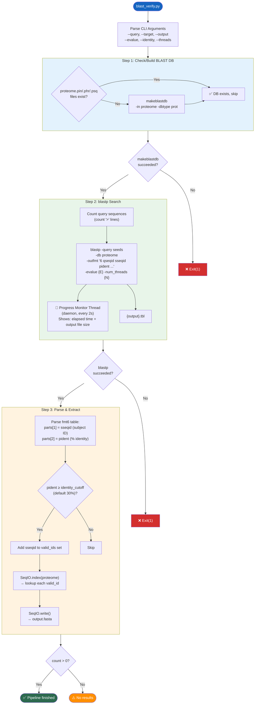

---

## 1. 依赖总览

### Python 标准库
`argparse` `subprocess` `os` `sys` `time` `threading`

### 第三方库
| 库 | 用途 |
|---|---|
| `Bio.SeqIO`（Biopython） | FASTA 索引与序列写出 |

### 外部二进制工具
| 工具 | 版本要求 | 用途 |
|---|---|---|
| `makeblastdb` | BLAST+ ≥ 2.10 | 从 FASTA 创建 BLAST 数据库 |
| [blastp](file:///Users/baijiuzhuo/Downloads/pipeline/blast_verify.py#34-109) | BLAST+ ≥ 2.10 | 蛋白-蛋白序列比对搜索 |

---

## 2. CLI 参数

| 参数 | 类型 | 默认值 | 说明 |
|---|---|---|---|
| `--query` | str | **必填** | 查询序列 FASTA（种子序列） |
| `--target` | str | **必填** | 目标蛋白质组 FASTA |
| `--output` | str | **必填** | 输出命中序列 FASTA |
| `--evalue` | float | `1e-5` | E-value 阈值 |
| `--identity` | float | `30.0` | 序列一致性百分比阈值（%） |
| `--threads` | int | `4` | CPU 线程数 |

---

## 3. 核心函数详解

### 3.1 [check_or_make_blastdb()](file:///Users/baijiuzhuo/Downloads/pipeline/blast_verify.py#7-33)（L7-32）

**智能数据库管理**：
1. 检查目标 FASTA 旁是否已有数据库文件（`.pin` `.phr` `.psq`）
2. 存在 → 跳过创建
3. 不存在 → 执行 `makeblastdb -in {fasta} -dbtype prot`
4. stdout 静默（`subprocess.DEVNULL`）

**设计意图**：避免重复创建数据库。[run_pipeline_v3.py](file:///Users/baijiuzhuo/Downloads/pipeline/run_pipeline_v3.py) 在 Step 3 前也调用了一次 `makeblastdb`，但此脚本也独立处理，支持作为单独工具使用。

### 3.2 [run_blastp()](file:///Users/baijiuzhuo/Downloads/pipeline/blast_verify.py#34-109)（L34-108）

**blastp 命令构建**：
```bash
blastp \
    -query {seeds.fasta} \
    -db {proteome} \
    -out {output}.tbl \
    -outfmt "6 qseqid sseqid pident length mismatch gapopen qstart qend sstart send evalue bitscore" \
    -evalue {E} \
    -num_threads {N}
```

**输出格式 6（Tabular）列定义**：

| 列号 | 字段 | 说明 |
|---|---|---|
| 0 | qseqid | 查询序列 ID |
| 1 | sseqid | 目标序列 ID（**提取用**） |
| 2 | pident | 序列一致性 %（**过滤用**） |
| 3 | length | 比对长度 |
| 4 | mismatch | 错配数 |
| 5 | gapopen | Gap 开放数 |
| 6 | qstart | 查询比对起始 |
| 7 | qend | 查询比对终止 |
| 8 | sstart | 目标比对起始 |
| 9 | send | 目标比对终止 |
| 10 | evalue | E-value |
| 11 | bitscore | Bit score |

**实时进度监控**（L67-84）：
- 启动 **daemon 线程** 作为进度监视器
- 每 **2 秒**刷新一次状态
- 显示：已运行时间 + 输出文件大小（B/KB/MB 自适应）
- 使用 `\r` 覆盖式输出（无换行滚屏）
- BLAST 完成后通过 `threading.Event` 优雅停止

### 3.3 [parse_and_extract()](file:///Users/baijiuzhuo/Downloads/pipeline/search_extract.py#49-112)（L110-169）

**阶段 1：解析表格 + Identity 过滤**（L118-138）
- 逐行读取 fmt6 表格
- 提取 `parts[1]`（sseqid，目标序列 ID）和 `parts[2]`（pident，一致性 %）
- Identity ≥ cutoff（默认 30%）→ 加入 `valid_ids` 集合
- 自动去重（set 数据结构）

**阶段 2：序列提取**（L146-169）
- 使用 `SeqIO.index()` 建立磁盘索引
- 逐个查找 valid_ids 中的序列
- ID 不存在时静默跳过（`pass`）
- `SeqIO.write()` 输出到 FASTA

---

## 4. [main()](file:///Users/baijiuzhuo/Downloads/pipeline/run_pipeline_v3.py#82-1415) 编排（L171-202）

```
Step 1: check_or_make_blastdb(proteome) → 检查/创建数据库
    ↓  failed → exit(1)
Step 2: run_blastp(seeds, proteome)      → {output}.tbl
    ↓  failed → exit(1)
Step 3: parse_and_extract(tbl, proteome) → {output}.fasta
    ↓  count == 0 → "No results" (不退出)
    ↓  count > 0  → "Success"
```

---

## 5. 输入/输出

### 输入
| 文件 | 来源 | 说明 |
|---|---|---|
| 种子序列 FASTA | [retrieve_seeds.py](file:///Users/baijiuzhuo/Downloads/pipeline/retrieve_seeds.py) | Gold 或 Broad 种子序列 |
| 蛋白质组 FASTA | 用户提供 | 目标物种蛋白质组 |

### 输出
| 文件 | 说明 |
|---|---|
| `{output}.tbl` | blastp 表格结果（fmt6，中间文件） |
| `{output}` | 提取的候选蛋白序列 FASTA |

---

## 6. 与 search_extract.py 的对比

| 维度 | search_extract.py (HMM) | blast_verify.py (BLAST) |
|---|---|---|
| 搜索引擎 | hmmsearch | blastp |
| 模型 | HMM Profile（概率模型） | 序列-序列比对 |
| 过滤标准 | E-value only | E-value + Identity % |
| 输出格式前 | `--tblout`（HMMER 专用） | `-outfmt 6`（BLAST 标准表格） |
| 进度监控 | 无 | 后台线程实时显示 |
| 数据库管理 | 不需要 | 自动检查/创建 BLAST DB |
| 互补优势 | 检测远缘同源物更灵敏 | 高Identity近缘同源物更准确 |

> 两者配合构成 Quad-Core 搜索的核心——HMM 擅长发现序列相似度低但结构保守的远缘成员，BLAST 擅长发现高相似度的近缘成员。

---

## 7. 错误处理

| 场景 | 处理 |
|---|---|
| makeblastdb 未安装 | `FileNotFoundError` → 终止 |
| makeblastdb 失败 | `CalledProcessError` → 终止 |
| blastp 未安装 | `FileNotFoundError` → 终止 |
| blastp 执行失败 | `CalledProcessError` → 停止线程 → 终止 |
| 表格行格式异常 | 跳过该行（`len(parts) < 12`） |
| Identity 解析失败 | `ValueError` → 跳过该行 |
| 提取时 ID 不存在 | 静默跳过 |
| 0 条命中 | "No results"（不 exit） |

---

## 8. 被调用方式

由 [run_pipeline_v3.py](file:///Users/baijiuzhuo/Downloads/pipeline/run_pipeline_v3.py) 在 Quad-Core Search 阶段调用（Step 3 的 Stream 3 和 Stream 4）：

```python
# Stream 3: BLAST-Gold
python blast_verify.py \
    --query seeds_gold.fasta \
    --target {proteome} \
    --output hits_blast_gold.fasta \
    --threads {cpu} \
    --evalue {evalue}

# Stream 4: BLAST-Broad (reviewed_only=false 时)
python blast_verify.py \
    --query seeds_broad.fasta \
    --target {proteome} \
    --output hits_blast_broad.fasta \
    --threads {cpu} \
    --evalue {evalue}
```

> 注意：`--identity` 未从 [run_pipeline_v3.py](file:///Users/baijiuzhuo/Downloads/pipeline/run_pipeline_v3.py) 显式传递，使用默认值 30%。

---

<div style="page-break-after: always;"></div>

<a id="mod-interproscan-runner"></a>

# interproscan_runner.py 技术报告

[⬆ 返回目录](#-目录点击跳转)

**文件**：[interproscan_runner.py](file:///Users/baijiuzhuo/Downloads/pipeline/interproscan_runner.py)
**行数**：345 行 | **大小**：~13 KB
**定位**：**InterProScan Domain 验证模块**——将候选蛋白提交到 EBI InterProScan 5 REST API（或本地安装）进行 Domain/跨膜区/信号肽分析，支持批处理、并发、断点续跑。

---

## 0. 流程图

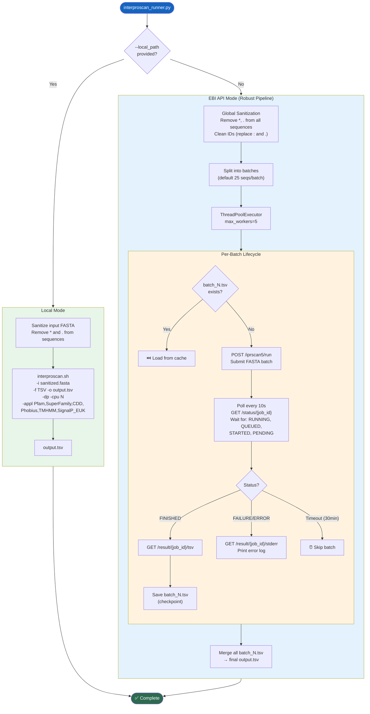

---

## 1. 依赖总览

### Python 标准库
`argparse` `time` `random` `sys` [os](file:///Users/baijiuzhuo/Downloads/pipeline/interproscan_runner.py#189-244)
`subprocess`（仅 Local 模式延迟导入）

### 第三方库
| 库 | 用途 |
|---|---|
| `requests` | EBI REST API 交互 |
| `Bio.SeqIO`（Biopython） | FASTA 解析 |
| `Bio.Seq.Seq` | 序列对象构建（清洗后重建） |
| `concurrent.futures.ThreadPoolExecutor` | API 模式并发任务 |

### 外部工具/API
| 工具/API | 模式 | 用途 |
|---|---|---|
| EBI InterProScan 5 REST API | API 模式 | 远程 Domain 分析 |
| `interproscan.sh` | Local 模式 | 本地 InterProScan 安装 |

---

## 2. CLI 参数

| 参数 | 类型 | 默认值 | 说明 |
|---|---|---|---|
| `--input` | str | **必填** | 输入蛋白 FASTA |
| `--output` | str | **必填** | 输出 TSV 结果文件 |
| `--email` | str | 内置默认 | EBI API 使用邮箱 |
| `--batch_size` | int | `25` | API 模式每批序列数 |
| `--local_path` | str | — | 本地 `interproscan.sh` 路径（提供则使用本地模式） |
| `--cpu` | int | `4` | 本地模式 CPU 数 |

---

## 3. 双模式架构

### 3.1 Local 模式 [run_local_interproscan()](file:///Users/baijiuzhuo/Downloads/pipeline/interproscan_runner.py#189-244)（L189-243）

直接调用本地安装的 InterProScan：
```bash
interproscan.sh \
    -i sanitized.fasta \
    -f TSV \
    -o output.tsv \
    -dp \
    -cpu 4 \
    -appl Pfam,SuperFamily,CDD,Phobius,TMHMM,SignalP_EUK
```

| 参数 | 说明 |
|---|---|
| `-i` | 输入 FASTA（已清洗） |
| `-f TSV` | 输出格式为 Tab 分隔 |
| `-dp` | 禁用预计算匹配查找（本地更稳定） |
| `-cpu` | 线程数 |
| `-appl` | 运行的分析应用 |

**序列清洗**（L201-214）：
- 移除 `*`（终止密码子）和 `.`（gap 标记）
- 跳过零长度序列
- 写出清洗后的临时文件

### 3.2 API 模式 [run_robust_pipeline()](file:///Users/baijiuzhuo/Downloads/pipeline/interproscan_runner.py#245-325)（L245-324）

通过 EBI REST API 提交远程分析。

---

## 4. API 模式核心函数详解

### 4.1 全局配置（L24-28）

| 常量 | 值 | 说明 |
|---|---|---|
| `API_URL` | `https://www.ebi.ac.uk/Tools/services/rest/iprscan5` | EBI 端点 |
| `MAX_CONCURRENT_JOBS` | `5` | 最大并发作业数（EBI 限制约 30，保守设 5） |

### 4.2 [submit_batch()](file:///Users/baijiuzhuo/Downloads/pipeline/interproscan_runner.py#30-104)（L30-103）

**提交参数**：
| 参数 | 值 | 说明 |
|---|---|---|
| `email` | 用户邮箱 | EBI 要求 |
| `title` | `Batch_{N}` | 识别标签 |
| [sequence](file:///Users/baijiuzhuo/Downloads/pipeline/retrieve_seeds.py#38-41) | FASTA 字符串 | 批次内所有序列 |
| `goterms` | `true` | 请求 GO 注释 |
| `pathways` | `true` | 请求通路注释 |
| [appl](file:///Users/baijiuzhuo/Downloads/pipeline/format_detector.py#172-225) | `PfamA,SuperFamily,CDD,Phobius,TMHMM,SignalP_EUK` | 6 个分析应用 |

**序列清洗**（每批）：
- ID 中 `.` 和 `:` 替换为 `_`（避免解析冲突）
- 序列中移除 `*` 和 `.`
- 跳过 ≤ 10aa 的短序列

**速率控制**：
- 提交前延迟 = `batch_index × 1.5s + 随机0-2s`（错开并发提交）
- 失败后指数退避：`10s × (attempt+1) + 随机0-5s`

**重试策略**：
- 最多 3 次重试
- 5xx 服务器错误 → 重试
- 400 Bad Request → 也重试（EBI 有时用 400 做限流）
- 其他 4xx → 直接失败

**Job ID 验证**：检查返回的 ID 是否以 `iprscan` 开头（EBI 格式更新适配）

### 4.3 [check_status()](file:///Users/baijiuzhuo/Downloads/pipeline/interproscan_runner.py#105-113)（L105-112）

```
GET /iprscan5/status/{job_id}
```

返回状态字符串：`RUNNING` / `QUEUED` / `STARTED` / `PENDING` / `FINISHED` / `FAILURE` / `ERROR`

### 4.4 [get_result()](file:///Users/baijiuzhuo/Downloads/pipeline/interproscan_runner.py#114-122)（L114-121）

```
GET /iprscan5/result/{job_id}/tsv
```

返回 TSV 格式结果文本。

### 4.5 [get_log()](file:///Users/baijiuzhuo/Downloads/pipeline/interproscan_runner.py#123-134)（L123-133）

失败时获取错误日志：
```
GET /iprscan5/result/{job_id}/stderr
GET /iprscan5/result/{job_id}/log
```

### 4.6 [process_batch()](file:///Users/baijiuzhuo/Downloads/pipeline/interproscan_runner.py#135-183)（L135-182）— 批次生命周期

```
   检查缓存 → [已存在] → 读取返回
       ↓ [不存在]
   submit_batch() → Job ID
       ↓
   轮询 check_status() (每 10s)
     等待状态: RUNNING / QUEUED / STARTED / PENDING
     超时: 180 × 10s = 30 分钟
       ↓
   FINISHED → get_result(tsv) → 保存 batch_N.tsv
   FAILURE  → get_log() → 打印错误日志后一行
```

**断点续跑**（L143-147）：
- 检查 `{temp_dir}/batch_{N}.tsv` 是否已存在且非空
- 存在 → 直接读取缓存内容，跳过提交
- 支持 `Ctrl+C` 中断后重新运行时自动恢复

### 4.7 [run_robust_pipeline()](file:///Users/baijiuzhuo/Downloads/pipeline/interproscan_runner.py#245-325) 编排（L245-324）

1. **全局清洗**（L258-272）：遍历所有序列，清洗后重建 `Seq` 对象
2. **分批**（L274-279）：按 `batch_size`（默认 25）切分
3. **并发执行**（L286-306）：`ThreadPoolExecutor(max_workers=5)`
   - 所有批次同时提交到线程池
   - `as_completed()` 逐个获取完成的结果
   - 支持 `KeyboardInterrupt` 优雅退出
4. **合并结果**（L315-323）：
   - 按**批次顺序**（而非完成顺序）读取 `batch_N.tsv`
   - 确保最终 TSV 输出顺序一致

---

## 5. 请求的分析应用

| 应用 | 数据库 | 检测内容 |
|---|---|---|
| **PfamA** | Pfam | 蛋白质域（Domain） |
| **SuperFamily** | SCOP | 超家族分类 |
| **CDD** | NCBI CDD | 保守域（Conserved Domain） |
| **Phobius** | — | 跨膜区 + 信号肽（联合预测） |
| **TMHMM** | — | 跨膜螺旋预测 |
| **SignalP_EUK** | — | 真核信号肽预测 |

> 注意：EBI 公共 API 是否开放 TMHMM/SignalP 会随时间变化。提交时请求，但如果 EBI 不支持会静默忽略。

---

## 6. 输入/输出

### 输入
| 文件 | 来源 |
|---|---|
| `candidates_merged.fasta` | Step 4 候选合并结果 |

### 输出
| 文件 | 说明 |
|---|---|
| `interproscan_results.tsv` | InterProScan TSV 格式结果 |
| `{output}_temp_batches/batch_N.tsv` | 各批次缓存文件（断点续跑用） |
| `{input}.sanitized` | 清洗后的临时 FASTA（Local 模式） |

### TSV 输出列格式（InterProScan 标准 11 列）

| 列号 | 字段 | 说明 |
|---|---|---|
| 0 | Protein Accession | 蛋白 ID |
| 1 | Sequence MD5 | 序列 MD5 |
| 2 | Sequence Length | 序列长度 |
| 3 | Analysis | 分析来源（Pfam/CDD/TMHMM 等） |
| 4 | Signature Accession | Domain ID（PF00001 等） |
| 5 | Signature Description | Domain 描述 |
| 6 | Start | 匹配起始位置 |
| 7 | End | 匹配终止位置 |
| 8 | Score/E-value | 统计显著性 |
| 9 | Status | 匹配状态（T=true） |
| 10 | Date | 分析日期 |
| 11+ | InterPro/GO/Pathway | 附加注释（如有） |

---

## 7. 关键设计决策

### 7.1 双模式设计
- **API 模式**：无需安装 InterProScan（数 GB），适合一般用户
- **Local 模式**：适合大批量分析（不受 EBI 速率限制）、离线环境、敏感数据

### 7.2 保守并发策略
EBI 允许约 30 并发，但使用 5 个并发：
- 避免 CDD 超时（CDD 分析慢，高并发导致排队）
- 避免触发 EBI 限流
- 保证稳定性优先于速度

### 7.3 断点续跑
每批完成后立即写入 `batch_N.tsv` 缓存文件。如果中断：
- 重新运行时自动跳过已完成的批次
- 仅重新提交未完成的批次
- 大规模分析（100+ 序列）的关键可靠性保障

### 7.4 双层序列清洗
1. **全局清洗**（[run_robust_pipeline](file:///Users/baijiuzhuo/Downloads/pipeline/interproscan_runner.py#245-325) L258-272）：所有序列统一处理
2. **批次清洗**（[submit_batch](file:///Users/baijiuzhuo/Downloads/pipeline/interproscan_runner.py#30-104) L36-48）：每批提交前再次清洗

确保无论输入质量如何，提交给 EBI 的序列总是合法的。

---

## 8. 错误处理

| 场景 | 处理 |
|---|---|
| EBI 返回 5xx | 重试 3 次，指数退避 |
| EBI 返回 400 | 重试 3 次（可能是限流） |
| EBI 返回其他 4xx | 直接失败（该批次） |
| 网络错误 | 重试 3 次 |
| Job ID 格式异常 | 打印警告，返回 None |
| 轮询超时（30min） | 放弃该批次 |
| Job 状态 FAILURE/ERROR | 获取错误日志并打印 |
| `Ctrl+C` 中断 | 优雅停止线程池，保留已完成缓存 |
| 本地 IPS 不存在 | `sys.exit(1)` |
| 本地 IPS 执行失败 | 返回 False |

---

## 8. 被调用方式

由 [run_pipeline_v3.py](file:///Users/baijiuzhuo/Downloads/pipeline/run_pipeline_v3.py) Step 5 通过 `ThreadPoolExecutor` 并行调用：

```python
# API 模式
python interproscan_runner.py \
    --input candidates_merged.fasta \
    --output interproscan_results.tsv \
    --email {email}

# Local 模式
python interproscan_runner.py \
    --input candidates_merged.fasta \
    --output interproscan_results.tsv \
    --email {email} \
    --local_path /path/to/interproscan.sh \
    --cpu {cpu}
```

---

<div style="page-break-after: always;"></div>

<a id="mod-scan-cdd-ncbi"></a>

# scan_cdd_ncbi.py 技术报告

[⬆ 返回目录](#-目录点击跳转)

**文件**：[scan_cdd_ncbi.py](file:///Users/baijiuzhuo/Downloads/pipeline/scan_cdd_ncbi.py)
**行数**：208 行 | **大小**：~7 KB
**定位**：**NCBI Batch CD-Search 模块**——将候选蛋白提交到 NCBI CDD（Conserved Domain Database）进行 Domain 搜索，作为 InterProScan 的补充验证源。

---

## 0. 流程图

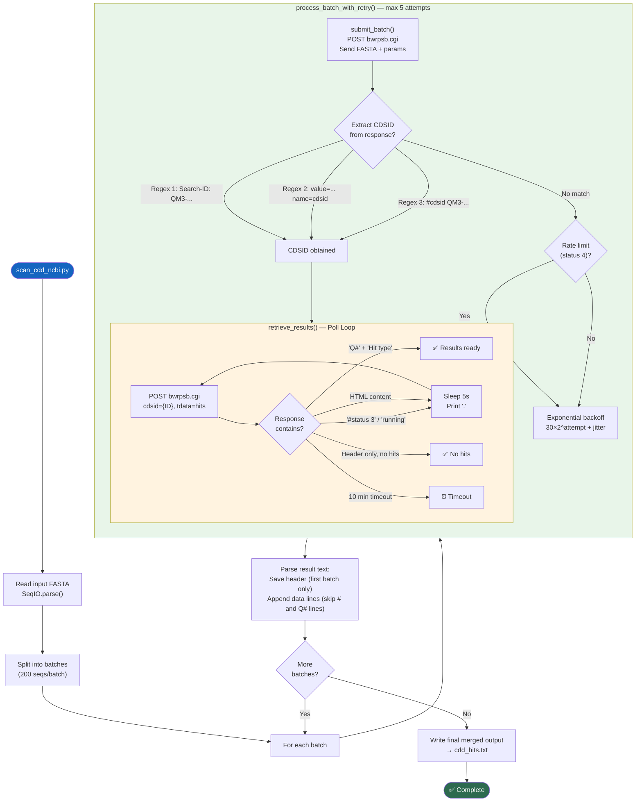

---

## 1. 依赖总览

### Python 标准库
`argparse` `time` `sys` [re](file:///Users/baijiuzhuo/Downloads/pipeline/ncbi/run_pipeline_v3.py#32-36) `random`

### 第三方库
| 库 | 用途 |
|---|---|
| `requests` | NCBI CDD API HTTP 交互 |
| `Bio.SeqIO`（Biopython） | FASTA 解析 |

### 外部 API
| API | 端点 | 用途 |
|---|---|---|
| NCBI Batch CD-Search | `https://www.ncbi.nlm.nih.gov/Structure/bwrpsb/bwrpsb.cgi` | 保守域搜索 |

---

## 2. CLI 参数

| 参数 | 类型 | 默认值 | 说明 |
|---|---|---|---|
| `--input` | str | **必填** | 输入蛋白 FASTA |
| `--output` | str | **必填** | 输出 Hit Table 文件 |
| `--db` | str | [cdd](file:///Users/baijiuzhuo/Downloads/pipeline/run_pipeline_v3.py#536-543) | 搜索数据库（cdd/pfam/smart 等） |
| `--evalue` | float | `0.01` | E-value 阈值 |

---

## 3. 核心函数详解

### 3.1 [submit_batch()](file:///Users/baijiuzhuo/Downloads/pipeline/scan_cdd_ncbi.py#20-74)（L20-73）

**请求构建**：
| 参数 | 值 | 说明 |
|---|---|---|
| [db](file:///Users/baijiuzhuo/Downloads/pipeline/blast_verify.py#7-33) | [cdd](file:///Users/baijiuzhuo/Downloads/pipeline/run_pipeline_v3.py#536-543) | 搜索数据库 |
| `smode` | `auto` | 自动选择搜索模式 |
| `useid1` | `true` | 使用用户提交的 ID（而非 NCBI 分配） |
| `filter` | `true` | 启用低复杂度过滤 |
| `evalue` | 用户指定 | E-value 阈值 |
| `tdata` | [hits](file:///Users/baijiuzhuo/Downloads/pipeline/ncbi/run_pipeline_v3.py#674-681) | 请求 Hit Table 格式输出 |
| `queries` | FASTA 字符串 | 全批序列（已移除 `*`） |

**CDSID 提取**（三重正则）：

NCBI 返回格式不固定，使用三种模式依次尝试：
1. `Search-ID:\s*([A-Z0-9-]+)` — 标准格式
2. `value="([A-Z0-9-]+)" name="cdsid"` — HTML 表单格式
3. `#cdsid\s+([A-Z0-9-]+)` — 文本格式

**限流检测**：
- 检查响应中是否包含 `status\t4` 或 `Too many requests`
- 发现限流时打印明确警告

### 3.2 [retrieve_results()](file:///Users/baijiuzhuo/Downloads/pipeline/scan_cdd_ncbi.py#75-130)（L75-129）

**轮询状态机**：

| 响应特征 | 判定 | 动作 |
|---|---|---|
| 包含 `Q#` 且包含 `Hit type` | ✅ 有结果 | 返回内容 |
| 包含 `# Batch CD-Search` 且无 [status](file:///Users/baijiuzhuo/Downloads/pipeline/interproscan_runner.py#105-113) | ✅ 无命中 | 返回内容 |
| 包含 `#status\t3` | 🔄 运行中 | 等待 5s |
| 包含 `running`（不区分大小写） | 🔄 运行中 | 等待 5s |
| HTML 内容 | 🔄 排队中 | 等待 5s |
| 包含 `# Batch CD-Search`（兜底） | ✅ 完成 | 返回内容 |
| 超过 600s | ⏰ 超时 | 返回 None |

**轮询请求参数**：
| 参数 | 值 | 说明 |
|---|---|---|
| `tdata` | [hits](file:///Users/baijiuzhuo/Downloads/pipeline/ncbi/run_pipeline_v3.py#674-681) | 请求 Hit Table |
| `cdsid` | 提交时获取的 ID | 作业标识 |
| `dmode` | `rep` | Report 模式 |

### 3.3 [process_batch_with_retry()](file:///Users/baijiuzhuo/Downloads/pipeline/scan_cdd_ncbi.py#131-151)（L131-150）

封装单批次的完整生命周期：

```
For attempt in 1..5:
    1. submit_batch() → CDSID
    2. retrieve_results(CDSID) → result_text
    3. 成功 → 返回
    4. 失败 → 指数退避: 30 × 2^attempt + random(1-10)s
```

退避时间示例：
| 尝试 | 等待时间 |
|---|---|
| 1 | ~31-40s |
| 2 | ~61-70s |
| 3 | ~121-130s |
| 4 | ~241-250s |
| 5 | ~481-490s |

### 3.4 [main()](file:///Users/baijiuzhuo/Downloads/pipeline/blast_verify.py#171-200) 编排（L152-207）

```
1. 读取全部序列
2. 按 BATCH_SIZE=200 分批
3. 串行处理每批（process_batch_with_retry）
4. 合并结果：
   - 第一批：保存 header 行（# 和 Q# 开头）
   - 后续批：仅追加数据行（跳过重复 header）
5. 写出最终文件
```

---

## 4. 输入/输出

### 输入
| 文件 | 来源 |
|---|---|
| `candidates_merged.fasta` | Step 4 候选合并结果 |

### 输出
| 文件 | 说明 |
|---|---|
| `cdd_hits.txt` | NCBI CD-Search Hit Table |

### Hit Table 输出格式

```
Q#1 - >protein_001
  1  Specific  cd12345  domain_name  1e-50  100-300  ...
  2  Superfam  cl54321  superfamily  3e-20  50-350   ...
```

| 字段 | 说明 |
|---|---|
| Q# | 查询序号 |
| Hit type | Specific / Superfam / Multi-domain |
| PSSM-ID | CDD PSSM 标识 |
| Domain Short Name | 域名 |
| E-value | 统计显著性 |
| From-To | 匹配位置 |

---

## 5. 与 interproscan_runner.py 的对比

| 维度 | interproscan_runner.py | scan_cdd_ncbi.py |
|---|---|---|
| 数据源 | EBI InterPro (Pfam+CDD+SCOP+Phobius+TMHMM+SignalP) | NCBI CDD only |
| API | EBI REST API | NCBI bwrpsb.cgi |
| 并发 | ThreadPoolExecutor (5 workers) | 串行（逐批处理） |
| 批量大小 | 25 seq/batch | 200 seq/batch |
| 断点续跑 | ✅ 缓存文件 | ❌ 不支持 |
| 分析范围 | 6 种分析应用 | 仅 CDD |
| 互补价值 | 广覆盖（多数据库） | CDD 深度搜索 |

> 两者并行运行（Step 5），互为补充。CDD 对某些 Domain（如 cd/sd 前缀）比 Pfam 更敏感。

---

## 6. 关键设计决策

### 6.1 NCBI 特殊 API 格式
`bwrpsb.cgi` 不是标准 REST API，而是类 CGI Web 接口。返回格式混合了 HTML 和文本，需要多种正则匹配来提取 Job ID。

### 6.2 串行而非并行
与 InterProScan 不同，CDD 搜索使用串行处理：
- NCBI 限流更严格
- 单批 200 条足够大，总批次数通常较少
- 避免触发 `status 4`（限流状态）

### 6.3 Header 去重
多批次结果合并时，仅保留第一批的 header 行，后续批次的 `#` 和 `Q#` 行被跳过，避免输出文件中出现重复元数据。

---

## 7. 错误处理

| 场景 | 处理 |
|---|---|
| 无输入序列 | `sys.exit(1)` |
| 提交失败 | 重试 5 次，指数退避 |
| CDSID 无法提取 | 打印响应片段诊断 → 重试 |
| 限流（status 4） | 打印显眼警告 → 退避重试 |
| 轮询超时（10min/batch） | 放弃该批次 |
| 轮询网络错误 | 返回 None → 触发重试 |
| 某批次永久失败 | 打印警告，继续下一批（部分结果） |

---

## 8. 被调用方式

由 [run_pipeline_v3.py](file:///Users/baijiuzhuo/Downloads/pipeline/run_pipeline_v3.py) Step 5 通过 `ThreadPoolExecutor` 与 InterProScan 并行调用：

```python
python scan_cdd_ncbi.py \
    --input candidates_merged.fasta \
    --output cdd_hits.txt \
    --evalue 0.01
```

---

<div style="page-break-after: always;"></div>

<a id="mod-universal-family-extractor"></a>

# universal_family_extractor.py 技术报告

[⬆ 返回目录](#-目录点击跳转)

**文件**：[universal_family_extractor.py](file:///Users/baijiuzhuo/Downloads/pipeline/universal_family_extractor.py)
**行数**：806 行 | **大小**：~32 KB
**定位**：**最终候选提取模块（v4.0 Rosetta Stone）**——基于 Domain 验证结果过滤候选基因，集成 `format_detector` ID 映射规则，从 GFF/Proteome/CDS/Genome 中提取完整的基因家族数据集。

---

## 0. 流程图

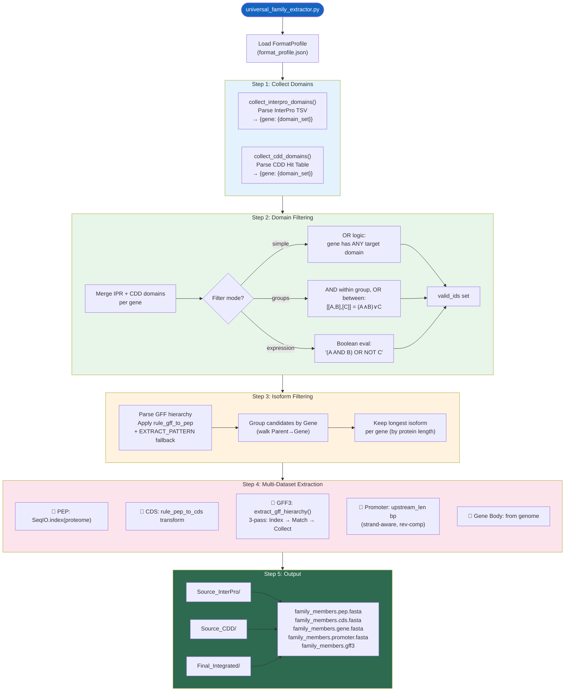

---

## 1. 依赖总览

### Python 标准库
`sys` [os](file:///Users/baijiuzhuo/Downloads/pipeline/pipeline_utils.py#1842-2222) `argparse` [re](file:///Users/baijiuzhuo/Downloads/pipeline/run_pipeline_v3.py#34-38) `shutil` [json](file:///Users/baijiuzhuo/Downloads/pipeline/format_detector.py#45-48)

### 第三方库
| 库 | 用途 |
|---|---|
| `Bio.SeqIO`（Biopython） | FASTA 索引与序列写出 |

### 内部模块
| 模块 | 用途 |
|---|---|
| `format_detector` | FormatProfile 加载、ID 规则转换 |

---

## 2. CLI 参数

| 参数 | 类型 | 默认值 | 说明 |
|---|---|---|---|
| `--cdd` | str | — | CDD Hit Table 文件 |
| `--interpro` | str | — | InterProScan TSV 文件 |
| `--genome` | str | **必填** | 基因组 FASTA |
| `--proteome` | str | **必填** | 蛋白质组 FASTA |
| `--cds` | str | **必填** | CDS 核酸 FASTA |
| `--gff` | str | **必填** | GFF3 注释文件 |
| `--upstream` | int | `2000` | 启动子提取上游长度（bp） |
| `--output` | str | **必填** | 输出目录 |
| `--domains` | str | **必填** | 目标 Domain ID（逗号分隔） |
| `--logic` | str | `union` | 来源合并逻辑（union/intersection） |
| `--profile` | str | — | format_profile.json 路径 |
| `--domain_filter_mode` | str | `simple` | 过滤模式（simple/groups/expression） |
| `--domain_groups` | str | — | JSON 格式分组 |
| `--domain_expression` | str | — | 布尔表达式 |

---

## 3. 核心函数详解

### 3.1 Domain 解析（L27-93）

#### [collect_interpro_domains()](file:///Users/baijiuzhuo/Downloads/pipeline/universal_family_extractor.py#27-55)（L27-54）
解析 InterProScan TSV：
- `cols[0]` → 序列 ID
- `cols[4]` → Signature Accession（如 PF00001）
- `cols[11]` → InterPro Accession（如 IPR000001）
- 返回 `{gene_id: set(domain_ids)}`

#### [collect_cdd_domains()](file:///Users/baijiuzhuo/Downloads/pipeline/universal_family_extractor.py#56-94)（L56-93）
解析 CDD Hit Table：
- 处理 `Q# → >gene_id` 格式提取 ID
- 正则匹配 Domain ID：`cd\d+` `cl\d+` `pfam\d+` `smart\d+` `cog\d+` `PLN\d+` `IPR\d+` `PF\d+`
- 返回 `{gene_id: set(domain_ids)}`

### 3.2 三模式 Domain 过滤（L95-201）

| 模式 | 函数 | 逻辑 | 示例 |
|---|---|---|---|
| `simple` | 直接集合交集 | 基因有 ANY 目标 Domain | `PF00001,IPR000001` |
| `groups` | [evaluate_group_filter()](file:///Users/baijiuzhuo/Downloads/pipeline/universal_family_extractor.py#95-118) | 组内 AND，组间 OR | `[["PF00001","cd123"],["IPR001"]]` → (PF00001∧cd123)∨IPR001 |
| [expression](file:///Users/baijiuzhuo/Downloads/pipeline/universal_family_extractor.py#119-156) | [evaluate_expression_filter()](file:///Users/baijiuzhuo/Downloads/pipeline/universal_family_extractor.py#119-156) | 完整布尔表达式 | [(IPR001 AND cd001) OR NOT PF009](file:///Users/baijiuzhuo/Downloads/pipeline/run_pipeline_v3.py#39-48) |

[evaluate_expression_filter()](file:///Users/baijiuzhuo/Downloads/pipeline/universal_family_extractor.py#119-156) 实现：
1. 用正则提取所有 token
2. 将每个 Domain ID 替换为 `True`/`False`
3. 将 `AND`/`OR`/`NOT` 转为 Python 语法
4. [eval()](file:///Users/baijiuzhuo/Downloads/pipeline/universal_family_extractor.py#95-118) 执行布尔表达式

### 3.3 Isoform 过滤 [filter_longest_isoforms()](file:///Users/baijiuzhuo/Downloads/pipeline/universal_family_extractor.py#257-401)（L257-400）

**目标**：同一基因的多个转录本/蛋白亚型，只保留最长的一个。

**算法**：
1. **GFF 单遍扫描**：
   - 解析所有行的 `ID` 和 `Parent` 属性
   - 对每个 GFF 属性值，应用 `rule_gff_to_pep` 转换后与候选 ID 匹配
   - **降级**：规则不匹配时，用 `EXTRACT_PATTERN`（100+ 正则）提取 Gene ID
2. **层级回溯**：
   - 从匹配的 feature 沿 `Parent` 链上溯到顶层 gene
   - 建立 `candidate_id → gene_id` 映射
3. **最长选择**：
   - 按 gene 分组
   - 每组保留蛋白序列最长的 candidate

### 3.4 GFF 层级提取 [extract_gff_hierarchy()](file:///Users/baijiuzhuo/Downloads/pipeline/universal_family_extractor.py#402-628)（L402-627）

**三遍扫描算法**（处理大型 GFF3 文件）：

| 遍次 | 目的 | 关键操作 |
|---|---|---|
| **Pass 1** | 建立索引 | 记录每个 feature 的 ID/行号/坐标/类型；构建 parent→children 映射；对无 ID 的 CDS/exon 生成 synthetic ID |
| **Pass 2** | 匹配候选 | 对每行尝试 `rule_gff_to_pep` + `EXTRACT_PATTERN`；匹配后沿 parent 链回溯到根 gene |
| **Pass 3** | 收集后代 | 递归 [collect_descendants()](file:///Users/baijiuzhuo/Downloads/pipeline/universal_family_extractor.py#583-597) 收集根 gene 下所有 feature；按原始行号排序输出 |

**关键技术细节**：
- 使用 `f"{feat_id}::{line_num}"` 作 unique key 处理重复 ID（如多个 CDS 共享 ID）
- 无 ID 的 feature 生成 `__CDS_{parent}_{line_num}` 式合成 ID
- 支持 gzip 压缩文件

### 3.5 数据集提取 [extract_datasets()](file:///Users/baijiuzhuo/Downloads/pipeline/universal_family_extractor.py#629-715)（L629-714）

对每个最终候选基因提取 5 类数据：

| 数据 | 方法 | ID 转换 |
|---|---|---|
| **PEP** | `SeqIO.index(proteome)` 直接查找 | 原 ID |
| **CDS** | `SeqIO.index(cds)` 查找 → 降级原 ID | `rule_pep_to_cds` |
| **GFF3** | [extract_gff_hierarchy()](file:///Users/baijiuzhuo/Downloads/pipeline/universal_family_extractor.py#402-628) 已收集的行 | Rosetta Stone |
| **Promoter** | 从 genome 按坐标+链方向提取 | `upstream_len` bp |
| **Gene Body** | 从 genome 按坐标提取 | 坐标映射 |

**启动子提取逻辑**：
- 正链（+）：`gene_start - upstream_len` → `gene_start - 1`
- 反链（-）：`gene_end + 1` → `gene_end + upstream_len` → **反向互补**

---

## 4. 输入/输出

### 输入
| 文件 | 来源 |
|---|---|
| InterProScan TSV | [interproscan_runner.py](file:///Users/baijiuzhuo/Downloads/pipeline/interproscan_runner.py) |
| CDD Hit Table | [scan_cdd_ncbi.py](file:///Users/baijiuzhuo/Downloads/pipeline/scan_cdd_ncbi.py) |
| 蛋白质组 FASTA | 用户提供 |
| CDS FASTA | 用户提供 |
| 基因组 FASTA | 用户提供 |
| GFF3 | 用户提供（或 [gff_normalizer.py](file:///Users/baijiuzhuo/Downloads/pipeline/gff_normalizer.py) 标准化后） |
| format_profile.json | [format_detector.py](file:///Users/baijiuzhuo/Downloads/pipeline/format_detector.py) |

### 输出
| 目录 / 文件 | 说明 |
|---|---|
| `Source_InterPro/` | 仅 InterPro 验证的子集 |
| `Source_CDD/` | 仅 CDD 验证的子集 |
| `Final_Integrated/` | 合并后的最终家族成员 |
| `family_members.pep.fasta` | 蛋白序列 |
| `family_members.cds.fasta` | CDS 核酸序列 |
| `family_members.gene.fasta` | 基因体（含位置注释） |
| `family_members.promoter.fasta` | 启动子序列 |
| `family_members.gff3` | 完整基因结构注释 |

---

## 5. 关键设计决策

### 5.1 三模式过滤体系
从简单 OR → 分组 AND/OR → 完整布尔表达式，渐进式满足不同复杂度需求。

### 5.2 Rosetta Stone 集成
所有 ID 匹配环节（GFF 扫描、CDS 提取）均通过 [normalize_id_with_rule()](file:///Users/baijiuzhuo/Downloads/pipeline/universal_family_extractor.py#245-254) 应用 format_detector 学到的规则，不再硬编码 ID 转换逻辑。

### 5.3 三遍扫描策略
GFF3 文件可能数 GB，三遍扫描各有明确目标：
1. 建索引（不可省略）
2. 匹配候选（仅关注匹配逻辑）
3. 收集后代（仅处理已匹配的根基因）

### 5.4 来源分离输出
同时输出 `Source_InterPro/`、`Source_CDD/`、`Final_Integrated/` 三个子集，便于用户对比不同验证源的覆盖率。

---

## 6. 错误处理

| 场景 | 处理 |
|---|---|
| format_detector 导入失败 | 静默降级，使用原始 ID |
| FormatProfile 加载失败 | Warning，继续使用原始 ID |
| GFF 层级解析异常 | 降级为 candidate_id = gene_id |
| CDS ID 转换后找不到 | 降级为原始 ID 二次查找 |
| 布尔表达式 eval 错误 | 返回 False（保守拒绝） |
| 无候选通过过滤 | 打印提示，不提取 |
| Chromosome 不在 genome 中 | 跳过该基因的 promoter / gene body |

---

## 7. 被调用方式

由 [run_pipeline_v3.py](file:///Users/baijiuzhuo/Downloads/pipeline/run_pipeline_v3.py) Step 6 调用：

```python
python universal_family_extractor.py \
    --cdd cdd_hits.txt \
    --interpro interproscan_results.tsv \
    --genome {genome} \
    --proteome {proteome} \
    --cds {cds} \
    --gff {gff} \
    --upstream 2000 \
    --output {out_dir}/final \
    --domains {target_domains} \
    --profile {tmp_dir}/format_profile.json
```

---

<div style="page-break-after: always;"></div>

<a id="mod-pipeline-utils"></a>

# pipeline_utils.py 技术报告

[⬆ 返回目录](#-目录点击跳转)

**文件**：[pipeline_utils.py](file:///Users/baijiuzhuo/Downloads/pipeline/pipeline_utils.py)
**行数**：3765 行 | **大小**：~152 KB | **函数数**：61
**定位**：**GFIP 核心工具库**——为所有模块提供共享函数，涵盖日志、命令执行、序列分析、MSA/Motif、进化树、可视化渲染、HTML 报告生成、启动子分析、Ka/Ks 分析等全部功能。

---

## 0. 模块架构图

```mermaid
flowchart LR
    subgraph UTILS ["pipeline_utils.py (3765 lines, 61 functions)"]
        direction TB

        subgraph P1 ["Phase 1: Infrastructure"]
            LOG["setup_logger()<br/>get_logger()<br/>save_json()"]
            SYS["check_dependencies()<br/>run_cmd()"]
        end

        subgraph P2 ["Phase 2: Biological Helpers"]
            BIO["validate_fasta()<br/>cluster_sequences()<br/>normalize_id()"]
            DOM["parse_domain_info()"]
        end

        subgraph P3 ["Phase 3: MSA & Motif"]
            MSA["run_mafft_alignment()<br/>render_msa_html()<br/>trim_msa_by_gap()"]
            MOT["extract_motifs_from_msa()<br/>check_docker()<br/>run_meme_docker()<br/>run_meme_local()<br/>parse_meme_xml()"]
        end

        subgraph P4 ["Phase 4: Phylogenetics"]
            TREE["run_fasttree()<br/>run_iqtree()"]
            PROP["analyze_protein_properties()"]
        end

        subgraph P5 ["Phase 5: Visualization"]
            GFF_V["parse_gff_structure()"]
            QUAL["compute_structure_redundancy()<br/>compute_sequence_similarity()"]
            SVG["render_combined_chart()"]
            MOTIF_HTML["render_motif_map_html()"]
        end

        subgraph P6 ["Phase 6: Chromosomal Map"]
            CHR["calc_chromosome_lengths()<br/>calculate_gene_density()<br/>render_chromosomal_map()"]
        end

        subgraph P7 ["Phase 7: HTML Report"]
            RPT["generate_html_report()<br/>get_base64_image()<br/>render_promoter_analysis_auto()"]
        end

        subgraph P8 ["Phase 8: Promoter Analysis"]
            CIS["load_cis_element_db()<br/>scan_promoters()<br/>run_meme_promoter()<br/>run_tomtom()"]
            CIS_P["parse_meme_id_map()<br/>parse_jaspar_db_names()<br/>parse_tomtom_results()"]
            CIS_H["update_html_report_with_promoters()<br/>generate_promoter_html_section()"]
            CIS_R["export_cis_data_for_r()<br/>run_cis_visualization()"]
        end

        subgraph P9 ["Phase 9: Ka/Ks Analysis"]
            KA["protein_to_codon_alignment()<br/>write_axt_format()<br/>run_kaks_calculator()"]
        end
    end

    RUN["run_pipeline_v3.py"] --> UTILS
    EXT["universal_family_extractor.py"] --> UTILS
    KAKS["run_kaks_analysis.py"] --> UTILS
    PROM["run_promoter_analysis.py"] --> UTILS

    style UTILS fill:#f5f5f5
    style P1 fill:#e3f2fd
    style P3 fill:#e8f5e9
    style P5 fill:#fff3e0
    style P7 fill:#fce4ec
    style P8 fill:#f3e5f5
```

---

## 1. 依赖总览

### Python 标准库
`concurrent.futures` [json](file:///Users/baijiuzhuo/Downloads/pipeline/format_detector.py#45-48) `logging` [os](file:///Users/baijiuzhuo/Downloads/pipeline/pipeline_utils.py#1842-2222) `platform` `shutil` `subprocess` `sys` `time` [re](file:///Users/baijiuzhuo/Downloads/pipeline/ncbi/run_pipeline_v3.py#32-36) `math` `xml.etree.ElementTree` [base64](file:///Users/baijiuzhuo/Downloads/pipeline/pipeline_utils.py#2225-2236) `pathlib`

### 第三方库
| 库 | 用途 |
|---|---|
| `Bio.SeqIO` / `Bio.AlignIO` | FASTA/MSA 读写 |
| `Bio.SeqUtils.ProtParam.ProteinAnalysis` | 蛋白理化性质计算 |
| `Bio.Phylo` | Newick 进化树解析与布局 |
| `Bio.Seq` / `Bio.SeqRecord` | 序列对象构建 |
| `Bio.Align.MultipleSeqAlignment` | MSA 对象构建 |
| `collections.defaultdict` / `Counter` | 数据统计 |
| `matplotlib`（延迟导入） | 染色体图渲染 |

---

## 2. 各功能阶段详解

### Phase 1: Infrastructure（L1-131）

| 函数 | 行数 | 功能 |
|---|---|---|
| [setup_logger()](file:///Users/baijiuzhuo/Downloads/pipeline/pipeline_utils.py#19-50) | L19-49 | 创建双通道 Logger（Console=INFO, File=DEBUG） |
| [get_logger()](file:///Users/baijiuzhuo/Downloads/pipeline/pipeline_utils.py#51-53) | L51-52 | 获取全局 Logger 单例 |
| [save_json()](file:///Users/baijiuzhuo/Downloads/pipeline/pipeline_utils.py#54-62) | L54-61 | JSON 序列化工具 |
| [check_dependencies()](file:///Users/baijiuzhuo/Downloads/pipeline/pipeline_utils.py#64-84) | L64-83 | 检查外部工具是否在 `src/` 或 `PATH` 中 |
| [run_cmd()](file:///Users/baijiuzhuo/Downloads/pipeline/pipeline_utils.py#85-132) | L85-131 | **通用命令执行器**（日志、断点续跑、重试） |

[run_cmd()](file:///Users/baijiuzhuo/Downloads/pipeline/pipeline_utils.py#85-132) 细节：
- **断点续跑**：检查 `expected_output` 文件/目录是否已存在且非空
- **重试**：线性退避（`retry_delay × attempt`）
- **容错**：`ignore_error=True` 时失败不退出
- stdout/stderr 直接流到终端（保留子进程的进度条等信息）

### Phase 2: Biological Helpers（L133-278）

| 函数 | 行数 | 功能 |
|---|---|---|
| [validate_fasta()](file:///Users/baijiuzhuo/Downloads/pipeline/pipeline_utils.py#134-153) | L134-152 | FASTA 文件存在性及格式验证 |
| [cluster_sequences()](file:///Users/baijiuzhuo/Downloads/pipeline/retrieve_seeds.py#38-41) | L154-175 | 序列子采样（过滤 <50aa → 随机抽样） |
| [normalize_id()](file:///Users/baijiuzhuo/Downloads/pipeline/pipeline_utils.py#177-185) | L177-184 | ID 标准化（去除 `.1`/`_1`/`-1`/`.t1` 后缀） |
| [parse_domain_info()](file:///Users/baijiuzhuo/Downloads/pipeline/pipeline_utils.py#186-279) | L186-278 | **CDD + InterProScan 双源 Domain 解析** |

[parse_domain_info()](file:///Users/baijiuzhuo/Downloads/pipeline/pipeline_utils.py#186-279) 解析策略：
- **CDD**：提取 Domain 名+描述
- **InterPro TSV**：按 [analysis](file:///Users/baijiuzhuo/Downloads/pipeline/pipeline_utils.py#2238-2279) 字段分类：
  - `TMHMM` / `Phobius` → 跨膜区
  - `SignalP` → 信号肽
  - `Coils` → 卷曲螺旋
  - 其他 → Domain 注释
- 所有 ID 通过 [normalize_id()](file:///Users/baijiuzhuo/Downloads/pipeline/pipeline_utils.py#177-185) 标准化后合并

### Phase 3: MSA & Motif（L280-806）

| 函数 | 行数 | 功能 |
|---|---|---|
| [run_mafft_alignment()](file:///Users/baijiuzhuo/Downloads/pipeline/pipeline_utils.py#280-311) | L280-310 | MAFFT 比对（支持断点续跑） |
| [render_msa_html()](file:///Users/baijiuzhuo/Downloads/pipeline/pipeline_utils.py#312-372) | L312-371 | MSA 彩色 HTML 渲染（ClustalX 配色） |
| [extract_motifs_from_msa()](file:///Users/baijiuzhuo/Downloads/pipeline/pipeline_utils.py#374-540) | L374-539 | **MSA 保守块提取（MEME 替代方案）** |
| [check_docker()](file:///Users/baijiuzhuo/Downloads/pipeline/pipeline_utils.py#542-551) | L542-550 | Docker 可用性检测 |
| [run_meme_docker()](file:///Users/baijiuzhuo/Downloads/pipeline/pipeline_utils.py#552-608) | L552-607 | Docker 容器运行 MEME |
| [run_meme_local()](file:///Users/baijiuzhuo/Downloads/pipeline/pipeline_utils.py#609-661) | L609-660 | 本地 MEME 运行 |
| [parse_meme_xml()](file:///Users/baijiuzhuo/Downloads/pipeline/pipeline_utils.py#662-745) | L662-744 | MEME XML 结果解析 |
| [trim_msa_by_gap()](file:///Users/baijiuzhuo/Downloads/pipeline/pipeline_utils.py#746-807) | L746-806 | MSA gap 列修剪 |

[extract_motifs_from_msa()](file:///Users/baijiuzhuo/Downloads/pipeline/pipeline_utils.py#374-540) 算法：
1. 逐列计算保守性（最高频氨基酸占比 ≥ 阈值）
2. 识别连续保守列块（≥ `min_len` 列）
3. **合并距离 ≤ 10 列的相邻块**（模拟 MEME 跨 gap 桥接）
4. 提取共识序列（保守位用 majority 字符，变异位用 `.`）
5. 反向映射到每个基因的**非对齐坐标**（MSA→Protein 坐标转换）

### Phase 4: Phylogenetics & Properties（L808-937）

| 函数 | 行数 | 功能 |
|---|---|---|
| [run_fasttree()](file:///Users/baijiuzhuo/Downloads/pipeline/pipeline_utils.py#810-835) | L810-834 | FastTree 近似最大似然树 |
| [run_iqtree()](file:///Users/baijiuzhuo/Downloads/pipeline/pipeline_utils.py#836-904) | L836-903 | IQ-TREE 2 高精度进化树（ModelFinder + Bootstrap） |
| [analyze_protein_properties()](file:///Users/baijiuzhuo/Downloads/pipeline/pipeline_utils.py#905-938) | L905-937 | 蛋白理化性质（MW/pI/GRAVY/不稳定指数/氨基酸组成） |

[run_iqtree()](file:///Users/baijiuzhuo/Downloads/pipeline/pipeline_utils.py#836-904) 参数支持：
- `-m TEST`（ModelFinder 自动选模型）
- `-bb N`（UFBoot2 超快 Bootstrap）
- `-alrt N`（SH-aLRT 检验）
- `extra_args`（自定义额外参数）

### Phase 5: Visualization（L939-1730）

| 函数 | 行数 | 功能 |
|---|---|---|
| [parse_gff_structure()](file:///Users/baijiuzhuo/Downloads/pipeline/pipeline_utils.py#939-1146) | L939-1145 | **GFF3 基因结构解析**（兼容 NCBI/Ensembl/自定义格式） |
| [compute_structure_redundancy()](file:///Users/baijiuzhuo/Downloads/pipeline/pipeline_utils.py#1148-1204) | L1148-1203 | 基因结构冗余度检测（注释质量指标） |
| [compute_sequence_similarity()](file:///Users/baijiuzhuo/Downloads/pipeline/pipeline_utils.py#1206-1336) | L1206-1335 | 跨 scaffold 序列相似性检测（组装质量指标） |
| [render_combined_chart()](file:///Users/baijiuzhuo/Downloads/pipeline/pipeline_utils.py#1337-1640) | L1337-1639 | **Tree + Gene Structure + Motif 组合 SVG 渲染**（~300行） |
| [render_motif_map_html()](file:///Users/baijiuzhuo/Downloads/pipeline/pipeline_utils.py#1641-1731) | L1641-1730 | Motif Map HTML（"Beads-on-String" 风格） |

[parse_gff_structure()](file:///Users/baijiuzhuo/Downloads/pipeline/pipeline_utils.py#939-1146) 核心策略：
- 候选引导扫描：仅解析与 `target_ids` 匹配的基因
- 三层层级解析：[gene](file:///Users/baijiuzhuo/Downloads/pipeline/pipeline_utils.py#2280-2782) → `mRNA` → `exon/CDS`
- 多格式兼容：尝试 `ID`、`Name`、`protein_id`、`Parent` 等属性
- format_detector 规则应用于 ID 匹配

[render_combined_chart()](file:///Users/baijiuzhuo/Downloads/pipeline/pipeline_utils.py#1337-1640) SVG 布局：
- 左区：Cladogram 进化树（所有末端对齐）
- 中区：Gene Structure（Exon/CDS/UTR 彩色块）
- 右区：Motif 分布（彩色圆点）
- 底区：图例

### Phase 6: Chromosomal Map（L1735-2221）

| 函数 | 行数 | 功能 |
|---|---|---|
| [calc_chromosome_lengths()](file:///Users/baijiuzhuo/Downloads/pipeline/pipeline_utils.py#1735-1773) | L1735-1772 | 从 FASTA/FAI 获取染色体长度 |
| [calculate_gene_density()](file:///Users/baijiuzhuo/Downloads/pipeline/pipeline_utils.py#1776-1838) | L1776-1837 | 基因密度计算（分 bin 统计） |
| [render_chromosomal_map()](file:///Users/baijiuzhuo/Downloads/pipeline/pipeline_utils.py#1842-2222) | L1842-2221 | **染色体分布图渲染**（~380行，matplotlib） |

[render_chromosomal_map()](file:///Users/baijiuzhuo/Downloads/pipeline/pipeline_utils.py#1842-2222) 特性：
- 多列侧标签布局（自动排版）
- 每列最多 6 个标签
- 基因密度热图叠加
- 自然排序染色体名

### Phase 7: HTML Report（L2225-2781）

| 函数 | 行数 | 功能 |
|---|---|---|
| [get_base64_image()](file:///Users/baijiuzhuo/Downloads/pipeline/pipeline_utils.py#2225-2236) | L2225-2235 | 图片→Base64 编码（嵌入 HTML） |
| [render_promoter_analysis_auto()](file:///Users/baijiuzhuo/Downloads/pipeline/pipeline_utils.py#2238-2279) | L2238-2278 | 自动检测启动子分析结果并生成 HTML 段 |
| [generate_html_report()](file:///Users/baijiuzhuo/Downloads/pipeline/pipeline_utils.py#2280-2782) | L2280-2781 | **主 HTML 报告生成器**（~500行） |

[generate_html_report()](file:///Users/baijiuzhuo/Downloads/pipeline/pipeline_utils.py#2280-2782) 包含内容：
- 搜索漏斗图（各阶段候选数量递减可视化）
- 候选基因详细表（含 Domain、TM、SP 标注）
- 蛋白理化性质表
- MSA 彩色展示（嵌入）
- Motif Map 可视化
- 进化树（SVG 嵌入）
- 染色体分布图（PNG Base64 嵌入）
- 共线性图（PNG 嵌入）
- Ka/Ks 分析结果
- 质量指标（结构冗余度、跨 scaffold 相似性）

### Phase 8: Promoter Analysis（L2788-3412）

| 函数 | 行数 | 功能 |
|---|---|---|
| [load_cis_element_db()](file:///Users/baijiuzhuo/Downloads/pipeline/pipeline_utils.py#2788-2830) | L2788-2829 | 加载顺式元件数据库（Golden List） |
| [scan_promoters()](file:///Users/baijiuzhuo/Downloads/pipeline/pipeline_utils.py#2831-2904) | L2831-2903 | 启动子序列扫描（正则匹配） |
| [run_meme_promoter()](file:///Users/baijiuzhuo/Downloads/pipeline/pipeline_utils.py#2905-2966) | L2905-2965 | 启动子 MEME de novo 发现 |
| [run_tomtom()](file:///Users/baijiuzhuo/Downloads/pipeline/pipeline_utils.py#2967-2998) | L2967-2997 | TOMTOM 已知 Motif 库比对 |
| [parse_meme_id_map()](file:///Users/baijiuzhuo/Downloads/pipeline/pipeline_utils.py#2999-3021) | L2999-3020 | MEME 结果 ID 映射 |
| [parse_jaspar_db_names()](file:///Users/baijiuzhuo/Downloads/pipeline/pipeline_utils.py#3022-3044) | L3022-3043 | JASPAR 数据库名称解析 |
| [parse_tomtom_results()](file:///Users/baijiuzhuo/Downloads/pipeline/pipeline_utils.py#3045-3091) | L3045-3090 | TOMTOM 结果解析 |
| [update_html_report_with_promoters()](file:///Users/baijiuzhuo/Downloads/pipeline/pipeline_utils.py#3092-3165) | L3092-3164 | 注入启动子分析到报告 |
| [generate_promoter_html_section()](file:///Users/baijiuzhuo/Downloads/pipeline/pipeline_utils.py#3166-3413) | L3166-3412 | 分组热图（Hormone/Light/Stress/Dev）HTML |

### Phase 9: Ka/Ks Analysis（L3417-3763）

| 函数 | 行数 | 功能 |
|---|---|---|
| [protein_to_codon_alignment()](file:///Users/baijiuzhuo/Downloads/pipeline/pipeline_utils.py#3417-3579) | L3417-3578 | **蛋白→密码子比对**（pal2nal 等效实现） |
| [write_axt_format()](file:///Users/baijiuzhuo/Downloads/pipeline/pipeline_utils.py#3580-3610) | L3580-3609 | 密码子比对→AXT 格式（All-vs-All 配对） |
| [run_kaks_calculator()](file:///Users/baijiuzhuo/Downloads/pipeline/pipeline_utils.py#3611-3623) | L3611-3622 | Docker 运行 KaKs_Calculator |
| [export_cis_data_for_r()](file:///Users/baijiuzhuo/Downloads/pipeline/pipeline_utils.py#3625-3701) | L3625-3700 | 导出 TSV 供 R 可视化 |
| [run_cis_visualization()](file:///Users/baijiuzhuo/Downloads/pipeline/pipeline_utils.py#3703-3764) | L3703-3763 | R 脚本渲染 ggtree+启动子+热图 |

[protein_to_codon_alignment()](file:///Users/baijiuzhuo/Downloads/pipeline/pipeline_utils.py#3417-3579) 算法：
1. 构建 PEP_ID → CDS 序列映射（支持 format_detector 规则转换 ID）
2. 按蛋白比对的 gap 结构**反推密码子比对**
3. 蛋白 gap("-") → 插入 "---"（3 个 gap）
4. 非 gap → 取下 3 个核苷酸
5. 自动检测并跳过 in-frame 终止密码子
6. 可选移除全 gap 列

---

## 3. 关键设计模式

### 3.1 全局断点续跑
多个函数检查输出是否已存在：[run_cmd()](file:///Users/baijiuzhuo/Downloads/pipeline/pipeline_utils.py#85-132)、[run_mafft_alignment()](file:///Users/baijiuzhuo/Downloads/pipeline/pipeline_utils.py#280-311)、[run_meme_docker()](file:///Users/baijiuzhuo/Downloads/pipeline/pipeline_utils.py#552-608)、[run_meme_local()](file:///Users/baijiuzhuo/Downloads/pipeline/pipeline_utils.py#609-661)

### 3.2 延迟导入
`xml.etree.ElementTree`、`matplotlib`、`subprocess`、[base64](file:///Users/baijiuzhuo/Downloads/pipeline/pipeline_utils.py#2225-2236) 等仅在需要时导入，减少启动开销

### 3.3 ClustalX 配色体系
[render_msa_html()](file:///Users/baijiuzhuo/Downloads/pipeline/pipeline_utils.py#312-372) 使用标准 ClustalX 氨基酸配色方案：

| 颜色 | 氨基酸 | 性质 |
|---|---|---|
| 蓝 `#80a0f0` | A,I,L,M,F,W,V,C | 疏水 |
| 红 `#f01505` | K,R | 正电荷 |
| 紫 `#c048c0` | E,D | 负电荷 |
| 绿 `#00ff00` | N,Q,S,T | 极性 |
| 橙 `#f09048` | G | 甘氨酸 |
| 黄 `#ffff00` | P | 脯氨酸 |
| 青 `#15a4a4` | H,Y | 芳香族 |

### 3.4 Quality Metrics
两个质量指标为用户评估数据质量提供依据：
- **结构冗余度**：相同外显子结构的基因比例（高→注释问题）
- **跨scaffold相似性**：不同 scaffold 上 ≥99% 相似的序列对（高→组装碎片化）

---

<div style="page-break-after: always;"></div>

<a id="mod-run-promoter-analysis"></a>

# run_promoter_analysis.py 技术报告

[⬆ 返回目录](#-目录点击跳转)

**文件**：[run_promoter_analysis.py](file:///Users/baijiuzhuo/Downloads/pipeline/run_promoter_analysis.py)
**行数**：344 行 | **大小**：~13 KB
**定位**：**启动子顺式元件分析编排器**——整合 Golden List 正则扫描 + MEME de novo 发现 + TOMTOM 验证 + R 可视化，并将结果注入主 HTML 报告。

---

## 0. 流程图

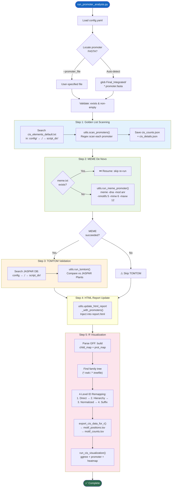

---

## 1. 依赖总览

### Python 标准库
[os](file:///Users/baijiuzhuo/Downloads/pipeline/pipeline_utils.py#1842-2222) `sys` `argparse` `logging` [re](file:///Users/baijiuzhuo/Downloads/pipeline/ncbi/run_pipeline_v3.py#32-36) `pathlib` `collections.defaultdict`

### 第三方库
| 库 | 用途 |
|---|---|
| [yaml](file:///Users/baijiuzhuo/Downloads/pipeline/config.yaml) | 配置文件解析 |
| `pipeline_utils` | 所有核心分析函数 |
| `format_detector` | ID 映射规则（延迟导入） |

---

## 2. CLI 参数

| 参数 | 类型 | 默认值 | 说明 |
|---|---|---|---|
| `--config` | str | **必填** | config.yaml 路径 |
| `--promoter_file` | str | 自动检测 | 启动子 FASTA 路径 |
| `--cpu` | int | `1` | MEME 并行线程数 |

---

## 3. 五步分析流程详解

### Step 1: Golden List Scanning（L66-86）

**数据库搜索路径**（优先级）：
1. `config/cis_elements_default.txt`
2. `./cis_elements_default.txt`
3. `{script_dir}/cis_elements_default.txt`

调用 `utils.scan_promoters()` 对每条启动子序列进行正则匹配扫描。

**输出**：
- `cis_counts.json` — `{gene_id: {motif_name: count}}`
- `cis_details.json` — `{gene_id: [{motif, start, end, strand, sequence}]}`

### Step 2: MEME De Novo Discovery（L88-99）

- **断点续跑**：检查 `MEME_Promoter/meme.txt` 是否已存在
- 调用 `utils.run_meme_promoter()` → 优先 Local MEME，降级 Docker
- 参数：`-dna -mod anr -nmotifs 5 -minw 6 -maxw 12`

### Step 3: TOMTOM Validation（L104-121）

将 MEME 发现的 de novo motif 与 JASPAR 植物数据库比对：
- **数据库搜索**：`config.promoter.tomtom_db` → `./` → `{script_dir}/`
- 调用 `utils.run_tomtom()`

### Step 4: HTML Report Update（L127-132）

调用 `utils.update_html_report_with_promoters()` 将结果注入主 `report.html`。

### Step 5: R Visualization — 最复杂的阶段（L134-337）

#### 5a. GFF 解析构建 ID 映射（L140-191）

从 GFF 构建两个映射：
- `child_map` — `{parent_id: [child_feature_ids]}`（层级关系）
- `prot_map` — `{feature_id: protein_id}`（蛋白 ID 映射）

#### 5b. 进化树定位（L196-231）

```
搜索: out_dir + final_dir + analysis_dir.parent
模式: *.nwk, *.tree, *.newick, *.treefile
优先: 名称含 "ML" / "iqtree" / "treefile" 的文件
```

从 Newick 文件用正则提取所有叶节点 ID：
1. [([A-Za-z0-9_\.\-]+)(?=:)](file:///Users/baijiuzhuo/Downloads/pipeline/ncbi/run_pipeline_v3.py#37-46) — 冒号前的 ID
2. [([A-Za-z0-9_\.\-]+)(?=[,)])](file:///Users/baijiuzhuo/Downloads/pipeline/ncbi/run_pipeline_v3.py#37-46) — 逗号/括号前（无分枝长度时）

#### 5c. 四级 ID 重映射（L233-308）

**核心问题**：启动子 ID（Gene 级）≠ 进化树 ID（Protein/Transcript 级）

| 级别 | 策略 | 示例 |
|---|---|---|
| 1. Direct | promoter_id ∈ tree_ids? | `Gh_A01G0001` = `Gh_A01G0001` |
| 2. Hierarchy | gene → children → protein → tree | `gene-LOC123` → mRNA → `XP_456.1` |
| 3. Normalized | apply rule_gff_to_pep | `cds-XP_456.1` → `XP_456.1` |
| 4. Suffix | append `.1` / `_1` / `.t1` / `_T01` / `-RA` | `AT1G01010` → `AT1G01010.1` |

对每个启动子 ID 依次尝试四级映射，找到匹配的 Tree ID。

#### 5d. 导出与渲染（L310-336）

```
export_cis_data_for_r() → motif_positions.tsv + motif_counts.tsv
run_cis_visualization() → R script → cis_element_analysis.[pdf/svg/png]
```

---

## 4. 输入/输出

### 输入
| 文件 | 来源 |
|---|---|
| [config.yaml](file:///Users/baijiuzhuo/Downloads/pipeline/config.yaml) | 用户/管线配置 |
| `*.promoter.fasta` | [universal_family_extractor.py](file:///Users/baijiuzhuo/Downloads/pipeline/universal_family_extractor.py) 提取 |
| `cis_elements_default.txt` | Golden List 数据库 |
| `cis_elements_jaspar_plants.meme` | JASPAR 植物 Motif 库 |
| `*.nwk` / `*.treefile` | 进化树文件 |
| GFF3 | 基因注释（ID 映射用） |

### 输出
| 文件/目录 | 说明 |
|---|---|
| `Promoter_Analysis/cis_counts.json` | 每基因 motif 计数 |
| `Promoter_Analysis/cis_details.json` | 每基因 motif 位置详情 |
| `Promoter_Analysis/MEME_Promoter/` | MEME de novo 结果 |
| `Promoter_Analysis/MEME_Promoter/tomtom_out/` | TOMTOM 验证结果 |
| `Promoter_Analysis/motif_positions.tsv` | R 可视化输入（位置分布） |
| `Promoter_Analysis/motif_counts.tsv` | R 可视化输入（热图） |
| `Promoter_Analysis/cis_element_analysis.*` | R 输出图形 |
| `report.html`（更新） | 注入启动子分析段 |

---

## 5. 关键设计决策

### 5.1 Hybrid Discovery Strategy
同时运行**已知 motif 扫描**（Golden List）和 **de novo discovery**（MEME），互为补充：
- Golden List 提供已验证的生物学意义
- MEME 发现家族特异的未知 motif
- TOMTOM 将 de novo motif 回连到已知数据库

### 5.2 四级 ID 映射
启动子 ID 通常为 Gene 级（因为启动子在基因上游），而进化树 ID 通常为 Protein/Transcript 级。四级渐进映射确保最大匹配率。

### 5.3 断点续跑
MEME 运行可能耗时较长（尤其大家族），检查已有输出避免重复运行。

---

## 6. 错误处理

| 场景 | 处理 |
|---|---|
| 启动子文件找不到 | `sys.exit(1)` |
| 文件为空 | `sys.exit(0)`（正常退出） |
| Golden List 数据库缺失 | `sys.exit(1)` |
| MEME 失败 | Warning → 跳过 TOMTOM |
| JASPAR 数据库缺失 | Warning → 跳过 TOMTOM |
| report.html 不存在 | Warning → 跳过 HTML 更新 |
| GFF 解析失败 | Warning → 使用原始 ID |
| Tree 文件缺失 | Warning → 跳过 R 可视化 |
| R 脚本失败 | Warning → 继续 |

---

## 7. 被调用方式

由 [run_pipeline_v3.py](file:///Users/baijiuzhuo/Downloads/pipeline/run_pipeline_v3.py) Step 11 调用：

```python
python run_promoter_analysis.py \
    --config config.yaml \
    --cpu {cpu}
```

---

<div style="page-break-after: always;"></div>

<a id="mod-visualize-cis-elements"></a>

# visualize_cis_elements.R 技术报告

[⬆ 返回目录](#-目录点击跳转)

**文件**：[visualize_cis_elements.R](file:///Users/baijiuzhuo/Downloads/pipeline/visualize_cis_elements.R)
**行数**：211 行 | **大小**：~7 KB | **语言**：R
**定位**：**顺式元件可视化脚本**——将启动子分析结果与进化树整合，生成 Publication-ready 的三面板组合图（Tree + Stacked Bar + Heatmap）。

---

## 0. 流程图

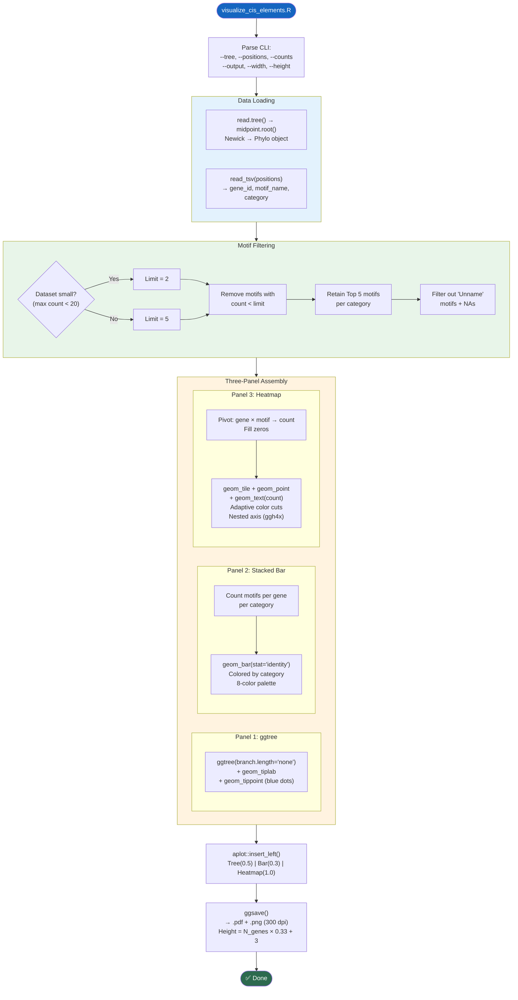

---

## 1. R 包依赖

| 包 | 用途 |
|---|---|
| `optparse` | CLI 参数解析 |
| `tidyverse` | 数据处理核心 |
| `readr` | TSV 读取 |
| `readxl` | Excel 读取（预留） |
| `ggtree` | 进化树渲染 |
| `tidytree` | 树数据操作 |
| `treeio` | 树文件 I/O |
| `ggfun` | ggplot2 辅助函数 |
| `ape` | Newick 树解析 |
| `phytools` | `midpoint.root()` 中点定根 |
| `aplot` | 多面板对齐组合 |
| `patchwork` | 图形拼接（备用） |
| `ggh4x` | 嵌套轴标签 |
| `RColorBrewer` | 配色方案 |

---

## 2. CLI 参数

| 参数 | 类型 | 默认值 | 说明 |
|---|---|---|---|
| `-t` / `--tree` | str | **必填** | Newick 进化树文件 |
| `-p` / `--positions` | str | **必填** | motif_positions.tsv |
| `-c` / `--counts` | str | — | motif_counts.tsv |
| `-o` / `--output` | str | `cis_element_analysis` | 输出前缀 |
| `-w` / `--width` | num | `20` | 图像宽度（英寸） |
| `-H` / `--height` | num | 自动 | 图像高度 |

---

## 3. 核心逻辑详解

### 3.1 数据加载（L31-50）

- **Tree**：`read.tree()` → `midpoint.root()`（中点定根，与 HTML 报告一致）
- **Positions**：读取 TSV，重命名列为 `X1`（gene）、`X2`（motif）、`description`（category）
- 过滤掉 `Unname` 前缀的 motif 和 NA 值

### 3.2 自适应 Motif 过滤（L52-78）

| 步骤 | 逻辑 | 说明 |
|---|---|---|
| **稀疏过滤** | 最大计数 < 20 → 阈值=2；否则阈值=5 | 小数据集保留更多 motif |
| **频率排序** | 按出现次数降序排列 | 高频 motif 优先 |
| **分类截断** | 每个 category 保留 Top 5 | 控制热图宽度 |

### 3.3 Panel 1: 进化树（L82-88）

```r
ggtree(tree, branch.length = "none")   # Cladogram 模式
  + geom_tiplab(offset = 0.5, size = 3)  # 叶节点标签
  + geom_tippoint(shape = 21, fill = "#3690c0", size = 3)  # 蓝色圆点
```

- `branch.length = "none"` → 所有分枝等长（Cladogram）
- `id_vector` 提取叶节点顺序 → 同步到其他面板

### 3.4 Panel 2: 堆叠柱状图（L91-121）

每个基因按 category 统计 motif 总数：

```r
group_by(X1, description) → summarise(stat = n())
```

**8 色配色方案**：
`#33a02c` `#a6cee3` `#e31a1c` `#ff7f00` `#6a3d9a` `#ffff99` `#b2df8a` `#cab2d6`

- Y 轴与 Tree 对齐（`factor(levels = rev(id_vector))`）
- 使用 `key_glyph = "point"` + `guide_legend(shape = 22)` 生成方块图例

### 3.5 Panel 3: 热图（L123-190）

**数据处理**：
```
gene × motif → count → pivot_wider(fill=0) → pivot_longer → 合并 category
```

**自适应色阶**：

| 数据范围 | 色阶区间 | 颜色数 |
|---|---|---|
| max ≤ 5 | 0,1,2,3,4,5 | 5 色（蓝→绿→紫） |
| max > 5 | 0,5,10,20,40,60,200 | 6 色（Paired 12 色子集） |

**ggh4x 嵌套轴**（L175）：
```r
guides(x = ggh4x::guide_axis_nested())
```
将 `interaction(X2, description)` 渲染为**双层轴标签**：
- 第一层：motif 名称（竖排 90°）
- 第二层：category 名称（粗体，水平）

### 3.6 组合输出（L192-210）

```r
final_plot <- p.promoter %>%
  insert_left(p.stat, width = 0.3) %>%
  insert_left(p.tree, width = 0.5)
```

`aplot::insert_left()` 自动对齐 Y 轴（确保 Tree/Bar/Heatmap 行对应）。

**自动高度**：`height = N_genes × 0.33 + 3`（英寸）

**输出**：
- `{output}.pdf` — 矢量图
- `{output}.png` — 300 DPI 位图

---

## 4. 输入/输出

### 输入
| 文件 | 来源 |
|---|---|
| Newick 树文件 | [run_pipeline_v3.py](file:///Users/baijiuzhuo/Downloads/pipeline/run_pipeline_v3.py) Step 9 |
| `motif_positions.tsv` | [export_cis_data_for_r()](file:///Users/baijiuzhuo/Downloads/pipeline/pipeline_utils.py#3625-3701) |
| `motif_counts.tsv` | [export_cis_data_for_r()](file:///Users/baijiuzhuo/Downloads/pipeline/pipeline_utils.py#3625-3701) |

### 输出
| 文件 | 说明 |
|---|---|
| `cis_element_analysis.pdf` | 矢量组合图 |
| `cis_element_analysis.png` | 300 DPI PNG |

---

## 5. 关键设计决策

### 5.1 中点定根
使用 `phytools::midpoint.root()` 确保树与 HTML 报告中的进化树根一致。

### 5.2 aplot 而非 patchwork
`aplot::insert_left()` 能自动对齐 **ggtree 系 ggplot** 的行顺序，而 `patchwork` 无法自动处理 ggtree 的行对齐。

### 5.3 嵌套轴标签
`ggh4x::guide_axis_nested()` 在热图 X 轴实现**自动分组**，无需手动绘制分隔线。

### 5.4 自适应阈值
小家族（<20 个 motif 出现）使用更宽松的保留阈值，避免过滤后无数据可视化。

---

## 6. 被调用方式

由 [pipeline_utils.py](file:///Users/baijiuzhuo/Downloads/pipeline/pipeline_utils.py) 的 [run_cis_visualization()](file:///Users/baijiuzhuo/Downloads/pipeline/pipeline_utils.py#3703-3764) 调用：

```bash
Rscript visualize_cis_elements.R \
    --tree family.nwk \
    --positions motif_positions.tsv \
    --counts motif_counts.tsv \
    --output Promoter_Analysis/cis_element_analysis
```

---

<div style="page-break-after: always;"></div>

<a id="mod-run-kaks-analysis"></a>

# run_kaks_analysis.py 技术报告

[⬆ 返回目录](#-目录点击跳转)

**文件**：[run_kaks_analysis.py](file:///Users/baijiuzhuo/Downloads/pipeline/run_kaks_analysis.py)
**行数**：405 行 | **大小**：~18 KB
**定位**：**选择压力分析模块（Ka/Ks）**——从蛋白 MSA + CDS 序列生成密码子比对，运行 KaKs_Calculator 计算 Ka/Ks 比值，支持并行分块、Docker/本地双模式、可视化和 HTML 报告注入。

---

## 0. 流程图

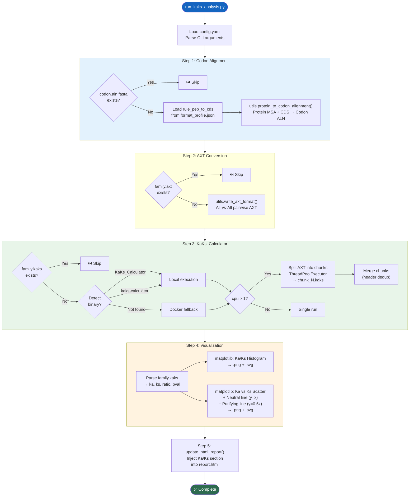

---

## 1. 依赖总览

### Python 标准库
`argparse` `logging` [os](file:///Users/baijiuzhuo/Downloads/pipeline/pipeline_utils.py#1842-2222) `sys` `shutil` `math` [re](file:///Users/baijiuzhuo/Downloads/pipeline/run_pipeline_v3.py#34-38) `pathlib`

### 第三方库
| 库 | 用途 |
|---|---|
| [yaml](file:///Users/baijiuzhuo/Downloads/pipeline/config.yaml) | 配置文件解析 |
| `matplotlib` | 直方图 + 散点图（延迟导入） |
| `concurrent.futures` | 并行分块（延迟导入） |
| `pipeline_utils` | 核心工具函数 |
| `format_detector` | ID 映射规则（延迟导入） |

### 外部工具
| 工具 | 模式 | 用途 |
|---|---|---|
| `KaKs_Calculator` / `kaks-calculator` | 本地 | Ka/Ks 计算 |
| Docker `kaks-calculator:local` | Docker | Ka/Ks 计算（降级） |

---

## 2. CLI 参数

| 参数 | 类型 | 默认值 | 说明 |
|---|---|---|---|
| `--config` | str | **必填** | config.yaml 路径 |
| `--msa` | str | **必填** | 蛋白 MSA FASTA |
| `--cds` | str | **必填** | CDS 核酸 FASTA |
| `--output` | str | `Result_KaKs` | 输出目录名 |
| `--mode` | str | `MA` | 计算方法（MA/YN/ML） |
| `--cpu` | int | `1` | 并行线程数 |
| `--profile` | str | — | format_profile.json 路径 |
| `--remove_gaps` | flag | — | 移除含 gap 列（严格模式） |

### 计算方法
| 方法 | 全称 | 特点 |
|---|---|---|
| **MA** | Model Averaging | 多模型平均，最推荐 |
| **YN** | Yang-Nielsen (2000) | 经典方法 |
| **ML** | Maximum Likelihood | 最大似然估计 |

---

## 3. 四步流程详解

### Step 1: 密码子比对（L47-74）

调用 `utils.protein_to_codon_alignment()`：
- 蛋白 MSA 中每个氨基酸 → 对应 3 个 CDS 核苷酸
- Gap（`-`）→ `---`（3 个 gap）
- 支持 `rule_pep_to_cds` 进行 ID 转换
- 支持 `--remove_gaps` 严格模式

### Step 2: AXT 格式转换（L76-85）

调用 `utils.write_axt_format()`：
- 密码子比对 → All-vs-All 配对
- 每对格式：`Seq1&Seq2\nseq1_codons\nseq2_codons\n\n`

### Step 3: KaKs_Calculator（L87-182）

**工具发现策略**（L98-106）：
1. `shutil.which("KaKs_Calculator")` → 本地
2. `shutil.which("kaks-calculator")` → 本地（小写变体）
3. 均未找到 → Docker 降级

**并行分块**（L125-172，cpu > 1 时）：
1. 解析 AXT 文件为独立的 pair 数据块（空行分隔）
2. 按 `ceil(total / n_threads)` 均分为 N 个 chunk
3. 每个 chunk 写入 `chunk_N.axt`
4. `ThreadPoolExecutor` 并行执行
5. 合并 `chunk_N.kaks`（header 仅保留一次）
6. 清理临时 chunk 文件

**Docker 命令**：
```bash
docker run --rm -v {out_dir}:/data kaks-calculator:local \
    KaKs_Calculator -i /data/family.axt -o /data/family.kaks -m MA
```

### Step 4: 可视化（L190-265）

**结果解析**（L191-221）：
- TSV 格式：`Sequence\tMethod\tKa\tKs\tKa/Ks\tP-Value`
- 过滤极端异常值（ratio > 10, Ka > 5, Ks > 5）

**图 A — Ka/Ks 直方图**：
- 20 bins，蓝色柱形
- 显示 Ka/Ks 比值分布

**图 B — Ka vs Ks 散点图**：
- 红色散点
- 灰色虚线：中性进化线（Ka/Ks = 1）
- 绿色点线：纯化选择线（Ka/Ks = 0.5）

### Step 5: HTML 报告注入 [update_html_report()](file:///Users/baijiuzhuo/Downloads/pipeline/run_kaks_analysis.py#288-402)（L288-401）

**统计摘要**：
| 指标 | 说明 |
|---|---|
| Total Gene Pairs | 总配对数 |
| Average Ka/Ks | 平均比值 |
| Positive Selection (Ka/Ks > 1) | 正选择配对数（红色标注） |
| Purifying Selection (Ka/Ks < 1) | 纯化选择配对数（绿色标注） |

**HTML 结构**：
- 摘要统计卡片
- 散点图 + 直方图（嵌入 PNG）
- 可展开的完整配对表格（按 Ka/Ks 降序，正选择行黄色高亮）

**注入位置**：优先插入 `<div class="footer">` 前，其次 `</body>` 前。

---

## 4. 输入/输出

### 输入
| 文件 | 来源 |
|---|---|
| config.yaml | 用户配置 |
| 蛋白 MSA | Step 7 MAFFT 比对结果 |
| CDS FASTA | [universal_family_extractor.py](file:///Users/baijiuzhuo/Downloads/pipeline/universal_family_extractor.py) 提取 |
| format_profile.json | [format_detector.py](file:///Users/baijiuzhuo/Downloads/pipeline/format_detector.py) |

### 输出
| 文件 | 说明 |
|---|---|
| `family.codon.aln.fasta` | 密码子比对 |
| `family.axt` | AXT 格式配对 |
| `family.kaks` | KaKs_Calculator 原始结果 |
| `kaks_histogram.png/svg` | Ka/Ks 分布直方图 |
| `ka_ks_scatter.png/svg` | Ka vs Ks 散点图 |
| `report.html`（更新） | 注入 Ka/Ks 分析段 |

---

## 5. 关键设计决策

### 5.1 PAL2NAL 替代
内置 Python 实现取代传统 `pal2nal.pl` Perl 脚本，减少外部依赖。

### 5.2 并行分块
大家族可产生 $\binom{n}{2}$ 对配对（如 50 个基因 → 1225 对），分块并行大幅缩短计算时间。

### 5.3 三步断点续跑
每一步检查输出文件是否已存在，支持中断后安全恢复。

---

## 6. 被调用方式

由 [run_pipeline_v3.py](file:///Users/baijiuzhuo/Downloads/pipeline/run_pipeline_v3.py) Step 10 调用：

```python
python run_kaks_analysis.py \
    --config config.yaml \
    --msa {final_aln} \
    --cds {cds_fasta} \
    --profile {format_profile.json} \
    --cpu {cpu} \
    --mode MA
```

---

<div style="page-break-after: always;"></div>

<a id="mod-run-synteny-analysis"></a>

# run_synteny_analysis.py 技术报告

[⬆ 返回目录](#-目录点击跳转)

**文件**：[run_synteny_analysis.py](file:///Users/baijiuzhuo/Downloads/pipeline/run_synteny_analysis.py)
**行数**：1144 行 | **大小**：~51 KB
**定位**：**共线性分析模块**——基于 JCVI（MCScanX）进行种内共线性检测、基因重复类型分类，并使用 Matplotlib 生成 Circos 风格可视化图。

---

## 0. 流程图

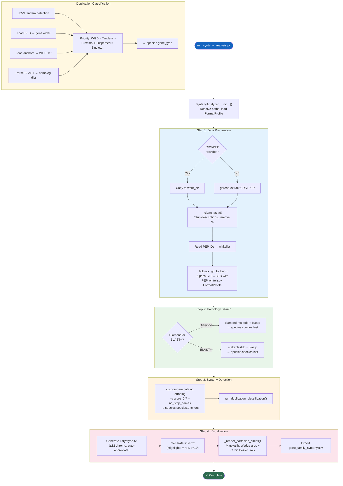

---

## 1. 依赖总览

### Python 标准库
`sys` [os](file:///Users/baijiuzhuo/Downloads/pipeline/run_synteny_analysis.py#830-848) `argparse` `shutil` `logging` `subprocess` `pathlib` `csv` `math`

### 第三方库
| 库 | 用途 |
|---|---|
| `Bio.SeqIO` | FASTA 序列读取/清理 |
| `matplotlib` | Circos 图渲染（延迟导入） |
| `numpy` | 三角函数/角度计算（延迟导入） |
| `jcvi` | MCScanX 共线性检测 |

### 外部工具
| 工具 | 用途 |
|---|---|
| `diamond` / [blastp](file:///Users/baijiuzhuo/Downloads/pipeline/blast_verify.py#34-109) | All-vs-All 自身同源搜索 |
| `gffread` | GFF→CDS/PEP 提取（可选） |

---

## 2. CLI 参数

| 参数 | 类型 | 默认值 | 说明 |
|---|---|---|---|
| `--genome` | str | **必填** | 基因组 FASTA |
| `--gff` | str | **必填** | GFF3 注释 |
| `--out_dir` | str | **必填** | 输出目录 |
| `--cds` | str | — | CDS FASTA（可选，避免 gffread） |
| `--pep` | str | — | 蛋白 FASTA（可选） |
| `--highlights` | str | — | 高亮基因 ID 文件 |
| `--threads` | int | `4` | 线程数 |
| `--evalue` | str | `1e-5` | BLAST E-value |
| `--profile` | str | — | format_profile.json |

---

## 3. [SyntenyAnalyzer](file:///Users/baijiuzhuo/Downloads/pipeline/run_synteny_analysis.py#54-1098) 类详解

### 3.1 Step 1: [prepare_data()](file:///Users/baijiuzhuo/Downloads/pipeline/run_synteny_analysis.py#91-139)（L91-138）+ [_fallback_gff_to_bed()](file:///Users/baijiuzhuo/Downloads/pipeline/run_synteny_analysis.py#140-409)（L140-408）

**PEP-Aligned BED 生成策略**：确保 BED 中的 ID 与 PEP/BLAST 完全一致。

**两遍 GFF 扫描**：

| 遍次 | 构建内容 |
|---|---|
| **Pass 1** | `parent_map` / `gene_attr_map` / `feat_to_prot` / `feat_coords` |
| **Pass 2** | 用 PEP ID 白名单匹配，输出 BED |

**蛋白 ID 提取优先级**（CDS feature）：
1. `protein_id=XP_/NP_`（NCBI RefSeq）
2. 其他属性值（过滤掉 `XM_/NM_` 前缀）
3. Feature ID 本身（去除 `cds.` 等前缀）
4. `format_detector.EXTRACT_PATTERN` 降级

**BED ID 匹配**（Pass 2）：
1. 应用 `rule_gff_to_pep` 规则转换
2. `EXTRACT_PATTERN` 提取
3. 版本号剥离（`.N` → base）

### 3.2 Step 2: [run_homology_search()](file:///Users/baijiuzhuo/Downloads/pipeline/run_synteny_analysis.py#421-455)（L421-454）

| 工具 | 优先级 | 命令 |
|---|---|---|
| Diamond | 1 | `diamond makedb` + `diamond blastp` |
| BLAST+ | 2 | `makeblastdb` + `blastp -outfmt 6` |

### 3.3 Step 3: [run_synteny()](file:///Users/baijiuzhuo/Downloads/pipeline/run_synteny_analysis.py#456-489) + [run_duplication_classification()](file:///Users/baijiuzhuo/Downloads/pipeline/run_synteny_analysis.py#490-632)（L456-631）

**JCVI 调用**：
```bash
python -m jcvi.compara.catalog ortholog {prefix} {prefix} --cscore=.7 --no_strip_names
```

**五级重复分类**：

| 类型码 | 名称 | 检测逻辑 |
|---|---|---|
| 4 | **WGD/Segmental** | 出现在 anchors 文件中 |
| 3 | **Tandem** | JCVI tandem 检测 OR 同染色体距离 < 10 |
| 2 | **Proximal** | 同染色体距离 10-20 |
| 1 | **Dispersed** | 有同源基因但距离 > 20 或跨染色体 |
| 0 | **Singleton** | 无同源基因 |

优先级：WGD > Tandem > Proximal > Dispersed > Singleton

### 3.4 Step 4: [generate_circos_conf()](file:///Users/baijiuzhuo/Downloads/pipeline/run_synteny_analysis.py#633-829) + [_render_cartesian_circos()](file:///Users/baijiuzhuo/Downloads/pipeline/run_synteny_analysis.py#849-1090)（L633-1089）

#### 核型构建（L717-777）

| 场景 | 策略 |
|---|---|
| 目标染色体 ≥ 12 | 仅保留含目标基因的染色体 |
| 目标染色体 < 12 | 目标染色体 + 最长染色体补齐至 12 |
| 染色体 > 12 | 自动缩缩写为 `chr01` 格式 + 保存映射文件 |

**预扫描优化**：先扫描 anchors 文件找出含高亮基因链接的染色体，优先显示有实际共线性连接的。

#### Circos 渲染（L849-1089）

纯 Matplotlib 实现,无外部 Circos 依赖：

- **染色体弧段**：`matplotlib.patches.Wedge`（NPG 10 色配色）
- **共线性连线**：三次 Bézier 曲线（`mpath.Path` CURVE4）
- **控制点**：`ctrl_factor=0.3`（线经过圆心附近弯曲）
- **分层渲染**：背景灰色链接 → 高亮红色链接（zorder 控制）
- **基因标签**：引导线（tick）+ 切线旋转文字
- **弧段标签**：按弧度大小自适应字号（< 3° 跳过，< 8° 小字）

#### CSV 导出（L968-996）

```csv
Member_Gene,Member_Chr,Member_Start,Member_End,Collinear_Gene,Collinear_Chr,Collinear_Start,Collinear_End
```

仅导出高亮链接（家族成员相关的共线性对）。

---

## 4. 输入/输出

### 输入
| 文件 | 来源 |
|---|---|
| Genome FASTA | 用户提供 |
| GFF3 | 用户提供 / gff_normalizer 标准化 |
| CDS/PEP FASTA | universal_family_extractor 或 gffread |
| highlights.txt | run_pipeline_v3.py 生成的候选基因列表 |
| format_profile.json | format_detector.py |

### 输出
| 文件 | 说明 |
|---|---|
| `Synteny_Work/{prefix}.bed` | JCVI 格式 BED |
| `Synteny_Work/{prefix}.{prefix}.last` | BLAST 结果 |
| `Synteny_Work/{prefix}.{prefix}.anchors` | 共线性锚点 |
| `Synteny_Work/{prefix}.gene_type` | 重复类型分类 |
| `Circos_Results/karyotype.txt` | 核型文件 |
| `Circos_Results/links.txt` | 链接文件 |
| `Circos_Results/circos_chr_mapping.tsv` | 染色体缩写映射 |
| `synteny_circos.png/svg` | Circos 图 |
| `gene_family_synteny.csv` | 共线性基因对 CSV |

---

## 5. 关键设计决策

### 5.1 PEP-Aligned BED
传统方法先生成 BED 再做 BLAST，ID 不匹配是最常见错误。本模块先提取 PEP，再用 PEP ID 作白名单生成 BED，从根本上消除 ID 不匹配。

### 5.2 纯 Python Circos
避免用户安装 Perl 版 Circos。Matplotlib 实现虽然简化，但已包含弧段、Bézier 连线、标签、分层渲染等核心功能。

### 5.3 智能染色体筛选
预扫描 anchors 找有实际共线性链接的染色体，避免显示无关 scaffold。

### 5.4 内置分类器
当 JCVI `duplicate_gene_classifier` 不可用时，使用内置 Python 分类器作为降级方案。

---

<div style="page-break-after: always;"></div>

<a id="mod-run-batch-pipeline"></a>

# run_batch_pipeline.py 技术报告

[⬆ 返回目录](#-目录点击跳转)

**文件**：[run_batch_pipeline.py](file:///Users/baijiuzhuo/Downloads/pipeline/run_batch_pipeline.py)
**行数**：234 行 | **大小**：~9 KB
**定位**：**多物种批量编排器**——扫描批量目录中的物种文件夹，自动检测各来源（NCBI/Ensembl/Phytozome/JGI/PLAZA）的基因组数据文件，并行启动 [run_pipeline_v3.py](file:///Users/baijiuzhuo/Downloads/pipeline/run_pipeline_v3.py) 分析每个物种。

---

## 0. 流程图

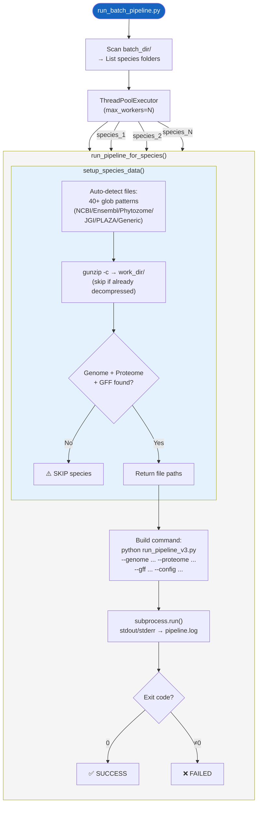

---

## 1. CLI 参数

| 参数 | 类型 | 默认值 | 说明 |
|---|---|---|---|
| `--batch_dir` | str | **必填** | 物种文件夹根目录（每个子目录=一个物种） |
| `--out_dir` | str | **必填** | 结果输出根目录 |
| `--config` | str | **必填** | 主 config.yaml（所有物种共享） |
| `--workers` | int | `10` | 最大并行物种数 |
| `--cpu_per_job` | int | `4` | 每个管线的 CPU 数 |
| `--mode` | str | `api` | InterProScan 模式（api/local） |
| `--ncbi_api_key` | str | — | NCBI API Key（提高速率限制） |

---

## 2. 核心函数详解

### 2.1 [setup_species_data()](file:///Users/baijiuzhuo/Downloads/pipeline/run_batch_pipeline.py#21-135)（L21-134）

**自动文件检测系统**——40+ glob 模式覆盖主流数据源：

| 文件类型 | 数据源示例 |
|---|---|
| **Genome** | `*_genomic.fna.gz`（NCBI）, `*.dna.toplevel.fa.gz`（Ensembl）, `*.hardmasked.fa.gz`（Phytozome） |
| **Proteome** | `*_protein.faa.gz`（NCBI）, `*.pep.all.fa.gz`（Ensembl）, `*.protein.fa.gz`（Phytozome） |
| **CDS** | `*_cds_from_genomic.fna.gz`（NCBI）, `*.cds.all.fa.gz`（Ensembl） |
| **GFF** | `*_genomic.gff.gz`（NCBI）, `*.gff3.gz`（通用） |

**排除列表防止交叉匹配**：

| 文件类型 | 排除关键词 |
|---|---|
| Genome | `_cds_`, [_protein](file:///Users/baijiuzhuo/Downloads/pipeline/pipeline_utils.py#905-938), `_rna` |
| Proteome | `_cds_`, `_genomic` |
| CDS | [_protein](file:///Users/baijiuzhuo/Downloads/pipeline/pipeline_utils.py#905-938) |

**解压策略**：`gunzip -c {src} > {dest}`（保留原始 gz，跳过已解压文件）

**必需文件**：Genome + Proteome + GFF（CDS 可选但建议提供）

### 2.2 [run_pipeline_for_species()](file:///Users/baijiuzhuo/Downloads/pipeline/run_batch_pipeline.py#136-191)（L136-190）

构建 [run_pipeline_v3.py](file:///Users/baijiuzhuo/Downloads/pipeline/run_pipeline_v3.py) 命令：

```bash
python run_pipeline_v3.py \
    --config {master_config} \
    --family {species_name} \
    --genome {genome} --proteome {proteome} \
    --cds {cds} --gff {gff} \
    --out_dir Result_{species_name} \
    --tmp_dir tmp/tmp_{species_name} \
    --cpu {cpu_per_job} \
    --interpro_mode {api|local}
```

**隔离性**：
- 每个物种独立 `out_dir` 和 `tmp_dir`
- stdout/stderr 重定向到 `pipeline.log`
- 使用 `subprocess.run(check=True)` 捕获失败

### 2.3 [main()](file:///Users/baijiuzhuo/Downloads/pipeline/scan_cdd_ncbi.py#152-205) 并行调度（L192-233）

```python
ThreadPoolExecutor(max_workers=args.workers)
```

- 每个物种一个线程
- `as_completed()` 收集结果
- 异常隔离（一个物种失败不影响其他物种）

---

## 3. 输入/输出

### 输入目录结构
```
batch_dir/
├── Arabidopsis_thaliana/
│   ├── GCF_000001735.4_TAIR10.1_genomic.fna.gz
│   ├── GCF_000001735.4_TAIR10.1_protein.faa.gz
│   ├── GCF_000001735.4_TAIR10.1_cds_from_genomic.fna.gz
│   └── GCF_000001735.4_TAIR10.1_genomic.gff.gz
├── Oryza_sativa/
│   └── ...
└── Gossypium_hirsutum/
    └── ...
```

### 输出目录结构
```
out_dir/
├── input_data_unzipped/
│   ├── Arabidopsis_thaliana/    (解压后的文件)
│   ├── Oryza_sativa/
│   └── ...
├── Result_Arabidopsis_thaliana/  (管线结果)
│   ├── pipeline.log
│   ├── report.html
│   └── ...
├── Result_Oryza_sativa/
├── tmp/
│   ├── tmp_Arabidopsis_thaliana/
│   └── tmp_Oryza_sativa/
└── ...
```

---

## 4. 关键设计决策

### 4.1 优先级 glob 匹配
模式列表按特异性降序排列（NCBI 特有模式 → Ensembl → Phytozome → 通用），避免通用模式错误匹配其他文件类型。

### 4.2 进程级隔离
每个物种通过 `subprocess.run()` 启动独立 Python 进程，内存完全隔离。线程池仅负责调度和日志。

### 4.3 GFF 标准化延迟
不在批量层执行 AGAT 标准化，而是让每个 [run_pipeline_v3.py](file:///Users/baijiuzhuo/Downloads/pipeline/run_pipeline_v3.py) 实例根据各自 [config.yaml](file:///Users/baijiuzhuo/Downloads/pipeline/config.yaml) 配置决定是否标准化。

---

## 5. 被调用方式

由用户直接调用：

```bash
python run_batch_pipeline.py \
    --batch_dir ~/data/multiple_species \
    --out_dir ~/results/batch_analysis \
    --config config.yaml \
    --workers 10 \
    --cpu_per_job 4 \
    --mode api
```

---

<div style="page-break-after: always;"></div>

<a id="mod-render-multi-species-summary"></a>

# render_multi_species_summary_v2.py 技术报告

[⬆ 返回目录](#-目录点击跳转)

**文件**：[render_multi_species_summary_v2.py](file:///Users/baijiuzhuo/Downloads/pipeline/render_multi_species_summary_v2.py)
**行数**：1000 行 | **大小**：~46 KB
**定位**：**多物种汇总报告生成器（V3）**——聚合批量分析结果，通过 NCBI Entrez 自动分类物种，生成包含 Chart.js 图表和 DataTables 表格的交互式 HTML 报告。

---

## 0. 流程图

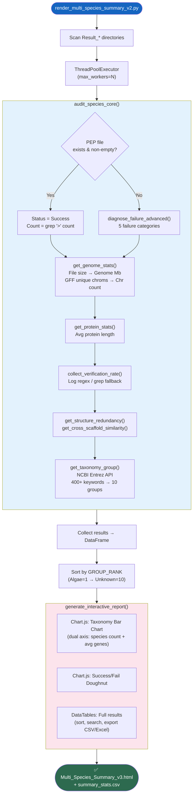

---

## 1. 依赖总览

| 库 | 用途 |
|---|---|
| `pandas` | DataFrame 汇总 |
| `Bio.Entrez` | NCBI Taxonomy API |
| [yaml](file:///Users/baijiuzhuo/Downloads/pipeline/config.yaml) | 配置解析 |
| `concurrent.futures` | 并行审计 |
| [json](file:///Users/baijiuzhuo/Downloads/pipeline/format_detector.py#45-48) / [re](file:///Users/baijiuzhuo/Downloads/pipeline/run_pipeline_v3.py#34-38) / `math` / `shlex` | 数据处理 |

---

## 2. CLI 参数

| 参数 | 类型 | 默认值 | 说明 |
|---|---|---|---|
| `--global_out` | str | **必填** | 批量结果根目录 |
| `--config` | str | **必填** | config.yaml（提供 email / API key） |
| `--threads` | int | `4` | 并行审计线程数 |

---

## 3. 核心函数详解

### 3.1 [get_taxonomy_group()](file:///Users/baijiuzhuo/Downloads/pipeline/render_multi_species_summary_v2.py#75-388)（L75-387）

通过 **NCBI Entrez API** 自动分类物种为 10 个进化组：

| 组 | 排序 | 检测关键词数 |
|---|---|---|
| Algae | 1 | ~50（绿藻/红藻/硅藻） |
| Streptophyte Algae | 1.5 | Streptophyta ∩ ¬Embryophyta |
| Bryophytes | 2 | ~30（苔藓/地钱/角苔） |
| Lycophytes | 2.5 | ~15（石松/卷柏） |
| Ferns | 3 | ~50（蕨类/木贼） |
| Gymnosperms | 4 | ~30（松柏/苏铁/银杏） |
| Basal Angiosperms | 5 | ANA 级（睡莲/离瓣花） |
| Magnoliids | 5.5 | ~30（木兰/樟/胡椒） |
| Monocots | 6 | ~80（禾本/兰/棕榈） |
| Eudicots | 7 | ~200（十字花/豆/蔷薇等） |

**API 鲁棒性**：
- 内置 [safe_entrez_request()](file:///Users/baijiuzhuo/Downloads/pipeline/render_multi_species_summary_v2.py#80-96) 重试包装器（4 次重试，指数退避）
- API Key 检测（有 key: 0.1s 间隔，无 key: 0.35s）
- 品种名降级：`Triticum aestivum Julius` → `Triticum aestivum` → `Triticum`

### 3.2 [get_genome_stats()](file:///Users/baijiuzhuo/Downloads/pipeline/render_multi_species_summary_v2.py#392-484)（L392-483）

| 指标 | 方法 | 性能 |
|---|---|---|
| Genome Size (Mb) | 文件大小 / 1.05（FASTA overhead）| O(1)，无需读文件 |
| Chr Count | `grep -v '^#' GFF | cut -f1 | sort -u | wc -l` | 快速 shell 命令 |
| 降级估算 | `file_size / 50MB`（当 GFF 不可用时） | O(1) |

### 3.3 [diagnose_failure_advanced()](file:///Users/baijiuzhuo/Downloads/pipeline/render_multi_species_summary_v2.py#541-570)（L541-569）

五类失败诊断：

| 类别 | 检测模式 | 建议 |
|---|---|---|
| No Candidates | `Found 0 entries` 等 | 检查家族名/E-value |
| Domain Filter | `Extracted: PEP=0` | 放松 Domain E-value |
| Dependency | `ModuleNotFoundError` | 安装缺失工具 |
| API Error | `Connection refused` | 重试或用本地模式 |
| Synteny Error | `Synteny.*FAILED` | 检查 GFF/安装 MCScanX |

### 3.4 [collect_verification_rate()](file:///Users/baijiuzhuo/Downloads/pipeline/render_multi_species_summary_v2.py#571-632)（L571-631）

多级获取验证率：
1. 正则从 log 提取 `Merged Result` 和 `Extracted: PEP=N`
2. 降级：直接 `grep -c '>' merged.fasta` / `pep.fasta`
3. 计算 `final/merged × 100%`

### 3.5 [audit_species_with_timeout()](file:///Users/baijiuzhuo/Downloads/pipeline/render_multi_species_summary_v2.py#634-669)（L634-668）

使用 `signal.SIGALRM` 强制超时（默认 4000s），防止单物种卡住。Windows 降级为无超时。

### 3.6 [generate_interactive_report()](file:///Users/baijiuzhuo/Downloads/pipeline/render_multi_species_summary_v2.py#740-951)（L740-950）

| 前端技术 | 用途 |
|---|---|
| Bootstrap 5 | 响应式布局 |
| Chart.js | 双轴柱状图 + 环形图 |
| DataTables | 排序/搜索/导出（CSV/Excel） |
| Inter 字体 | 现代排版 |

**图表 A**：Taxonomy Distribution（双 Y 轴：物种数 + 平均基因数）
**图表 B**：Success/Fail 环形图
**表格**：13 列交互表（Group/Species/Status/Count/Genome/Chr/AvgLen/VerifyRate/Redundancy/Similarity/Reason/Suggestion/Action）

---

## 4. 输入/输出

### 输入
```
global_out/
├── Result_Arabidopsis_thaliana/
│   ├── pipeline.log
│   ├── pipeline_summary.md
│   └── Final_Integrated/family_members.pep.fasta
├── Result_Oryza_sativa/
│   └── ...
└── ...
```

### 输出
| 文件 | 说明 |
|---|---|
| `Multi_Species_Summary_v3.html` | 交互式汇总报告 |
| `summary_stats.csv` | 全部统计数据 CSV |

---

## 5. 被调用方式

由用户在批量分析后调用：

```bash
python render_multi_species_summary_v2.py \
    --global_out ~/results/batch_analysis \
    --config config.yaml \
    --threads 4
```
