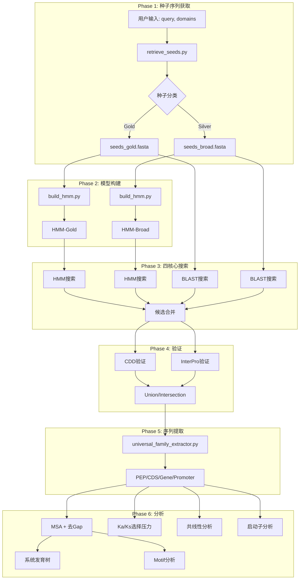

# GFIP 技术路线图 (Gene Family Identification Pipeline)

> **版本**: v3.1 (Quad-Core Edition)  
> **最后更新**: 2026-01-24  
> **文档目的**: 详细记录 Pipeline 每一步的技术细节、数据流和关键处理逻辑

---

## 总体架构



---

## Phase 1: 种子序列获取

### 脚本: `retrieve_seeds.py`

#### 1.1 数据源 (三轨并行)

| 数据源 | API端点 | 获取方式 |
|--------|---------|----------|
| **NCBI Protein** | Entrez ESearch + EFetch | 按query检索，分批下载 |
| **UniProt** | REST API (uniprot.org) | Swiss-Prot + TrEMBL 检索 |
| **InterPro** | EBI InterPro API | 按InterPro ID获取成员 |

#### 1.2 种子分类逻辑 (Gold vs Silver)

```python
def classify_sequence(rec, source):
    """
    GOLD (高可信度):
    - NCBI: NP_* 或 YP_* (已验证的RefSeq)
    - UniProt: Swiss-Prot (已审核)
    - InterPro: Reviewed entries
    
    SILVER (预测/未审核):
    - NCBI: XP_* (预测蛋白)
    - UniProt: TrEMBL
    - InterPro: Unreviewed
    """
```

#### 1.3 序列质量过滤

```python
# pipeline_utils.cluster_sequences()
# 1. 过滤短片段 (< 50 aa)
# 2. 按长度排序 (最长优先)
# 3. 如果超过 max_count，随机采样保持多样性
```

**输出文件**:
- `{family}_seeds_gold.fasta` - 高可信度种子
- `{family}_seeds_broad.fasta` - 广泛种子 (reviewed_only=False时)

---

## Phase 2: HMM模型构建

### 脚本: `build_hmm.py`

#### 2.1 构建流程

```bash
# Step 1: 多序列比对 (MAFFT)
mafft --auto --amino --thread {cpu} seeds.fasta > seeds.aln

# Step 2: 构建HMM (HMMER hmmbuild)
hmmbuild --cpu {cpu} family.hmm seeds.aln

# Step 3: 压缩HMM (可选)
hmmpress family.hmm
```

#### 2.2 关键参数

| 参数 | 默认值 | 说明 |
|------|--------|------|
| `--cpu` | 4 | 并行线程数 |
| MAFFT `--auto` | - | 自动选择比对算法 |

**输出文件**:
- `{family}_gold.hmm` - Gold种子HMM
- `{family}_broad.hmm` - Broad种子HMM

---

## Phase 3: 四核心搜索 (Quad-Core Search)

### 脚本: `run_pipeline_v3.py` + `search_extract.py`

#### 3.1 四条搜索流

| 流 | 模型/种子 | 工具 | 输出 |
|----|-----------|------|------|
| **Stream 1** | HMM-Gold | hmmsearch | `hits_hmm_gold.fasta` |
| **Stream 2** | HMM-Broad | hmmsearch | `hits_hmm_broad.fasta` |
| **Stream 3** | Seeds-Gold | BLASTp | `hits_blast_gold.fasta` |
| **Stream 4** | Seeds-Broad | BLASTp | `hits_blast_broad.fasta` |

#### 3.2 hmmsearch 参数

```bash
hmmsearch --tblout hits.tbl -E {evalue} --cpu {cpu} model.hmm proteome.fasta
```

#### 3.3 BLASTp 参数

```bash
blastp -query seeds.fasta -subject proteome.fasta \
       -evalue {evalue} -num_threads {cpu} \
       -outfmt 6 -max_target_seqs 1000
```

#### 3.4 候选合并

```python
# merge_candidates.py 逻辑
all_ids = set()
for hit_file in [hmm_gold, hmm_broad, blast_gold, blast_broad]:
    ids = parse_fasta_ids(hit_file)
    all_ids.update(ids)

# 输出: merged_candidates.fasta
```

---

## Phase 4: 域验证 (Domain Validation)

### 4.1 CDD扫描

#### 脚本: `scan_cdd_ncbi.py`

```python
# 使用 NCBI CD-Search API (远程)
# 或本地 rpstblastn + CDD数据库

# 关键步骤:
# 1. 提交序列到 NCBI CD-Search
# 2. 轮询结果
# 3. 解析命中的 Domain (pssm_id 匹配 target_domains)
```

**输出**: `cdd_hits.txt` (TSV格式)

### 4.2 InterPro扫描

#### 脚本: `interproscan_runner.py`

```python
# 模式: 'local' 或 'api'

# API模式 (EBI):
# 1. 序列清洗 (去除非标准氨基酸)
s.seq = Seq(cleaned_seq)  # 重要: 必须用Seq对象

# 2. 分批提交 (batch_size=30)
# 3. 异步轮询结果
# 4. 解析TSV输出
```

**输出**: `interproscan_results.tsv`

### 4.3 候选整合逻辑

```python
# universal_family_extractor.py
if logic == "union":
    final_ids = cdd_hits | interpro_hits
elif logic == "intersection":
    final_ids = cdd_hits & interpro_hits
```

---

## Phase 5: 序列提取

### 脚本: `universal_family_extractor.py`

#### 5.1 ID归一化

```python
def normalize_id(pid):
    """
    处理不同平台的ID格式:
    - NCBI: XP_028218932.1 → XP_028218932_1
    - Ensembl: cds-CAA33989.1 → cds-CAA33989_1
    - EVM: EVM0001234.1 → EVM0001234_1
    """
    return re.sub(r'[._]', '_', pid.split()[0])
```

#### 5.2 CDS映射策略 (build_cds_map)

| 策略 | 格式 | 示例 |
|------|------|------|
| 1. NCBI protein_id | `[protein_id=XP_xxx]` | NCBI GFF注释 |
| 2. NCBI _prot_ | `lcl\|..._prot_XP_xxx` | NCBI FASTA头 |
| 3. NCBI _cds_ | `lcl\|..._cds_XP_xxx` | NCBI CDS文件 |
| 4. Ensembl gene: | `gene:ENSG00000xxx` | Ensembl注释 |
| 5. Ensembl transcript: | `transcript:ENST00000xxx` | **新增**: Ensembl蛋白→CDS映射 |
| 6. EVM gene= | `gene=Fsh101G000010` | EVM格式 |
| 7. 直接ID | 蛋白ID = CDS ID | 简单格式(如连翘) |

#### 5.3 最长异构体过滤

```python
def filter_longest_isoforms(candidate_ids, proteome_path, gff_path):
    """
    步骤:
    1. 解析GFF获取 mRNA->Gene 关系
    2. 按Gene分组所有转录本
    3. 每个Gene保留最长的转录本
    """
```

#### 5.4 输出文件

| 文件 | 内容 | 用途 |
|------|------|------|
| `family_members.pep.fasta` | 蛋白序列 | MSA/系统发育 |
| `family_members.cds.fasta` | CDS序列 | Ka/Ks分析 |
| `family_members.gene.fasta` | 基因组序列 | 基因结构 |
| `family_members.promoter.fasta` | 启动子序列 | 顺式元件分析 |
| `family_members.gff3` | 基因结构 | 染色体定位 |

---

## Phase 6: 分析流程

### 6.1 多序列比对 (MSA)

#### 脚本: `pipeline_utils.run_mafft_alignment()`

```bash
mafft --auto --amino --thread {cpu} input.fasta > output.aln
```

### 6.2 MSA Gap修剪 ⚠️ 关键步骤

#### 脚本: `pipeline_utils.trim_msa_by_gap()`

```python
def trim_msa_by_gap(input_aln, output_aln, max_gap_ratio=0.5):
    """
    移除Gap比例 > 50% 的列
    
    目的:
    - 提高系统发育树拓扑质量
    - 减少比对噪音对下游分析的影响
    
    流程:
    1. 读取比对文件
    2. 统计每列的gap比例
    3. 保留 gap_ratio <= max_gap_ratio 的列
    4. 输出修剪后的比对
    """
```

**应用场景**:
- 系统发育树构建前**: 必须进行Gap修剪
- Motif分析**: 使用原始MSA (保留Gap用于定位)

### 6.3 系统发育树构建

#### 工具优先级

| 优先级 | 工具 | 命令 |
|--------|------|------|
| 1 | IQ-TREE2 | `iqtree2 -s trimmed.aln -m MFP -bb 1000 -nt AUTO` |
| 2 | FastTree | `fasttree -lg < trimmed.aln > tree.nwk` |

#### 关键参数

```python
# pipeline_utils.run_iqtree()
cmd = [
    iqtree_bin,
    "-s", aln_file,
    "-m", "MFP",      # ModelFinder Plus (自动模型选择)
    "-bb", "1000",     # 1000次超快Bootstrap
    "-nt", str(threads),
    "-redo"            # 覆盖已有结果
]
```

### 6.4 Motif分析

#### 策略1: MEME (Gold Standard)

```python
# pipeline_utils.run_meme_local() / run_meme_docker()
cmd = [
    "meme", input_fasta,
    "-o", out_dir,
    "-protein",
    "-nmotifs", str(n_motifs),  # 默认15
    "-minw", "6",
    "-maxw", "50",
    "-mod", "zoops"
]
```

#### 策略2: MSA-Based Fallback

```python
def extract_motifs_from_msa(msa_file, min_len=6, conservation_threshold=0.7):
    """
    从MSA中提取保守区块作为Motif
    
    步骤:
    1. 逐列计算保守性 (最高频率氨基酸)
    2. 连续保守列组成保守区块
    3. 提取共识序列
    """
```

---

## Phase 7: Ka/Ks选择压力分析

### 脚本: `run_kaks_analysis.py`

#### 7.1 完整流程


#### 7.2 密码子比对 (PAL2NAL替代)

```python
def protein_to_codon_alignment(msa_path, cds_path, output_path, remove_gaps=True):
    """
    关键步骤:
    1. 读取蛋白MSA
    2. 读取CDS序列
    3. 按蛋白ID匹配CDS (使用build_cds_map)
    4. 将蛋白比对"翻译"成密码子比对:
       - 蛋白gap (-) -> 密码子gap (---)
       - 蛋白残基 (M) -> 对应密码子 (ATG)
    5. 移除终止密码子 (TAA, TAG, TGA)
    6. 移除全Gap列
    """
```

#### 7.3 AXT格式转换

```python
def write_axt_format(codon_aln_path, axt_path):
    """
    AXT格式 (KaKs_Calculator输入):
    
    Seq1&Seq2
    ATGCATGC...
    ATGCATGC...
    
    (每对序列一组，空行分隔)
    """
```

#### 7.4 并行KaKs计算

```python
# 分块并行
chunk_size = math.ceil(total_pairs / n_threads)
for i in range(n_threads):
    chunk_pairs = pairs[start:end]
    # 每个线程计算一个chunk
    executor.submit(run_kaks_chunk, chunk_axt, chunk_out)

# 合并结果
merge_kaks_chunks()
```

---

## Phase 8: 共线性分析

### 脚本: `run_synteny_analysis.py`

#### 8.1 SyntenyAnalyzer类

```python
class SyntenyAnalyzer:
    def run(self):
        self.setup()          # 检查依赖
        self.prepare_data()   # GFF→BED, 提取CDS/PEP
        self.run_homology_search()  # All-vs-All Diamond
        self.run_synteny()    # MCScanX
        self.generate_circos_conf()  # Karyotype + Links
        self.render_circos_plot()    # Matplotlib Circos
```

#### 8.2 GFF→BED转换

```python
def _fallback_gff_to_bed(self):
    """
    双遍扫描策略:
    
    Pass 1: 构建映射
    - FeatureID -> ParentID
    - FeatureID -> ProteinID
    
    Pass 2: 输出BED
    - 对每个mRNA/transcript，解析到ProteinID
    - 输出: Chrom, Start, End, ProteinID, Score, Strand
    """
```

#### 8.3 Homology搜索

```bash
# Diamond (比BLAST快100x)
diamond makedb --in pep.fasta -d pep
diamond blastp -d pep -q pep.fasta -e 1e-5 --max-target-seqs 5 -o blast.tsv
```

#### 8.4 MCScanX共线性检测

```bash
# JCVI (MCScanX Python封装)
python -m jcvi.compara.catalog ortholog --no_strip_names species species
```

---

## Phase 9: 启动子分析

### 脚本: `run_promoter_analysis.py`

#### 9.1 启动子提取

```python
# 默认提取TSS上游2000bp
upstream_len = config.get('promoter', {}).get('upstream', 2000)

# 从GFF获取基因起点和方向
# 提取对应的基因组序列 (正/负链)
```

#### 9.2 MEME Motif发现

```bash
meme promoter.fasta -dna -oc meme_out -nmotifs 10 -minw 6 -maxw 20 -mod zoops
```

#### 9.3 TOMTOM Motif比对

```bash
tomtom meme_out/meme.txt {motif_database} -o tomtom_out
```

---

## 数据流总结

```
用户输入
    ↓
┌─────────────────────────────────────────────────────┐
│ Phase 1: 种子获取                                    │
│   NCBI + UniProt + InterPro → Gold/Silver分类        │
└─────────────────────────────────────────────────────┘
    ↓
┌─────────────────────────────────────────────────────┐
│ Phase 2: HMM构建                                     │
│   MAFFT比对 → hmmbuild                               │
└─────────────────────────────────────────────────────┘
    ↓
┌─────────────────────────────────────────────────────┐
│ Phase 3: 四核心搜索                                   │
│   HMM-Gold + HMM-Broad + BLAST-Gold + BLAST-Broad    │
└─────────────────────────────────────────────────────┘
    ↓
┌─────────────────────────────────────────────────────┐
│ Phase 4: 域验证                                       │
│   CDD + InterPro → Union/Intersection                │
└─────────────────────────────────────────────────────┘
    ↓
┌─────────────────────────────────────────────────────┐
│ Phase 5: 序列提取                                     │
│   最长异构体过滤 → PEP/CDS/Gene/Promoter              │
└─────────────────────────────────────────────────────┘
    ↓
┌─────────────────────────────────────────────────────┐
│ Phase 6-9: 高级分析                                   │
│   MSA(→Gap修剪) → 系统发育树                          │
│   MSA → Motif分析                                    │
│   CDS → 密码子比对(→去Gap/Stop) → Ka/Ks              │
│   共线性分析 (Diamond + MCScanX + Circos)            │
│   启动子分析 (MEME + TOMTOM)                         │
└─────────────────────────────────────────────────────┘
    ↓
HTML报告 + 可视化
```

---

## 关键技术细节备忘

### ⚠️ 必须注意的处理步骤

| 步骤 | 处理 | 原因 |
|------|------|------|
| **MSA后** | Gap列修剪 (>50%) | 提高系统发育树质量 |
| **密码子比对后** | 移除终止密码子 | 避免KaKs计算错误 |
| **密码子比对后** | 移除全Gap列 | 确保比对有效 |
| **InterPro提交前** | 序列清洗 (非标准AA) | 避免API错误 |
| **GFF解析** | 双遍扫描 | 正确追踪 mRNA→Gene 关系 |
| **ID映射** | normalize_id() | 跨平台兼容 (NCBI/Ensembl/EVM) |

### 🔧 重要配置参数

| 参数 | 默认值 | 说明 |
|------|--------|------|
| `evalue` | 1e-5 | HMM/BLAST阈值 |
| `max_gap_ratio` | 0.5 | MSA修剪阈值 |
| `conservation_threshold` | 0.7 | Motif保守性阈值 |
| `upstream_len` | 2000 | 启动子长度 |
| `n_motifs` | 15 | MEME发现motif数 |
| `bootstrap` | 1000 | IQ-TREE bootstrap |

---

*文档结束*
