# GFIP Pipeline 技术路线图 (Gene Family Identification Pipeline)

## 📋 目录
1. [总体架构](#总体架构)
2. [Step 1: 种子序列获取](#step-1-种子序列获取)
3. [Step 2: HMM 模型构建](#step-2-hmm-模型构建)
4. [Step 3: 四核心搜索策略](#step-3-四核心搜索策略)
5. [Step 4: 候选合并与去重](#step-4-候选合并与去重)
6. [Step 5: 结构域验证](#step-5-结构域验证)
7. [Step 6: 序列提取 (Universal Family Extractor)](#step-6-序列提取)
8. [Step 7: 多序列比对 (MSA)](#step-7-多序列比对)
9. [Step 8: Motif 分析](#step-8-motif-分析)
10. [Step 9: 进化树构建](#step-9-进化树构建)
11. [Step 10: 染色体定位](#step-10-染色体定位)
12. [Step 11: 选择压力分析 (Ka/Ks)](#step-11-选择压力分析)
13. [Step 12: 共线性分析](#step-12-共线性分析)
14. [ID 映射策略](#id-映射策略)
15. [多物种批量处理](#多物种批量处理)

---

## 总体架构

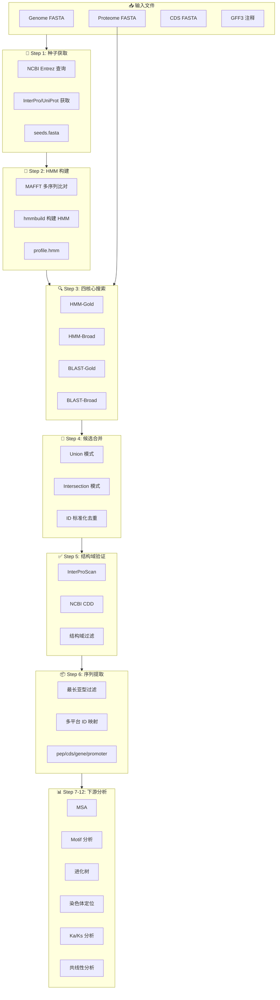

---

## Step 1: 种子序列获取

### 执行脚本
`retrieve_seeds.py`

### 工作流程

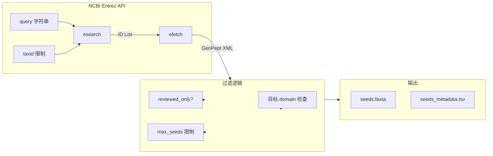

### 关键参数

| 参数 | 说明 | 默认值 |
|------|------|--------|
| `query` | NCBI 搜索词 | 必需 |
| `taxid` | 分类ID限制 | 33090 (Viridiplantae) |
| `reviewed_only` | 仅 Swiss-Prot 审核序列 | False |
| `max_seeds` | 最大种子数 | 10000 |
| `domains` | 目标结构域过滤 | 必需 |

### 输出文件
- `seeds.fasta` - 种子蛋白序列
- `seeds_metadata.tsv` - 包含 accession, organism, domains 等信息

---

## Step 2: HMM 模型构建

### 执行脚本
`run_pipeline_v3.py` 内联代码

### 工作流程

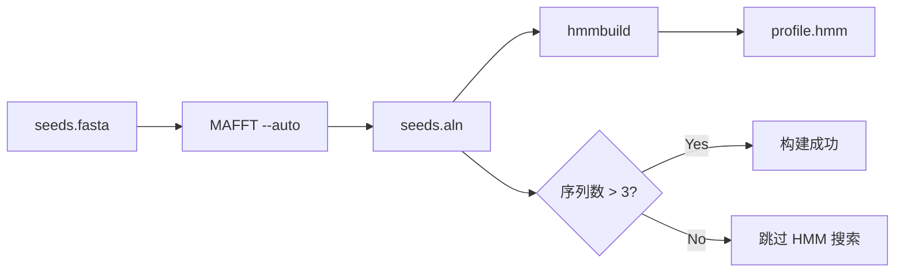

### 关键命令

```bash
# 多序列比对
mafft --auto --thread {cpu} seeds.fasta > seeds.aln

# HMM 构建
hmmbuild --amino profile.hmm seeds.aln
```

### 失败处理
- 种子数 < 3: 跳过 HMM 搜索，仅使用 BLAST
- MAFFT 失败: 使用 muscle 作为备选

---

## Step 3: 四核心搜索策略

### 架构图

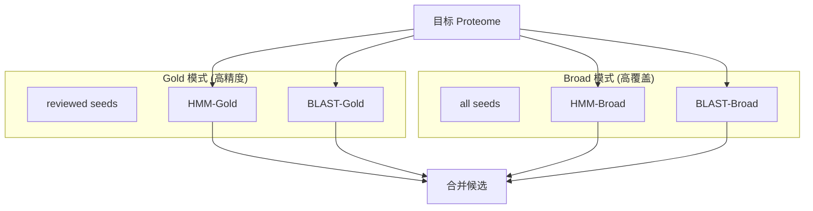

### 搜索方法详情

#### HMM 搜索 (hmmsearch)
```bash
hmmsearch --tblout hits.tbl --cpu {cpu} -E {evalue} profile.hmm proteome.fasta
```

**结果解析:**
- 提取 E-value < 阈值的 hits
- 从 `target name` 列提取蛋白 ID

#### BLAST 搜索 (blastp)
```bash
makeblastdb -in proteome.fasta -dbtype prot -out db
blastp -query seeds.fasta -db db -outfmt 6 -evalue {evalue} -num_threads {cpu}
```

**结果解析:**
- Column 2 = Subject ID (目标蛋白)
- 按 E-value 排序并去重

### reviewed_only 模式
当 `reviewed_only=True`:
- 跳过 HMM-Broad 和 BLAST-Broad
- 仅使用 Gold 模式 (Swiss-Prot 审核种子)

---

## Step 4: 候选合并与去重

### ID 标准化函数

```python
def normalize_id(pid):
    """
    标准化蛋白 ID 以处理跨平台差异
    
    Examples:
      XP_028218932.1 → XP_028218932_1
      cds-CAA33989.1 → CAA33989_1
      transcript:Os01t0100100-01 → Os01t0100100_01
    """
    # 1. 去除常见前缀
    for pfx in ['cds-', 'cds.', 'gene-', 'gene:', 'transcript:', 'rna-']:
        if pid.lower().startswith(pfx):
            pid = pid[len(pfx):]
    
    # 2. 替换 . 为 _ (版本号统一)
    pid = pid.replace('.', '_')
    
    # 3. 去除 lcl| 前缀
    if pid.startswith('lcl|'):
        pid = pid[4:]
    
    return pid
```

### 合并逻辑

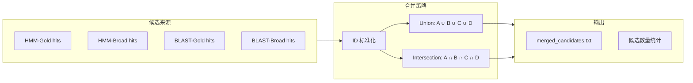

---

## Step 5: 结构域验证

### 双验证架构

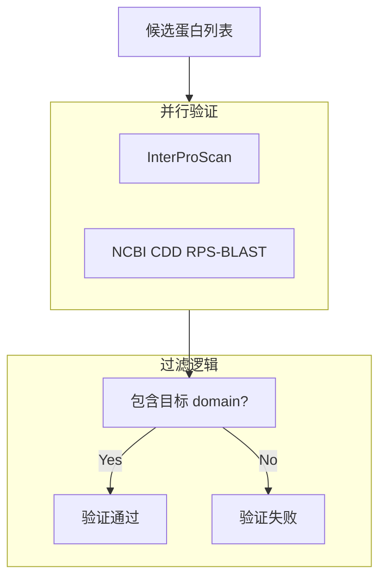

### InterProScan 执行

**本地模式:**
```bash
interproscan.sh -i candidates.fasta -f tsv -o interpro_results.tsv
```

**API 模式:**
```python
# 分批提交到 EBI API
# Batch size: 30 sequences
# Rate limit: 30 requests/minute
```

### CDD 验证

```bash
rpsblast -query candidates.fasta -db Cdd -outfmt 6 -evalue 0.01
```

**结果解析:**
- 匹配 `target_domains` 中的任一 domain ID
- 输出: `cdd_hits.tsv`

---

## Step 6: 序列提取

### 执行脚本
`universal_family_extractor.py`

### 多平台 ID 映射策略

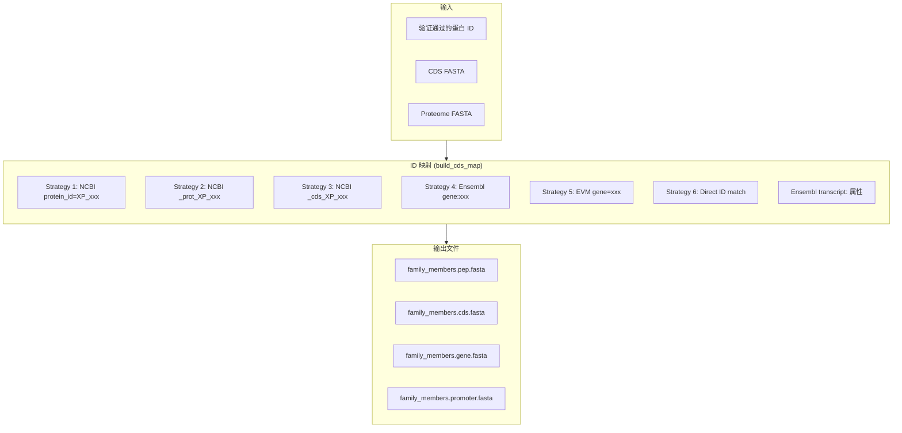

### 最长亚型过滤

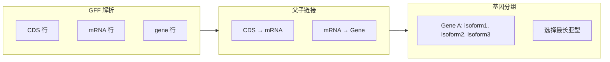

### Ensembl ID 处理详解

**问题:** Ensembl 蛋白 ID 与 CDS ID 格式不同

| 文件 | ID 示例 |
|------|---------|
| Protein | `>cds-CAA33989.1 ... transcript:transcript-rps2` |
| CDS | `>transcript-rps2 cds ... gene:gene-rps2` |

**解决方案:**
1. 扫描 Proteome 提取 `transcript:xxx` 属性
2. 建立 `protein_id → transcript_id` 映射
3. 用 `transcript_id` 查找 CDS 记录

---

## Step 7: 多序列比对

### 执行流程

```bash
mafft --auto --thread {cpu} family_members.pep.fasta > family_members.aln.fasta
```

### 比对后处理
- 去除全 gap 列
- 计算平均相似度
- 输出: `family_members.aln.fasta`

---

## Step 8: Motif 分析

### 工具: MEME Suite


### 启动子分析

```bash
# 提取上游 2kb 序列
# 分析 cis-regulatory elements
meme promoter.fasta -dna -mod zoops -nmotifs 10
```

---

## Step 9: 进化树构建

### 工具选择

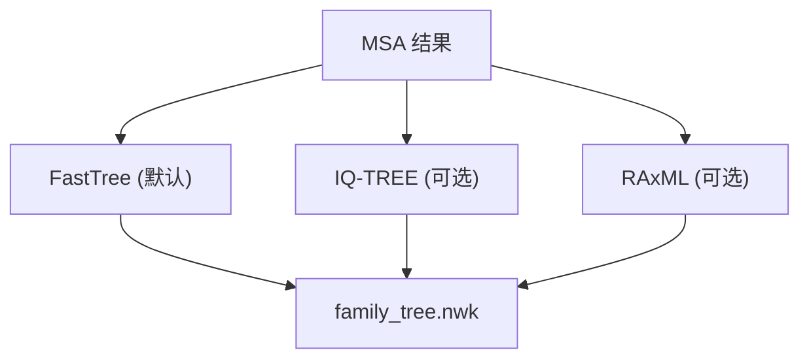

### 默认命令
```bash
FastTree -lg family_members.aln.fasta > family_tree.nwk
```

---

## Step 10: 染色体定位

### 执行脚本
`pipeline_utils.py` 中的 `generate_chromosomal_map()`

### 工作流程


### 输出示例
- 染色体图示: 显示基因在各染色体上的分布位置
- 颜色编码: 可按 domain 类型或表达水平着色

---

## Step 11: 选择压力分析

### Ka/Ks 计算流程

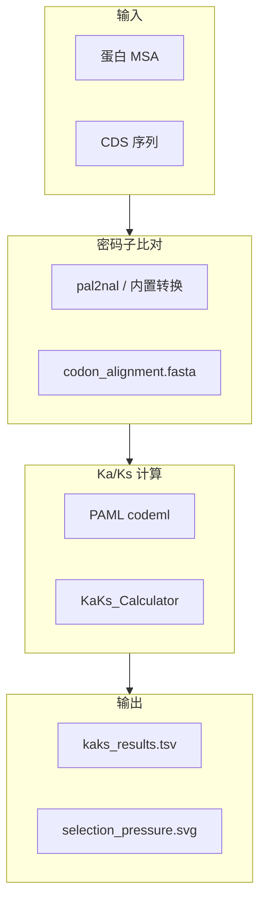

### CDS ID 映射问题 (已修复)

**问题:** 蛋白 MSA 中的 ID 与 CDS FASTA 中的 ID 不匹配

**解决方案:**
- Ensembl: 通过 `transcript:` 属性中转
- NCBI: 通过 `[protein_id=]` 属性映射
- 简单格式: 直接 ID 匹配

---

## Step 12: 共线性分析

### 执行脚本
`run_synteny_analysis.py`

### 工作流程

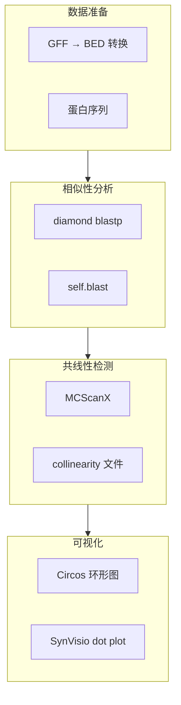

### GFF 转 BED (多格式支持)

```python
def _fallback_gff_to_bed(self):
    """
    支持多种 GFF 格式:
    1. NCBI RefSeq: protein_id=XP_xxx
    2. Ensembl: transcript:xxx, gene:xxx
    3. TreeGene/EVM: gene=xxx
    4. 简单格式: 直接使用 ID
    """
```

---

## ID 映射策略

### 支持的文件格式

| 来源 | Proteome ID 示例 | CDS ID 示例 | 映射策略 |
|------|------------------|-------------|----------|
| **NCBI RefSeq** | `XP_028218932.1` | `lcl xxx_cds_XP_028218932.1_123` | `[protein_id=]` 属性 |
| **Ensembl** | `cds-CAA33989.1` | `transcript-rps2` | `transcript:` 属性 |
| **TreeGene** | `MA_10000213g0010` | `MA_10000213g0010` | 直接匹配 |
| **EVM** | `Fsh101G000010.1` | `Fsh101G000010.1` | `gene=` 属性 |
| **Phytozome** | `Glyma.01G000100.1.p` | `Glyma.01G000100.1` | 去除 `.p` 后缀 |

### normalize_id() 函数详解

```python
def normalize_id(pid):
    """
    步骤:
    1. 去除前缀: cds-, gene-, transcript:, rna-
    2. 替换版本分隔符: . → _
    3. 去除 lcl| 前缀
    4. 大小写统一 (可选)
    
    示例:
      "cds-CAA33989.1" → "CAA33989_1"
      "XP_028218932.1" → "XP_028218932_1"
      "transcript:Os01t0100100-01" → "Os01t0100100_01"
    """
```

---

## 多物种批量处理

### 执行脚本
`run_batch_pipeline.py`

### 架构

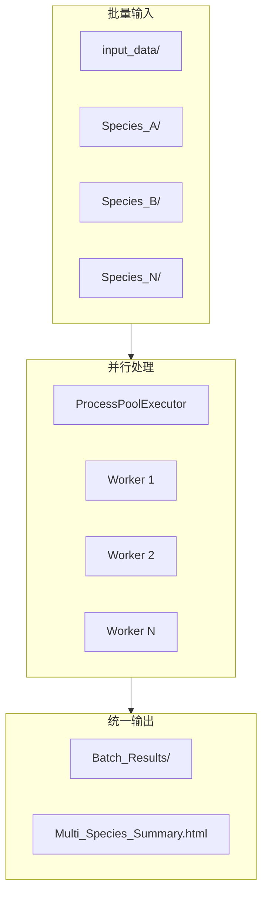

### 文件自动检测

```python
# 支持的文件模式
GENOME_PATTERNS = [
    "*.dna.toplevel.fa*",      # Ensembl
    "*_genomic.fna*",          # NCBI
    "*.genome.fa*",            # Generic
]

PROTEOME_PATTERNS = [
    "*.pep.all.fa*",           # Ensembl
    "*_protein.faa*",          # NCBI
    "*.protein.fa*",           # Generic
]

CDS_PATTERNS = [
    "*.cds.all.fa*",           # Ensembl
    "*_cds_from_genomic.fna*", # NCBI
    "*.cds.fa*",               # Generic
]

GFF_PATTERNS = [
    "*.gff3*",
    "*.gff*",
    "*_genomic.gff*",
]
```

---

## 📝 配置文件示例

```yaml
# config.yaml
family: "4CL"
query: "4-coumarate-CoA ligase"
query_abbr: "4CL"
domains: "cd05904"
interpro_id: "IPR000873"

genome: "/path/to/genome.fa"
proteome: "/path/to/proteome.fa"
cds: "/path/to/cds.fa"
gff: "/path/to/annotation.gff3"

email: "your@email.com"
ncbi_api_key: "your_api_key"
taxid: 33090

cpu: 8
evalue: 1e-5
max_seeds: 10000
reviewed_only: false
run_synteny: true
normalize_gff: false
skip_interpro: false

interpro_mode: "api"  # or "local"
logic: "union"  # or "intersection"

promoter:
  upstream: 2000
  tomtom_db: "/path/to/JASPAR.meme"
```

---

## 🔧 依赖工具

| 工具 | 版本 | 用途 |
|------|------|------|
| MAFFT | ≥7.0 | 多序列比对 |
| HMMER | ≥3.3 | HMM 构建/搜索 |
| BLAST+ | ≥2.12 | 相似性搜索 |
| FastTree | ≥2.1 | 进化树构建 |
| Diamond | ≥2.0 | 快速蛋白比对 |
| MCScanX | latest | 共线性分析 |
| MEME Suite | ≥5.0 | Motif 分析 |
| PAML | ≥4.9 | Ka/Ks 计算 |
| InterProScan | ≥5.50 | 结构域注释 (可选本地) |

---

*文档版本: v1.0 | 最后更新: 2026-01-24*
